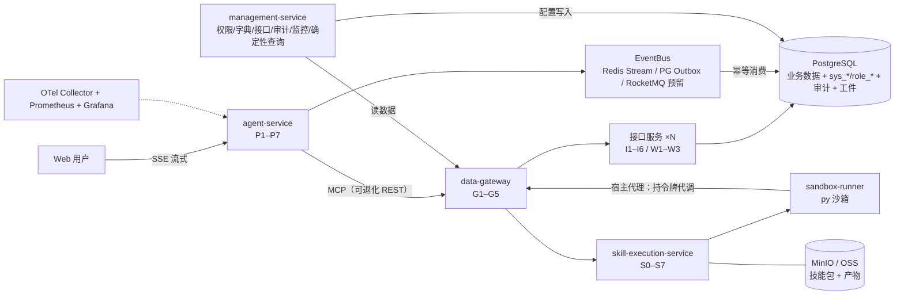

# 系统设计规格说明书：医生数据智能助理（工程级完整版）

**文档版本**: v3.6（文件 `医生数据智能助理-系统设计规格说明书-harness-v1.0.md`，即 harness 分支线主线）
**状态**: 待骨架开发（范围经 ADR-15~18 收窄：骨架期仅 AgentScope 慢路径；服务拓扑与服务架构以 §18 定稿 ADR-20 为准；契约与状态机以 §19 为准；快路径、业务工具契约、业务测试数据后置。v3.2 新增：ADR-27 复用 AgentScope 内置能力（权限 / 事件 / 中间件 / Trace），ADR-28 会话日志先行（append-only 日志是唯一事实源，队列只是落库通道）。**v3.3 新增：ADR-18 二次修订（采用 `HarnessAgent` 作为装配外壳，原「不采用」结论作废）、ADR-29 工具执行管线五段、ADR-30 编排职责边界、ADR-31 HarnessAgent 装配基线；新增 §9.5 为工具执行面的唯一定义（§19 / §20 仍是契约与状态机的唯一契约源）**）
**目标产品**: 基于自然语言的企业级多角色数据查询与分析智能助理
**交付形态**: 全新独立项目（自建管理系统 + 数据网关与接口服务 + 自建数据源与权限体系）
**技术基座**: Java / Spring Boot / Spring AI Alibaba Graph / AgentScope Java（`HarnessAgent` 装配外壳 + core `ReActAgent` / Permission / Middleware） / MCP / PostgreSQL / Redis / MinIO / Vue
**渠道（骨架期）**: Web 登录 + SSE 流式聊天（Codex 风格）；飞书/App 渠道后置

---

## 0. 文档目标与使用方式

### 0.1 这份文档的目标
- 作为**唯一、自包含的开发规格**：新开一个 Agent 窗口、只给本文档 + 空仓库，即可直接理解系统并开始开发，无需再向需求方追问。
- 完整覆盖：业务目标、总体架构、权限模型、意图与上下文、防幻觉、工具契约、存储、稳定性、可观测、安全、渠道、部署、骨架交付清单、验收标准。
- 所有「已经对齐的决策」以 §1 ADR 为准；后续任何变更必须更新本文档并新增 ADR 记录。

### 0.2 系统要达到的效果（产品级验收视角）
> 以下每条都是「用户可感知」的期望效果，开发完成后逐条验证。

1. 助理问「张医生上月利润多少」→ 快路径 2 秒内返回数字，带口径与来源标注（如：利润·支付口径·2026-07·单位万元），答案下方有 👍/👎 反馈。
2. 助理问「对比张医生和李医生上季度利润，张医生为什么降了」→ 返回对比表 + 维度归因（接诊量/客单价变化幅度），归因只引用真实查询数据并带来源标注。
3. 同一问题不同角色得到不同结果：市场角色能看到市场活动 ROI，财务角色看不到；越权提问被明确拒绝且不消耗 Agent 步数/token。
4. 系统里有多个「王医生」→ 弹出候选列表让用户选择，绝不默认取第一个。
5. 医生不存在 / 数据为空 / 无权查看 → 对外措辞统一（不泄露数据是否存在）。
6. 模糊时间（「最近」「上季度」）→ 按业务约定解析；解析不了反问一次并给选项。
7. 多轮对话「他呢」「同上」→ 正确继承上文医生/时间/指标，不重复问。
8. 全过程可见：前端像 Codex 一样流式展示「意图 → 权限 → 工具调用 → 思考 → 答案」，等待时能看到 Agent 在做什么。
9. LLM 故障 → 明确提示「AI 服务暂不可用，请稍后再试」，不黑屏、不静默失败（不带 AI 的确定性查询表单后置，见 §20.10）。
10. 管理员在管理端可查看：每次问答的完整回放、跑偏信号统计、幻觉拦截数、延迟分位、成本；并可修改口径字典/权限配置/Prompt 后重放验证。

### 0.3 给开发 Agent 的使用指引（必读）
- **阅读顺序**：先 §1 ADR 摘要 → §14 骨架交付清单 → 各章强制约束（权限 §4 / 防幻觉 §6 / 存储与落库 §8 / 稳定性 §9 / 可观测 §10 / 安全 §11）→ §16 验收标准 → §19 契约与状态机 / §20 安全与运维契约（唯一契约源）。
- **必守硬约束（不可偏离）**：
  1. 权限三层校验（工具白名单 / 入参校验 / 数据范围过滤）任何路径不可绕过；
  2. 数字一致性校验必须启用（骨架期）：工具返回的每个数字由程序编号登记成「数字台账」，模型只能用编号引用或写算式，程序复算通过才放行（§6.2 / §6.3）；
  3. 会话与步骤数据**先追加写本地 append-only 日志（唯一事实源）→ 再投递 → 消费端攒批落库**；「模型可见即落库」，**事件不得消失**（只允许 PG 滞后），见 §19.6 / ADR-28；**合规审计不参与该取舍**——`permission_audit` 与接口服务 I6 数据访问审计**直写 PG、一条不漏**；消费端必须幂等；
  4. 骨架期零缓存（含权限，直查 PG）；
  5. 工具入参结构化白名单，用户输入永不直接拼接 SQL；
  6. 数据级校验一律在接口服务层（data-gateway 之后的业务接口服务；Agent 层只做语义级约束）。
  7. 服务间调用必须带 API Key + HMAC 签名（防伪 / 防篡改），接口服务**验签但不判定接口可用性**（不查权限库、不回查网关）；**数据范围不由网关计算、也不下发**，由接口服务基于登录人自行推导（§19.1 / §19.7 / §20.1 / ADR-37）；
  8. 所有服务**无状态、可水平扩展、不允许单点**：业务状态一律外置（会话 / 挂起 / 待确认落 PG），计数类（限流 / 用量 / 并发）一律放 Redis，定时任务与投递器用分布式锁；代码与配置不得依赖单实例（§2.3 / §13）；
  9. 业务对象数据**只能经 data-gateway 取**（用户端 / 技能 / 管理端一律如此）；平台元数据与审计读走独立只读出口且只对 admin 开放（§2.3 / §18.4.6）；
  10. 会话事件日志（append-only）是**审计与事实表的唯一事实源**：先写日志再投递，审计 / 回放 / 评估 / 事实表一律从日志派生；**会话正文与历史不在此列——它的权威是框架 `AgentState`**（§19.5 / §19.6 / ADR-35）；队列（Redis / MQ）只是落库通道，其故障不得导致事件消失（§19.6 / ADR-28）；
  11. **不重复实现框架已有能力**：工具级权限闸门用 AgentScope Permission System（Rules + Mode + `ToolBase#checkPermissions`；**只管「工具要不要执行 / 要不要问用户」，数据级授权仍在平台网关 `G3` + 接口服务 `F`**，见 ADR-32 ④ / §9.5）、步骤事件用框架 typed events、横切口用 Middleware 5 钩子、Trace 用框架 OTel 中间件（§4.8 / §10.1 / §12.2 / ADR-27）；状态持久化 / 技能仓库 / 调度 / 对象存储同理复用 `agentscope-extensions` 官方模块（ADR-27）；agent 装配以 `HarnessAgent` 为外壳并按 **ADR-31 基线**关闭文件与命令能力（ADR-18 / ADR-31）；
  12. **工具调用必须走唯一执行管线**（§9.5 / ADR-29）：PRE → GUARD → EXECUTE → POST → RESULT 五段，唯一引擎 `ToolPipelineRunner`，**GUARD 段只能收紧、不可放行**；技能与沙箱等 external execution 必须经**通道适配器**映射进同一管线（`onActing` 追踪不到它们），任何服务不得另立特例；
  13. **编排职责单一**（ADR-30）：Graph 只承担「跨请求、可恢复的业务流程」（HITL / 检查点 / 选路），单次 `call` 内的横切一律 Middleware；**append-only 日志是审计与事实表的唯一事实源；会话状态的权威是 `AgentStateStore`**——两条链分工不合并（ADR-35 ①），Graph 检查点与平台侧快照是 `AgentStateStore` 的派生视图；
  14. **agent 运行时必须可插拔**（§18.10 / ADR-32）：只允许通过 `common/agent-spi` 的 `AgentRuntimePort` 接入——**`agent-service/core` 禁止 import 任何框架包**；**工具调用 100% 经平台 `ToolInvoker`**（运行时不得持有数据面凭据、不得直连网关）、**事件 100% 以中立 `AgentEvent` 上报**、**状态必须可导出为 `Snapshot`**；换实现只换 `runtime-<vendor>` module + 配置 `agent.runtime=<id>`，**不得影响任何其它服务节点**；新实现必须先过契约回归（TCK）才能上线；
  15. **用户自建技能的执行必须在平台侧沙箱**（§18.12 / ADR-33）：技能的**定义与审批**可下放给用户（每用户命名空间 + 草稿→审批→发布），但技能的**执行**一律交 `skill-execution-service` + `sandbox-runner`，并落在 §9.5 管线的 EXECUTE 段之内；**ADR-31 基线不变**（运行时不执行任何工具）；`HarnessAgent` 的默认文件系统是宿主 shell（`LocalFilesystemWithShell`），**不得以默认配置对外提供脚本执行**；将来若要改回运行时侧执行，必须满足 §18.12.4 的七个必配项并另写 ADR；**用户脚本的触达范围有且只有「容器内临时环境 + 本用户工作区」**——§18.12.5 的不可达资源清单（宿主其它路径、其它用户沙箱与工作区、同宿主上的其它容器、宿主 Docker、平台内部服务、云元数据、公网）逐项成立；**跨用户自定义技能不可见、不可列举、不可触发、不可装载**；
  16. **沙箱取数只能经宿主代理**（§18.4.4 / ADR-34）：沙箱**容器 `network("none")`、不持有任何凭据**；脚本要取数只能把请求写进挂载的 IO 目录，由**宿主代理**做「接口白名单 + 入参 schema + 带令牌代调网关 + 记审计」四道检查后代劳；**沙箱数据令牌只存在于宿主代理，不进入容器**（§18.12.5 不可达资源清单逐项实测）。

- **开发顺序**：按 §18.8 的 M1 → M2 → M3 → M4 里程碑推进；每个里程碑结束跑 §16 对应验收项，通过后再进入下一个。
- **环境**：`deploy/docker-compose.yml` 一键启动全部组件；初始化 SQL 与造数脚本幂等可重放。
- **技术版本**：以各组件当前稳定版为准；Spring AI Alibaba Graph / AgentScope Java 需要拉源码确认 API 行为（必要时提 issue）；LLM 走 OpenAI 兼容协议，默认 DeepSeek。
- **交付物**：可运行系统 + 单元/集成测试 + 对抗用例（越权/注入/同名/空数据/口径切换）+ 本文档同步更新。

### 0.4 建议仓库结构（骨架期）
```text
doctor-data-assistant/
├── agent-service/           # P1–P7：平台 core（Graph 编排 + 会话 + §9.5 工具执行管线 + 格式化 + SSE）+ runtime/ 可插拔运行时适配器（§18.10 / ADR-32）
│   ├── core/                # 平台侧：会话编排、SSE 投影、工具管线、台账、审计（**禁止 import 任何 agent 框架包**）
│   └── runtime/             # 可插拔 agent 运行时适配器：换实现只换这里 + 一行配置，不影响任何其它服务节点
│       ├── runtime-agentscope/  # 当前默认实现（HarnessAgent 外壳 + core ReActAgent + Middleware）
│       └── runtime-noop/        # 契约回归用假实现（不调模型、不出网）
├── gateway/                 # data-gateway：G1–G5，数据面唯一通道（对外 MCP / 对内 REST）
├── interface-doctor/        # 示例业务域接口服务（I1–I6 / W1–W3），新增域照此复制
├── skill-execution-service/ # S0–S7 技能包执行（骨架期内嵌 agent-service，按模块边界写死，见 §19.11）
├── sandbox-runner/          # Python 脚本隔离执行（骨架期后置）
├── management-service/      # M1–M7：登录、权限/字典/接口配置、审计回放（确定性查询表单后置）
├── web/                     # Vue 前端（登录 + 流式聊天 + 管理页）
├── common/                  # 权限判定（唯一实现）、服务间签名 / 验签（API Key + HMAC-SHA256，唯一实现，见 §20.1）、**agent-spi 运行时端口与中立模型（ADR-32，禁止 import 框架包）**、契约与事件定义、共享类型
├── deploy/                  # docker-compose、初始化 SQL、迁移脚本、造数脚本、监控配置
├── docs/                    # 本文档与后续 ADR
└── tests/                   # 集成测试与对抗测试
```

### 0.5 版本记录
| 版本 | 说明 |
| :-- | :-- |
| v1.0 | 初版（Doubao 生成） |
| v2.0 | 工程级重构：与需求方逐项对齐（ADR-01~14），补充权限/防幻觉/稳定性/可观测/安全等设计 |
| v2.1 | 补充文档目标、要达到的效果、给开发 Agent 的使用指引与建议仓库结构 |
| v2.2 | 骨架范围收窄为「仅慢路径」：意图节点空占位直连 AgentScope ReAct loop；入口意图识别改为非阻塞轻量（ADR-16）；HarnessAgent 评估不采用、改用 core ReActAgent（ADR-18，**该结论已于 v3.3 二次修订为「采用 HarnessAgent 作为装配外壳」，见 ADR-18 / ADR-31**）；用户预加载档案在 Graph 装配节点加载（ADR-17）；§7.2 工具契约与 §8.2 业务测试数据后置 |
| v2.3 | 权限体系扩展：技能与接口权限（ADR-19）——并集授权模型、sys_skill/sys_api/role_skill/skill_api/role_api 表、控制节点 A–F 分层（体验/强制/兜底）、技能执行不设审批节点（发布审核前移）；骨架期仅定契约，后置实现 |
| v2.4 | 服务架构与技能执行设计定稿（2026-09-10）：新增 §18——data-gateway 数据面唯一通道、skill-execution-service 独立部署、A–F 节点在新架构中的落点、技能包（playbook + 脚本）执行模型、工件与血缘、写接口 HITL、技能实例（查绩效→Excel→传 OSS）端到端规格 |
| v2.5 | 文档内部冲突对齐（口径：以 §18 为准）：取消独立 mcp-server（职责并入 data-gateway + 接口服务）；节点 A 粒度含直连接口、E = 网关 G3 前置 + 接口服务 I2 终检、F 仅在接口服务 I4、D 合并进 I4；scopeFor 统一取严交集（无 role_api 行以技能声明范围为界）；沙箱出网严格仅网关（**该口径已于 v3.3 作废：ADR-33 ⑤ 改为沙箱默认 `network("none")`，取数由平台侧带受限令牌代调**）；技能超 30s 整体转异步 job；里程碑统一为 §18.8 M1–M4（§14 退化为交付物清单、§4.11 并入）；新增 ADR-20；SSE 事件集 / 数据表 / 仓库结构 / 可观测命名统一 |
| v2.6 | 契约与状态机定稿（2026-09-12，§19）：新增 §19 作为唯一契约源（多角色并集与取严、技能/接口只用最新版、SSE 入场券与断线续传、AgentStateStore、先写库再投递、骨架期不引入 ACT、capabilities 由网关提供、确认前移到技能启动前、产物保留期、技能服务骨架期内嵌、状态机与验收口径）；章节编号统一为「章号.序号」（56 处小节号 + 20 处交叉引用）；新增 ADR-21 并修订 ADR-20 的 ACT 表述 |
| v2.7 | 类型三（安全与运维）定稿并写入 §20：**信任边界调整为网关单点判定**（网关下发 userId+scope，接口服务不再二次校验、不再查权限库，接受内网失守风险）；每人 + 全局日用量上限；服务发现固定配置；审计权威源为接口服务 I6；不删除、长期保留（归档召回后置）；思考流改为用户个人可选；新增 config_audit；Flyway 迁移；沙箱威胁模型；含 23 处正文对齐（§4.3 / §4.8 / §4.9 / §7.1 / §16-1 / §18.1 / §18.3 / §18.4 / §18.8 / §19.7 / §19.13）；新增 ADR-22 |
| v2.8 | 信任边界残留表述全量对齐（2026-09-12）：§3.2 / §18.1.3 / §18.4.2 G1 / §18.4.7 / §18.5.1 / §4.9 / §2 流水线中「接口服务验签 / 二次校验 / 网关转发 JWT」的旧表述统一改为「网关单点判定并下发 `userId + scope + requestId`，接口服务直接使用」；**明确接口服务不回查网关**（§19.7 / §20.1）；思考流可见性确认为**用户个人可选**（默认步骤卡 / 可选推理原文，§20.6）；**规格书文件同步改名为 `医生数据智能助理-系统设计规格说明书-v2.8.md`**（文件名与正文版本首次统一） |
| v2.9 | 两处设计纠正（2026-09-18）：① **网关 ↔ 内部服务之间新增防伪与防篡改**——每一跳采用「API Key + 共享密钥（防伪）+ HMAC-SHA256 请求签名（防篡改，签名串覆盖方法 / 路径 / query / 时间戳 / nonce / 请求体摘要）+ ±300s 时间窗 + nonce 一次性防重放」，接口服务**验签但仍不判定**（`apiSet` / `scopeFor` 仍只在网关推导，不查权限库、不回查）；§20.1 重写为完整规范（20.1.1–20.1.7：职责分工 / API Key + 共享密钥 / HMAC 规范 / 校验步骤 / 密钥管理与轮换 / 硬约束 / 风险与补偿），并落点同步 §0.3 / §0.4 / §2.2 / §3.2 / §3.4 / §4.1 / §4.3 / §4.8 / §4.9 / §4.10 / §7.1 / §10.1 / §11.6（新增）/ §13 / §16-1 / §17 / §18.1.2 / §18.1.3 / §18.3 / §18.4.2 / §18.4.5 / §18.4.7 / §18.5.1 / §18.6.1 / §18.6.2 / §18.8 / §19.7 / §19.11 / §19.13 / §20.12；新增 ADR-23（修订 ADR-20 / ADR-22 中「骨架期无服务间验签、应用层无第二道校验」的表述）；② **数据范围 `scopeFor` 由「取严交集」改为「多角色并集」**——用户对某接口的行级范围 = 各角色对该接口授权范围的并集（角色直配 `role_api.scope` 优先，无直配时用该角色经技能获得的技能声明范围；无任何授权来源 → 403），列级仍按 `sys_api.column_whitelist` 取严；§4.1 / §4.6 / §4.7 / §4.8 / §4.9 / §4.10（新增例 4 / 例 5）/ §19.1 / §19.13 同步 |
| v3.0 | 数字一致性校验机制重写为「台账 + 算式复算」（2026-09-18，ADR-24）：取消「从答案文本里抠数字 ↔ 工具结果包含比对」的严格判定（会误杀「下降了 12%」这类正当派生数字，用正则抠自然语言数字还会误判「三甲 / 第 2 季度 / 2026 年」）。改为：① 工具/技能返回的每个数字由程序编号登记成**数字台账**；② 模型结构化交出 `answer` + `figures[]`（台账编号）+ `expressions[]`（只能用编号写算式）；③ 程序按**算子白名单**用 `BigDecimal` 复算、按字典 `rounding` 定容差、按 `unit_convert` 归一单位；④ 一致则放行并**把计算过程与原始数据一起展示**，不一致则**降级为只展示接口原始数据**并计 `hallucination_blocked`（不硬拦、不静默改数）；⑤ 高频派生（同比/环比/占比/TOP N 合计）由接口按 `derived_of` 直接算好返回，模型只引用。§6.1 口径字典扩充 `scale / rounding / derived_of` 与 `unit_convert` 换算表；落点同步 §0.3 / §0.5 / §1（ADR-07、ADR-24）/ §2.2 / §3.2 / §3.3 / §3.4 / §3.5 / §6.1–§6.5 / §8.3 / §10.4 / §12.2 / §14 / §16-2 / §17 / §18.4.1 P6 / §18.5.4 / §18.5.5 / §18.5.8 / §18.6.1 / §18.7 |
| v3.1 | 第二轮设计对齐（2026-09-18）：① **数据范围简化**——删掉通用 `scope` 操作符字典与「技能声明范围」，范围**只在 `role_api.scope` 一处**承载（可见业务对象集合），技能只给接口调用资格；范围 → SQL 由**接口服务**按业务表归属字段拼 WHERE；补 **fail-closed**（解析失败 / 无来源 → 403，绝不当「全部」）；`role_skill` 收敛为单字段 `can_view`（**可见即可执行**，不拆 `can_view` / `can_invoke` 两个字段）；删 `role_api.is_read_only`；`sys_api.method` 明确为**副作用等级而非权限**（只决定确认 / 重试 / 审计 / 超时）（§4.1 / §4.6 / §4.7 / §4.9 / §4.10 / §19.1 / §19.13 / §20.12）；② **落库口径改为「先入队、消费端攒批落库」**（50 条 / 100ms + 单批上限 500），明示丢失窗口与 ≤1s 延迟，补死信表与滞后告警，本地 WAL 列为后置路线（§19.6 / §8.3 / §8.4 / §16-5，新增 **ADR-25 / ADR-26**）；③ **全局硬约束「无状态 / 可水平扩展 / 不允许单点」**：计数一律 Redis 原子计数、业务状态外置、定时任务与投递器用分布式锁、网关与入口可多副本（§0.3-8/9 / §2.3 / §9.3 / §13 / §18.4.2 / §17）；④ **时间口径**新增 §6.6（业务时区 `Asia/Shanghai` + UTC 存储 + 左闭右开区间 + 相对时间由程序解析），口径字典加 `timezone`；⑤ **JWT 寿命 ≤15 分钟** + refresh token + 网关每次查用户状态（停用 / 离职立即生效，角色变更最多 15 分钟延迟生效，不引入版本号，§19.4）；⑥ **表分区与冷热分层列为后置路线**并留三个零成本口子（§20.5 / §8.3）；⑦ 文档矛盾对齐：确定性查询表单统一为**骨架期不实现**（§0.2-9 / §9.2 / §12.2 / §16-6 / §20.2 / §20.12）、`capabilities` 统一为**骨架期零缓存**（§19.8）；⑧ 小口子：技能包**内容寻址**存储（§19.2 / §18.5.2）、技能模块**独立线程池隔离**（§19.11 / §9.3）、沙箱产物由**宿主代理经网关上传**（§18.5.3）、写操作**每轮 ≤3 次** + `confirmId` 一次性（§19.9） |
| v3.2 | 复用框架内置能力 + 会话日志先行（2026-09-19）：① **ADR-27**——AgentScope core 已有的 **Permission System**（`ALLOW/DENY/ASK/PASSTHROUGH` 规则 + `DEFAULT/ACCEPT_EDITS/EXPLORE/BYPASS/DONT_ASK` 模式 + `ToolBase#checkPermissions` 不可绕过的运行时检查）、**typed event 事件集**（含 `REQUIRE_USER_CONFIRM` / `ALL_TOOLS_DENIED` / `SUBAGENT_EXPOSED` / `EXCEED_MAX_ITERS` / `CUSTOM`）、**Middleware 5 钩子**（`onAgent` / `onReasoning` / `onActing` / `onModelCall` / `onSystemPrompt`）、**OTel tracing 中间件**必须复用；A–F 节点 / §12.2 SSE 事件表 / §10.1 span 打点改为**映射**而非自研（§4.8 / §10.1 / §12.2）；② **ADR-28**——**修订 ADR-25**：会话事件**先追加写本地 append-only 日志（唯一事实源，按批 `fsync`，必须挂真实卷、缺卷拒绝启动）再投递**，Redis / MQ 降级为「落库通道」，**删掉「已接受的丢失窗口」**；「模型可见即落库」，历史 / 回放 / 断线续传 / fork-resume 一律从日志派生（§0.3-3/10/11、§2.3、§8.4、§14-8、§16-5、§19.6、§19.13）；③ 规格书文件同步改名为 `医生数据智能助理-系统设计规格说明书-v3.2.md`（沿用 v2.8 起的「文件名与正文版本统一」约定） |
| v3.3 | 采纳 HarnessAgent 作为装配外壳 + 工具执行管线化 + 编排职责边界（2026-09-19）：① **ADR-18 二次修订**——从「不采用 HarnessAgent」改为**采用其作为装配外壳**（内层仍是 core `ReActAgent`），原三条理由已被 `disableXxx()` / `stateStore(...)` 推翻，并记录三条硬风险（缺省 `JsonFileAgentStateStore` / 缺省 workspace 路径 / `fromAgent` 行为不等价）；② **新增 ADR-31 装配基线**——基线关闭文件 / Shell / 记忆 / 子 agent / 工作区上下文，显式给 `stateStore` / `workspace` / `permissionContext` / 工具管线；且**不采用框架 `toolResultEviction`**（与关闭文件工具冲突），改用 POST 段 spill；③ **新增 ADR-29 工具执行管线五段**（PRE / GUARD / EXECUTE / POST / RESULT）——唯一引擎 `ToolPipelineRunner` + `ToolPipelineMiddleware`（挂 `onActing`）+ **external execution 通道适配器**（技能与沙箱 job 不被 `onActing` 追踪，必须订阅 `REQUIRE_EXTERNAL_EXECUTION` / `EXTERNAL_EXECUTION_RESULT` 映射进同一管线）；新增 **§9.5** 为工具执行面的唯一定义，§9.1 / §10.4 / §18.4.3 S4 / §19.9 改为指向 §9.5；④ **新增 ADR-30 编排职责边界**——Graph 管「跨请求、可恢复的业务流程」，Middleware 管「单次 `call` 内横切」，**事实源是 append-only 日志**（ADR-28），Graph 检查点与 `AgentStateStore` 降为派生视图；⑤ **ADR-27 扩充**——平台能力同复用 `agentscope-extensions` 官方模块（`PostgresAgentStateStore` / `RedisAgentStateStore` / 技能 PG 仓库 / AG-UI / scheduler / OSS / DockerSandbox）；⑥ 规格书文件改名为 `医生数据智能助理-系统设计规格说明书-v3.3.md`（**该 harness 分支线随后再改名为 `医生数据智能助理-系统设计规格说明书-harness-v1.0.md`**）；⑦ **ADR-32 agent 运行时端口（可插拔）**——新增 `common/agent-spi`（`AgentRuntimePort` + 中立 `AgentEvent` / `AgentRunRequest` / `Snapshot` + `ToolInvoker` 回调 SPI），`agent-service/core` 禁止 import 框架包、换实现只换 `runtime-<vendor>` module + 一行配置；三条不变量（工具调用 100% 经 `ToolInvoker` / 事件归一化为 `AgentEvent` / 状态可导出 `Snapshot`）；**安全底线从框架移回平台**（修订 ADR-27）、**管线归属平台 core**（修订 ADR-29）；会话绑定 `runtime_id`、不允许跨实现恢复；新增 §18.10 / §19.14；⑧ **新增 ADR-33 用户自建技能与脚本的执行归属**（§18.12 / §0.3-15 / §16-10）——技能的**定义**可下放给用户（每用户命名空间 + 草稿→审批→发布），技能的**执行**必须在平台侧沙箱；定这条的直接依据是：`HarnessAgent` 的默认文件系统是宿主 shell（`LocalFilesystemWithShell`，无沙箱无进程隔离），故 **ADR-31 基线不变**；⑨ 文档一致性对齐（不影响设计结论）：§14-1 补入 `common/agent-spi` / `agent-service/core` + `runtime/*` / `skill-execution-service` / `sandbox-runner` 并标注依赖方向，§14-5 把「AgentScope ReAct loop」改为 `HarnessAgent` 装配外壳 + §9.5 管线 + `AgentRuntimePort` 接入，§18.10 补「本版默认实现 = `runtime-agentscope`」；⑩ 文档一致性对齐（不影响设计结论）：§18.0「不用 harness」改为指向 ADR-01 / ADR-18 二次修订 / ADR-31，§18.0「py 沙箱允许联网、出网白名单=仅网关」改为与 ADR-33 ⑤ / §18.12.5 一致的「默认 `network("none")` + 平台侧代调」，§0.5 v2.5 行就地标注该口径作废；⑪ 沙箱取数通道统一为「容器无网络 + 宿主代理代调」（ADR-34）：§3.1 / §3.2 / §5.3 / §18.0 / §18.1.1 / §18.1.2 / §18.1.3 / §18.4.3 S5 / §18.4.4 / §18.5.1 / §18.5.2 / §18.12.5 / §20.1.5 / §20.9 全部对齐；新增 **ADR-34**；§18.4.4 补「宿主代理」定义与 IO 目录协议；manifest 字段由 network 改为 data 取数策略；§0.3 补第 16 条硬约束；§16-10 补「容器无网卡、无凭据」实测项 |
| v3.4 | 多副本会话管理定稿（2026-09-26）：① 新增 **ADR-35**——会话状态与历史**只有一份权威**（框架 `AgentState`，落 PG，实现用框架扩展 `agentscope-extensions-jdbc`），平台不再自建会话记录（`SessionJournal` / `SessionHistory` 删除，历史改为状态的纯函数投影，并明示其有损）；**明确两条链分工**（会话正文 = 框架状态；审计与事实表 = append-only 日志），**不许用日志重放去恢复会话**；② 多副本口径写进 §19.4 / §19.5 / §19.6 / §8.4 与 §0.3-10/13：会话与券/坑位全部走共享存储，实例内存只留「这一轮的回放位」（有界可淘汰）；**同一会话跨副本同时只允许一轮**（Redis 轮次坑位 + CAS 底线）；实例硬挂时用「开始标记 + 坑位无人占」判定中断并给出用户可读说明；**跨实例接流降级为「等本轮结束再整段补」**（不做跨副本实时推送，留作后续项）；③ 共享单例 agent（键 = 工具面 + 模型 + 迭代上限，每轮注入提示词与回调、每轮结束清理 slot 缓存），每轮工具清单走框架原生机制（完整编组 + 会话激活组），禁止每轮增删工具；④ 本机多副本冒烟脚本 `deploy/local-windows/two-instance-smoke.ps1` 与两实例集成用例（`AgentWebMultiInstanceTest`）落地；实现与后续项台账见 `doc/refactor/TASKS.md`。 |
| v3.5 | 数据范围归属定稿：**由接口服务基于登录人自行推导**（2026-09-26，新增 **ADR-37**，ADR-23 ② / ADR-26 ① / ADR-22 的「网关下发 scope」表述一并修订）：① **网关只做两件事**——解析身份（JWT → `userId` → 角色集）与判定**接口可用性**（`apiSet`，多角色并集），然后把 `userId + requestId` 放进请求体下发并**对请求签名**（API Key + HMAC，§20.1）；**数据范围不在网关计算、也不下发**。② **范围推导与「范围 → SQL」都在接口服务**：拿登录人 `userId` + 自己业务表的归属字段（如 `doctor.owner_id = :userId`）拼 WHERE；推导不出来 / 缺归属信息 → **403（fail-closed）**，绝不当「全部」。③ **范围不落配置表**：`role_api.scope` 与 `sys_api.column_whitelist` 两列已在 V13 迁移 DROP（`role_api` 退化成纯关联表：只回答「这个角色能不能调这个接口」）；**列级没有白名单**——返回哪些列由接口自己的 SQL 与返回类型写死。④ 正文同步落点：§0.3-7/12、§1、§3.4–§3.5、§4.1、§4.3、§4.5–§4.10、§6.6、§7.1、§11.2、§16-1、§17、§18.1.2–§18.1.3、§18.4.2、§18.4.5–§18.4.6、§18.5.1、§18.8、§19.1、§19.3、§19.7、§19.13、§20.1、§20.12；实现台账见 `doc/refactor/TASKS.md`（T1-16 / ADR-37）。 |
| v3.6 | 跨副本实时续看落地（H-01，2026-09-26；新增 **ADR-38**，并修订 ADR-36 ③ 的「只需接线」判断）：① **接入层的「这一轮正在产出什么」改为走框架 `MessageBus` 的会话事件语义**（`sessionPublishEvent` / `sessionReadEvents`），底座由平台实现（`RedisMessageBus`，键前缀 `agent-service:bus:`、日志带 TTL；单实例 / 测试用 `InMemoryMessageBus`，**退化而不是报错**）——经源码核查，框架 2.0.3 只有工作区文件版 `WorkspaceMessageBus`（服务 agent 内部的收件箱 / 异步工具 / 子代理，平台一律关闭），**并没有 Redis 版现成实现**，所以这里实现的是框架接口、复用的是框架默认方法。② **接流选「追日志」而不是「订阅推送」**：条目号单调递增，按游标读天然有序、不重不漏（推送在重连交界处必丢或必重，得再写一层去重与排序），代价是延迟上限 = 一个轮询间隔（默认 200ms）。③ **实时只是加速、不是前提**：追不到内容仍走「等跑完整段补 / 中断 / 超时」三条交代；**已经读到实时内容时不再整段补**（否则同一段回答会下发两遍）。④ **总线是临时数据**（TTL + 按条数封顶），会话正文的权威仍是 PG 里的框架状态（ADR-35 ① 不变）。正文同步 §19.4；实现台账见 `doc/refactor/TASKS.md`（H-01 已完成，H-10 拆出剩余子项）。 |
| v3.7 | **取消 ADR-19 ②「write 接口默认不对技能开放」（2026-09-27）**：技能可以绑定写接口，绑定不再按 `kind` 分叉——上传自动检查的 `WRITE_API_NOT_ALLOWED`（blocking）与页面改绑的同名校验一并删除，`ApiMetadata` 不再读 `kind`。理由：这条禁令是**配置期的副作用**，挡住的只是"绑不上"，挡不住"写操作真的发生"；写操作的真正闸门在执行期——网关与接口服务都要求一次性 `confirmId`（§19.9，`GatewayDataController` / `RegisteredApiAspect`）、沙箱无凭据、全链路审计。取消后「技能带出写接口权限」与「角色直配写接口」在 `apiSet` 并集里等价（并集公式本就没有 `kind` 过滤）。正文同步：§4.6、§4.8 节点 E 伪码、§4.9 边界、ADR-19 摘要；实现见 `SkillPackageService#replaceBoundRoutes` / `SkillPackageInspector`。 |
## 1. 关键决策记录（ADR 摘要）

| # | 决策点 | 结论 |
| :-- | :-- | :-- |
| ADR-01 | 技术选型 | 坚持 Spring AI Alibaba Graph（流程编排）+ AgentScope Java（`HarnessAgent` 装配外壳 + core `ReActAgent` 慢路径决策循环，ADR-18 二次修订 / ADR-31）；两层职责边界见 ADR-30；必要时拉组件源码开发，抽象层留好降低替换成本 |（v3.3 再修订，见 ADR-32：AgentScope 从「坚持的选型」降级为**当前默认实现**，可整体替换）
| ADR-02 | 数据来源 | 新项目自建数据源与表结构（含测试造数），不依赖 owl 数据；看 owl 仅用于理解业务查询复杂度 |
| ADR-03 | 权限体系 | 自建：RBAC（用户↔角色多对多）+ 数据域维度数据范围 + 字段级权限（预留）；骨架期零缓存，直查 PG |
| ADR-04 | 意图识别 | 不用 BERT；LLM 结构化输出（intent + entities JSON），快路径/慢路径共用 |
| ADR-05 | 澄清机制 | 模板化反问 + Graph interrupt/HITL 暂停恢复；上限 2 轮；同名/歧义必须确认 |
| ADR-06 | 会话上下文 | 结构化会话状态机（实体快照 + 滚动摘要）+ 指代消解并入意图识别；会话数据全量落库 PG（**落库口径已由 ADR-28 修订为「先写本地 append-only 日志（唯一事实源）再投递、消费端攒批落库」**） |
| ADR-07 | 防幻觉 | 口径字典（配置化，含单位/精度/派生声明）+ **数字台账 + 算式复算校验**（骨架期启用，ADR-24 修订）+ 数据驱动归因 |
| ADR-08 | 性能 | 快慢双路径：快路径 P95<2s（单步查询），慢路径 P95<8s（Agent 多步）；慢路径并发池受限；不做缓存（避免缓存一致性问题，压测后再按需加） |
| ADR-09 | 稳定性 | 超时预算链 + 熔断降级矩阵 + 用户级限流 + 会话 token 预算 + 边界防护；LLM 故障返回统一降级提示（**确定性查询入口已后置，见 ADR-25 同期修订与 §20.10**） |
| ADR-10 | 事件通道 | 可插拔 EventBus：骨架期实现 Redis Stream + PG Outbox；RocketMQ 预留接口（公司已有基础设施）；Kafka 后置；消费端必须幂等 |
| ADR-11 | 可观测性 | OTel Trace + Prometheus 指标 + JSON 日志 + 跑偏信号统计 + 用户反馈 + 会话回放；评估集回归 Phase 2 |
| ADR-12 | 渠道身份 | 骨架期自建账号体系 + JWT；Web 登录 + SSE 流式聊天页；飞书/SSO 走抽象后置 |
| ADR-13 | 部署 | 骨架期 docker-compose 本地环境，不用 K8s（无环境）；配置支持多环境隔离；K8s 清单后置预留 |
| ADR-14 | LLM 供应商 | OpenAI 兼容协议抽象，默认 DeepSeek，可切换豆包等 |
| ADR-15 | 骨架期执行路径 | 骨架期仅实现慢路径：Graph 意图节点保留但空占位，路由直连 AgentScope ReAct loop；快路径（确定性单步）、业务工具契约（§7.2）、业务测试数据与造数（§8.2）全部后置 |
| ADR-16 | 意图结构 | 去掉「入口一次 LLM 结构化意图识别」（仅剩慢路径时它只是延迟与失败面）；保留 ContextSnapshot（程序装配，多轮/澄清/审计）为必需结构，TaskSummary 作为 loop 后的非阻塞后置产物（回放/跑偏统计，快路径恢复时再评估是否升格为入口契约） |
| ADR-17 | 用户预加载位置 | 用户长期偏好/习惯等档案由 Graph「上下文装配节点」每轮一次直查 PG 注入 Agent 首轮 Prompt；不进 ReAct loop、不作为工具结果、权限范围明细仍不进 Agent 上下文 |
| ADR-18 | 技术选型修订（v3.3 二次修订） | **修订 v2.2 的「不采用 HarnessAgent」结论：骨架期采用 `HarnessAgent` 作为装配外壳**，内层仍是 `io.agentscope.core.ReActAgent`（`HarnessAgent#getDelegate()`），授权判定 / 事件 / 横切仍走 core（ADR-27 不变）。**原「不采用」的三条理由已被新版推翻**：①「自动注入文件 / 记忆 / 会话工具」→ 现有 `disableFilesystemTools()` / `disableShellTool()` / `disableMemoryTools()` / `disableMemoryHooks()` / `disableWorkspaceContext()` / `disableSubagents()` / `disableToolsConfig()` 可逐项关闭；②「会话与长期记忆落 workspace 文件，与 PG 重复」→ `stateStore(...)` 可替换为 `PostgresAgentStateStore`；③「只需要 MCP 查询工具」→ 外壳额外白拿 compaction / MCP 工具粒度白名单 / 技能仓库（含 PostgreSQL 后端）/ 子 agent 编排 / Sandbox / 调度 / AG-UI，多为本设计原计划自研的部分。**骨架期基线见 ADR-31（必守）**。**三条硬风险（必须处理）**：① `stateStore` 缺省为 `JsonFileAgentStateStore`（`~/.agentscope/state/<agentId>/`），不显式覆盖即违反 §19 的「挂起状态落 PG + 多副本共享」；② `workspace` 缺省为 `${user.dir}/.agentscope/workspace`，必须显式指定；③ `fromAgent(ReActAgent)` 只是**部分**迁移助手，且官方明说 HarnessAgent 会额外安装 workspace projection / agent-tracing / 默认 skill·subagent middleware，**行为不等价**，任何切换都要跑对拍回归。**回退路径**：若选择最小依赖，可退回 core `ReActAgent`；因 `fromAgent()` 存在，两个方向都是装配层替换而非重写，**该决策可逆**。落点同步 §2.2 / §9.5 / §12.2 / §18.4.1 / ADR-31 |**（v3.3 再修订，见 ADR-32）本条的 `HarnessAgent` 只是「当前默认实现」的一种装配，不是平台契约**：平台只依赖 `AgentRuntimePort`，换实现不改其它服务节点。
| ADR-19 | 技能与接口权限 | 技能=独立授权单元：角色配技能（role_skill）即获得该技能声明接口（skill_api，发布审核 approved）的使用资格；角色可用接口 = Σ(配置技能的 skill_api) ∪ 直配接口（role_api 承载角色直配接口）——并集模型，避免双重配置。技能执行运行时不设独立人工审批节点：高危管控前移为「发布时接口绑定一次审核 + 执行器/沙箱隔离 + 数据级过滤兜底 + 全链路审计」。（**v3.7 修订**：原第②条「write 接口默认不对技能开放」已取消——写接口可以绑进技能，写操作的闸门是执行期的一次性 `confirmId`，§19.9）控制节点分层：A 技能可见性注入(体验) / B 技能触发鉴权(强制) / C 执行器白名单(代码层) / E 接口调用鉴权(强制) / F 数据级过滤(兜底)。骨架期不实现，仅定契约（后置） |
| ADR-20 | 服务架构定稿（2026-09-10，§18，含 v2.5 冲突对齐） | data-gateway 为数据面唯一通道（接口服务/沙箱只在内网、只接受网关）；技能=包（manifest + playbook + 脚本 + 接口绑定）由 skill-execution-service 执行、脚本在 sandbox-runner 隔离运行（**容器无 DB 凭据、无网卡；出网只发生在宿主代理，由代理代调取数**——见 ADR-34）；跨服务身份与数据范围由**网关单点判定后下发给接口服务**、接口服务直接使用（**修订见 §20.1 / ADR-22 / ADR-23**：信任内网隔离、不查权限库；服务间以 API Key + 共享密钥 + HMAC 请求签名防伪防篡改，接口服务验签但不重新判定，剩余风险明示）；沙箱数据令牌保留（**由宿主代理持有、不进入容器**，见 ADR-34）；工件与血缘作为顺序确定性依据；写接口（OSS 上传）发布审核绑定 + 运行时 HITL（confirmId）；权限判定函数收敛在 common 共享库、骨架期零缓存直查 PG；E = 网关 G3 单点判定（下发身份与范围），F 仅在接口服务 I4；技能执行超 30s 转异步 job（jobId + poll + 挂起恢复）**（已由 ADR-23 修订：服务间新增 API Key + 共享密钥 + HMAC 请求签名，接口服务验签但不重新判定）** **（再经 ADR-37 修订）** 其中「跨服务身份与数据范围由网关单点判定后下发」改为：网关只判定**接口可用性**并下发身份（`userId + requestId`），**数据范围不下发**，由接口服务基于登录人自行推导。 |
| ADR-21 | 契约与状态机定稿（2026-09-12，§19） | 新增 §19 为唯一契约源；**修订 ADR-20**：骨架期不引入 ACT（进一步由 ADR-22 调整为网关单点判定 + 接口服务信任下发）；确认（HITL）前移到技能启动前一次确认、技能内不再打断；capabilities 由网关提供；技能/接口只用最新版不做版本并存；先写库再投递为强制路径；挂起用 AgentStateStore 落 PG；产物保留期 7 天替代任务超时；技能执行服务骨架期内嵌 agent-service 并按模块边界写死；章节编号统一为「章号.序号」 **（其中「先写库再投递为强制路径」已由 ADR-25 修订为「先入队、消费端攒批落库」，再经 ADR-28 修订为「先写本地 append-only 日志再投递」）** （后续再经 **ADR-37** 修订：网关只判定接口可用性并下发身份，**数据范围不下发**，由接口服务基于登录人自行推导） |
| ADR-22 | 安全与运维契约定稿（2026-09-12，§20） | 类型三定稿：**信任边界改为网关单点判定**（网关下发 userId+scope，接口服务不二次校验、不再查权限库；**明示接受内网失守时被冒充的风险**，网络策略默认全拒，自动化可达性探测骨架期不做）；每人 + 全局日用量上限（超限只拒新对话、不打断进行中）；服务发现骨架期用固定配置；审计以接口服务 I6 为数据访问权威源；不删除、长期保留（归档与召回后置）；思考流用户个人可选（默认步骤卡 / 可选 DeepSeek 推理原文）；新增 config_audit；Flyway 迁移；沙箱骨架期假设脚本可信；降级元数据接口与 SSE 连接治理后置 **（已由 ADR-23 修订：撤销「骨架期无服务间验签 / 应用层无第二道校验」，改为服务间 API Key + 共享密钥 + HMAC 签名 + 时间窗 + nonce 防重放）** |
| ADR-23 | 服务间防伪防篡改 + 数据范围并集（2026-09-18，§20.1 / §19.1） | **修订 ADR-20 / ADR-22**：① 网关与内部服务之间的每一跳新增**服务间防伪与防篡改**——调用方持 `X-Api-Key`（keyId）+ 共享密钥，对「方法 + 路径 + query + 时间戳 + nonce + 请求体 SHA-256 摘要」做 **HMAC-SHA256** 签名（`X-Signature`）；接收方按 keyId 取密钥重算比对、±300s 时间窗、nonce 一次性（Redis SETNX + TTL）防重放；失败统一 401 + 审计告警；密钥不进 URL / 日志 / Trace，按 keyId 支持双密钥轮换；沙箱侧密钥只由宿主代理持有、脚本不可见。**验签只证明「请求来自可信服务且未被篡改」，不替代网关单点判定**：`apiSet` / `scopeFor` 仍只在网关推导，接口服务不查权限库、不回查网关、不重算。② 数据范围口径由「多角色取严交集」改为**多角色并集**：`scopeFor(user, skill, api)` = 各角色对该接口授权范围的并集（角色直配 `role_api.scope` 优先，无直配时取该角色经技能获得的技能声明范围；无任何授权来源 → 403）；授权与数据范围口径统一为并集。**（② 的「技能声明范围」这一来源已由 ADR-26 修订：技能不再携带范围，范围只在 `role_api.scope`）** **（再经 ADR-37 修订）** ① 中「`apiSet` / `scopeFor` 仍只在网关推导」改为：网关只判定 **`apiSet`（接口可用性）**，**`scopeFor` 由接口服务基于登录人自行推导**、不再由网关计算与下发；② 的「范围只在 `role_api.scope`」作废（该列 V13 已 DROP）。 |
| ADR-24 | 数字一致性校验改为「台账 + 算式复算」（2026-09-18，§6.2 / §6.3） | **修订 ADR-07**：不做「从答案文本里抠数字 ↔ 工具结果比对」（严格包含判定会误杀「下降了 12%」这类正当派生数字；用正则抠自然语言数字还会误判「三甲 / 第 2 季度 / 2026 年」）。改为：① 工具/技能返回的每个数字由程序编号登记成**数字台账**（编号 / 数值 / 单位 / metricKey / timeRange / 口径 / 来源 apiId）；② 模型结构化交出 `answer` + `figures[]`（台账编号）+ `expressions[]`（表达式只允许编号 + 白名单算子，不许字面常量）；③ 程序按算子白名单（`+ - × ÷`、求和/平均/最大/最小/计数、占比/环比/同比/差额/百分点差）用 `BigDecimal` 复算、容差取字典 `rounding` 精度下最后一位的半个单位、单位先按 `unit_convert` 归一再算，**不引入通用表达式引擎、不用 `eval`、不做正则抠数**；④ 一致 → 放行并**把计算过程 + 原始数据一并展示**给用户；不一致 / 引用不存在的编号 / 答案中有台账与算式都覆盖不到的数字 → **降级**为「只展示接口原始数据 + 口径标注」并计 `hallucination_blocked`（不硬拦、不静默改数）；⑤ 高频、有明确口径的派生（同比/环比/占比/TOP N 合计）由接口服务按字典 `derived_of` **直接算好返回**，模型只引用编号；⑥ 分母为 0 / 样本低于阈值 → 输出「无法计算」，禁止 `∞ / NaN`；⑦ 纯定性回答（无数字）放行但计入「无数字断言占比」跑偏信号。落点同步 §0.3 / §0.5 / §2.2 / §3.4 / §3.5 / §6.1–§6.5 / §10.4 / §12.2 / §14 / §16-2 / §18.4.1 P6 / §18.5.5 |
| ADR-25 | 落库口径：先入队、消费端攒批落库（2026-09-18，§19.6 / §8.4 / §8.3） | **修订 ADR-21 / ADR-22 中「先写库再投递为强制路径」**：① 会话与步骤数据改为**先入 Redis Stream、消费端（`event-persist`）按「50 条 / 100ms」攒批写入 PG 事实表**，用户等待路径上不落库；② 以 `event_id` 唯一键 + `ON CONFLICT DO NOTHING` 保幂等，失败重试 5 次进 `event_dead_letter` 并告警，消费滞后（>1 万条 / >5s）与死信数一律告警；③ **明确接受**「消费者写库前 Redis 是唯一副本」这一丢失窗口（后果＝某次回放不完整；**不涉及合规审计**——`permission_audit` 与接口服务 I6 直写 PG、一条不漏）；④ Redis 独立部署 + AOF + `noeviction` + `MAXLEN ~ 100 万`；⑤ **本地 WAL 追赶重放列为后置演进路线**（骨架期不实现，接入真实数据前必须补齐）；⑥ 事实表补 `event_id`，时间列统一 `created_at timestamptz`、主键带 `created_at`、查询带时间范围，为月分区留口子（§20.5）。落点同步 §0.3-3 / §2.3 / §8.3 / §8.4 / §10.2 / §13 / §14-8 / §16-5 / §17 / §19.6 / §19.13。**（本 ADR 的「已接受的丢失窗口 / 先入队」口径已由 ADR-28 修订：事件先追加写本地 append-only 日志（唯一事实源）再投递，Redis / MQ 降级为落库通道，事件不得消失）** |
| ADR-26 | 数据范围简化 + 全局无状态硬约束（2026-09-18，§4.6–§4.10 / §6.6 / §19.1 / §19.4 / §2.3） | **修订 ADR-23** 的 ②（其中「无直配时取技能声明范围」不再存在）：① **删掉通用 `scope` 操作符字典与「技能声明范围」**——数据范围**只在 `role_api.scope` 一处**承载（该角色可见的业务对象集合），技能只给「可调用哪些接口」的资格、不携带任何范围；范围 → SQL 由**接口服务**按业务表的归属字段（如 `doctor.owner_id`）拼 WHERE，权限模块不认识业务表结构；**fail-closed**：范围缺失 / 解析失败 / 无任何授权来源 → 403，绝不当「全部」。② `role_skill` 收敛为单字段 `can_view`（**可见即可执行**：可见就等于可调用，不拆 `can_view` / `can_invoke` 两个字段）；删 `role_api.is_read_only`；`sys_api.method` 明确为**副作用等级而非权限**（只决定确认 / 重试 / 审计 / 超时）。③ **全局硬约束「无状态 / 可水平扩展 / 不允许单点」**：任何服务不持有会话 / 任务等业务状态（状态一律外置 PG / Redis），计数一律 Redis 原子计数（禁止本地内存计数），定时任务与投递器用分布式锁互斥，网关与各入口可多副本。④ **时间口径**新增 §6.6（业务时区 `Asia/Shanghai`、DB 存 UTC `timestamptz`、区间左闭右开 `[起,止)`、相对时间由程序解析），口径字典加 `timezone`。⑤ **JWT 有效期 ≤15 分钟** + refresh token + 网关每请求查 `sys_user.status`（停用 / 离职立即生效；角色变更最多 15 分钟延迟生效；**不引入 token 版本号**）。⑥ **表分区 / 冷热分层列为后置路线**，骨架期只留三个零成本口子（`created_at timestamptz` / 主键带 `created_at` / 查询带时间范围）（§20.5 / §8.3）。落点同步 §0.3-8/9 / §2.3 / §4.1 / §4.6–§4.10 / §6.6 / §9.3 / §13 / §17 / §18.4.2 / §19.1 / §19.4 / §19.13 / §20.12 **（再经 ADR-37 修订）** ① 中「数据范围只在 `role_api.scope` 一处承载」作废：`role_api.scope` 与 `sys_api.column_whitelist` 均已在 V13 DROP，范围改由**接口服务基于登录人自行推导**；其余（技能只给接口资格、fail-closed、无状态硬约束）不变。 |
| ADR-27 | 复用 AgentScope 内置能力，不重复实现（2026-09-19，§4.8 / §10.1 / §12.2 / §18.4.1） | **ADR-27 本身不改选型；ADR-01 不变，ADR-18 的装配外壳已由 v3.3 二次修订（见 ADR-18 / ADR-31）。本条禁止重复实现框架已有能力**：① **权限**——工具闸门一律用 `io.agentscope.core.permission`（在 **agentscope-core**，非 harness）：`PermissionRule`（`ALLOW` / `DENY` / `ASK` / `PASSTHROUGH`，规则优先级最高）+ `PermissionMode`（`DEFAULT` / `ACCEPT_EDITS` / `EXPLORE` / `BYPASS` / `DONT_ASK`）+ **`ToolBase#checkPermissions` 运行时内置检查（不被 mode / rule 覆盖，是「不可绕过」的真实来源）**〔**该表述已由 ADR-32 ④ 修订：它只决定「工具要不要执行 / 要不要问用户」，数据级授权的底线在平台 `ToolInvoker` 唯一出口 + 网关 `G3` + 接口服务 `F`（详见本行末）**〕。映射：**A** = Toolkit 只注册 visibleTools + `EXPLORE` 兜底（写类工具 DENY）；**B** = 技能工具挂 DENY/ASK 规则 + 技能入口 `canTrigger` 二次校验（§4.6 节点 B 逻辑不变）；**C** = 受限子 agent 的工具清单由代码生成（不依赖规则）；**E** = 注册到工具上的规则集 + 框架内置检查（**网关 G3 仍是唯一授权判定**，规则只是同一结论在 agent 侧的执行形态）；**F** = 不变，仍在接口服务（框架不接管数据层，§20.1.6-3 不受影响）。② **事件**——§12.2 的 SSE 事件表是**业务投影层**，底层必须由框架 typed event 派生（`REQUIRE_USER_CONFIRM` / `USER_CONFIRM_RESULT` / `REQUIRE_EXTERNAL_EXECUTION` / `EXTERNAL_EXECUTION_RESULT` / `ALL_TOOLS_DENIED` / `SUBAGENT_EXPOSED` / `EXCEED_MAX_ITERS` / `REQUEST_STOP` / `HINT_BLOCK` / `CUSTOM`），子 agent 归属用事件的 `source`（如 `main/researcher`），业务事件（`skill_start` / `artifact` / `sandbox_job`）用 `CUSTOM` 承载。③ **横切**——P1 / P2 / P6、审计、成本计数一律以 `MiddlewareBase` 五钩子（`onAgent` / `onReasoning` / `onActing` / `onModelCall` / `onSystemPrompt`）实现，不再新增 Graph 节点；`onSystemPrompt` 是 Transformer（链式改写），作为「固定前缀 + 尾部 delta」的落点。④ **Trace**——用框架自带的 OTel tracing 中间件，业务 span 名（P/G/S/I/W）保留用于回放对号，同时必须挂载 `gen_ai.*` 标准属性（OpenTelemetry GenAI 语义约定）。**冲突处理**：仅当框架能力与本文档契约冲突（如 F 必须在接口服务、权限判定必须单点）时才允许自研，且必须写 ADR 记录「冲突点 + 补偿措施 + 回归用例」；harness 侧能力（Plan Mode / Skill 包 / Sandbox / Channel / Compaction）**骨架期仍不启用**，但契约必须对齐，并在 §15 路线里优先切框架实现。**（v3.3 扩充）⑤ 平台能力同样复用 `agentscope-extensions` 官方模块，不自研**：状态持久化用 `PostgresAgentStateStore` / `RedisAgentStateStore`（Jedis / Redisson / Lettuce）与 `PostgresDistributedStore`；技能仓库用 `agentscope-extensions-skill-postgresql-repository`（另有 Git / MySQL / Nacos / classpath 后端）；异步 job 用 `agentscope-extensions-scheduler`（Quartz / XXL-Job）；工件对象存储用 `agentscope-extensions-oss`；沙箱评估 harness `DockerSandbox`（含快照与恢复）。⑥ **流式协议**：`agentscope-agui-spring-boot-starter`（AG-UI，WebFlux + MVC）是否替换 §12.2 自研事件层，列为 M1 调研项，**不做无条件切换**（须先确认能否承载证据等级 / 口径标注等业务语义）；在此之前 §12.2 仍是唯一事件契约源。**（v3.3 再修订，见 ADR-32）**：④ 的链路改为「框架 typed event → 中立 `AgentEvent`（§8.4）→ §12.2 投影」；① 中「不可绕过的真实来源」**从框架的 `ToolBase#checkPermissions` 移回平台侧**——`ToolInvoker` 唯一出口 + 网关 G3 + 接口服务 F 才是底线，框架权限系统降级为**该实现内部的第二道纵深防御**（否则换框架就换掉了安全边界）；选型措辞改为「默认实现可替换」。落点同步 §0.3-11 / §4.8 / §10.1 / §12.2 / §14-5 / §17 / §18.4.1 / ADR-18 / ADR-31 |
| ADR-28 | 会话日志先行：append-only 日志是唯一事实源（2026-09-19，§19.6 / §8.3 / §8.4 / §16-5） | **修订 ADR-25（回归 ADR-21 / ADR-22「先落地再投递」的精神，但改为「先写日志」）**：① 事件路径改为**先追加写本地 append-only 日志**（`/data/eventlog/agent-{instanceId}.jsonl`，按批 `fsync`，**必须挂真实卷**；启动时校验卷可用，不可用则**拒绝启动**）→ 再 `XADD` 投递 → 消费端攒批落库 → 投递确认后按保留窗口（默认 24h，可配）裁剪；② **删掉「已接受的丢失窗口」**——事件**不得消失**，Redis / 消费者故障只允许造成 **PG 滞后**（仍允许 ≤1 秒落库延迟），进程重启时扫描日志把「投递未确认」事件重新入队（`event_id` 幂等，重放安全）；Redis 不可用时**继续写本地日志 + 计数告警**，不丢弃、不静默；③ **「模型可见即落库」**——进入模型请求的 System Prompt 片段 / 工具 schema / 工具结果 / 注入提醒必须能从日志重建，运行期断言违规即告警；④ 历史 / 回放 / 断线续传 / 评估 / **fork-resume** 一律从日志派生（PG 事实表是查询视图，不是事实源）；⑤ 观测新增「本地日志未投递积压（条数 + 最早未确认时间）」与磁盘水位告警（§10.2）。落点同步 §0.3-3/10 / §2.3 / §8.3 / §8.4 / §10.2 / §14-8 / §16-5 / §17 / §19.6 / §19.13 |
| ADR-29 | 工具执行管线五段：PRE / GUARD / EXECUTE / POST / RESULT（2026-09-19，§9.5 / §9.1 / §10.4 / §18.4.3 S4 / §19.9） | **所有工具调用（`iface_*` / `skill_*` / `py_*` / 平台内置工具）必须走唯一执行管线，唯一执行面定义见新增 §9.5**；不得在技能服务、接口服务或技能脚本里另立特例。**五段职责**：PRE = 放行 / 拒绝 / 发起询问（`ASK`）/ 改写本次调用参数；**GUARD = 只能拒绝或弃权（单调收紧，没有「放行」权力）**；EXECUTE = 环绕包裹（超时 / 只读幂等重试 / 耗时与 token 打点，不判权限）；POST = 结果级处置（接受 / 拦截 / 替换结果 / 追加提醒上下文）；RESULT = 只读观察（台账登记 / 审计落库 / SSE 投影）。**为什么 GUARD 独立于 PRE**：写进 PRE 的约束会被后续钩子的参数改写或组合放行抵消，只有单调守卫能保证「无论前面怎么放行，这里一票否决」——配额、越权收紧、重复调用熔断、写次数上限一律写 GUARD。**实现落点**：`common/toolpipeline/`（`ToolStage` / `ToolPreHook` / `ToolGuard` / `ToolPostHook` / `ToolInvocation` / `ToolOutcome`）+ `agent-service/agent/tool/ToolPipelineRunner`（唯一引擎，`@Order` 定序）+ `ToolPipelineMiddleware implements MiddlewareBase`（挂 `onActing`）。**通道适配器（硬要求）**：AgentScope 文档明确 `onActing` **不追踪 external execution**，而本设计的技能调用与沙箱 job 正是 external execution——**必须同时订阅 `REQUIRE_EXTERNAL_EXECUTION` / `EXTERNAL_EXECUTION_RESULT`，把外部通道映射进同一条五段管线**；否则技能链路绕开管线、§10.4 拦截与 §6.2 台账登记全部失效。**最小落地顺序**：M1 放 `ToolExecutor` + `AuditPostHook`（行为不变，用 Trace 对数验证覆盖 100%）→ `SpillPostHook`（删除 §18.4.3 S4 技能内特例）→ `ConfirmPreHook` + `NumberLedgerHook` → `ToolGuard`（§10.4 从统计改为拦截）。落点同步 §9.1 / §9.5 / §10.4 / §18.4.1 / §18.4.3 S4 / §19.9 |**（v3.3 再修订，见 ADR-32）本管线位于平台 core，不在运行时适配器内**：运行时不执行任何工具，只把调用委派给平台 `ToolInvoker`；因此上文的「通道适配器」是**适配器实现方的义务**，不是管线的一部分。
| ADR-30 | 编排职责边界：Graph 与 Middleware 各管一层（2026-09-19，§5.1 / §5.4 / §18.4.1） | **补齐 ADR-01（Graph）+ ADR-27（Middleware）之间的职责分割，禁止两套逻辑并存与双写**：① **Graph 只承担「跨请求、跨进程、可恢复」的业务流程**——HITL interrupt / 检查点（§5.4 / §19.9）、ContextSnapshot 装配与状态机（§5.1，检查点落 PG）、选路与降级分支（§18.4.1 P3）、审计锚点 `requestId`；② **单次 `call` 内的横切一律 Middleware**——审计埋点、成本计数、数字台账、Trace 属性、系统提示词拼装（`onSystemPrompt` 的「固定前缀 + 尾部 delta」）、工具执行管线（ADR-29）；**判据一句话**：这次 `call` 结束就没了 → Middleware；换个请求、换台机器还得接着跑 → Graph；③ **事实源唯一**：append-only 会话日志是唯一事实源（ADR-28），**Graph 检查点与 `AgentStateStore` 都是派生视图 / 缓存**，不得各自成为第二真相；④ **对话内 HITL 可用框架事件替代 Graph interrupt**（`REQUIRE_USER_CONFIRM` → `USER_CONFIRM_RESULT` 回灌下一次 `call`），但**跨小时 / 跨进程的异步 job 挂起恢复仍必须由外层编排承担**；⑤ **骨架期坦白**：因 ADR-15（仅慢路径、意图节点空占位），Graph 当下近乎空壳，其价值是「预留扩展位 + HITL 承载」；**保留决定不变**。落点同步 §5.1 / §5.4 / §9.5 / §18.4.1 / §19.6 / §19.9 |
| ADR-31 | HarnessAgent 装配基线（2026-09-19，§2.2 / §9.5 / §12.2 / §18.4.1） | **配合 ADR-18 二次修订**：骨架期以 `HarnessAgent` 作为装配外壳，装法与开关清单如下（理由：本设计第一原则是「agent 不碰数据、不碰权限明细」，文件与命令能力在医疗数据场景属于新增外泄面）。① **基线关闭**（`disableXxx`）：`disableFilesystemTools()` / `disableShellTool()` / `disableMemoryTools()` / `disableMemoryHooks()` / `disableWorkspaceContext()` / `disableSubagents()` / `disableToolsConfig()`；② **必须显式给**（否则框架默认值替你决定）：`stateStore(new PostgresAgentStateStore(...))`、`workspace(...)`、`permissionContext(...)`（ADR-27 规则集）、`middleware(new ToolPipelineMiddleware(...))`（ADR-29）；③ **按需开启**：`compaction(...)`、`skillRepository(...)`（骨架期可不启）；④ **一个取舍**：`toolResultEviction` 的占位符语义依赖 `read_file` 工具，与 `disableFilesystemTools()` 直接冲突——**本设计不采用框架 eviction，改用 §9.5 POST 段的 spill 到 MinIO + 平台可控 locator**（§18.4.3 S4）；⑤ **待验证项（M1）**：`agentscope-agui-spring-boot-starter`（AG-UI）能否承载 §12.2 的业务语义（证据等级 / 口径标注），验证通过才替换自研事件层。落点同步 §2.2 / §9.5 / §12.2 / §18.4.1 / §18.4.3 / §19.9 |**（v3.3 再修订，见 ADR-32）本条描述的是「当前默认实现」的装配基线**；平台只依赖 `AgentRuntimePort`，换实现时本节随之失效、其余服务不受影响。另：正因为基线关闭了文件 / Shell / 记忆工具，**运行时侧不存在需要自己执行的工具**，全部工具才能统一按「外部执行」委派给平台 `ToolInvoker`（ADR-32 不变量 1）。
| ADR-32 | agent 运行时端口：agent 节点可插拔（2026-09-19，§18.10 / §0.3-14 / §9.5 / §19.14） | **新增设定：agent 运行时必须可替换，且替换不得影响任何其它服务节点**。① **端口**——新增 `common/agent-spi`（**禁止 import 任何框架包**）：`AgentRuntimePort`（`id` / `version` / `capabilities` / `start` / `stream` / `confirm` / `cancel` / `snapshot` / `resume` / `close`）+ 中立模型（`AgentRunRequest` / `AgentEvent` / `AgentSession` / `Snapshot` / `ConfirmDecision` / `AgentBudgets` / `RuntimeCapabilities`）+ 回调 SPI（`ToolCatalog` / `ToolInvoker` / `PlatformTurnStore` / `EventPublisher` / `LedgerPort`）。② **依赖方向**——`agent-service/core → agent-spi ← agent-service/runtime/runtime-<vendor>`，core 与 runtime **互不依赖**；换实现只换 module + 一行配置 `agent.runtime=<id>`；仓库结构见 §0.4。③ **三条不变量**——**工具调用 100% 经平台 `ToolInvoker`**（运行时不得持有数据面凭据、不得直连 data-gateway）、**事件 100% 以中立 `AgentEvent` 上报**、**状态必须可导出为 `Snapshot` 并可恢复**。④ **安全边界的归属修正（修订 ADR-27）**——「不可绕过」**不再依赖框架的 `ToolBase#checkPermissions`**；底线回到平台侧（`ToolInvoker` 唯一出口 + 网关 G3 + 接口服务 F），框架权限系统降级为**该实现内部的第二道纵深防御**（否则换框架就等于换掉安全边界）。⑤ **管线归属（修订 ADR-29 / 澄清 ADR-31）**——§9.5 五段管线在**平台 core**；ADR-31 关闭文件 / Shell / 记忆工具后，**运行时侧不存在需要自己执行的工具**，全部工具统一按「外部执行」委派给 `ToolInvoker`，管线 / 权限 / 审计 / 台账天然跨实现。⑥ **会话绑定**——会话记录存 `runtime_id` / `runtime_version`，**不允许跨运行时恢复同一会话**（§19.14）。⑦ **准入门槛**——新实现必须先通过**契约回归（TCK）**（权限拒绝 / HITL 往返 / 取消 / 超步数 / 快照恢复 / 事件顺序 / 工具调用全走 `ToolInvoker` / 成本上报 / 错误归一化）才允许上线（§16-9）。⑧ **不做最小公分母抽象**——框架特有增强走 `RuntimeCapabilities` 声明与降级，不阻塞。落点同步 §0.3-14 / §0.4 / §8.4 / §9.5 / §10.1 / §16-9 / §17 / §18.4.1 / §18.10 / §19.14 |
| ADR-33 | 用户自建技能与脚本的执行归属（2026-09-19，§18.12 / §0.3-15 / §4.6 / §9.5 / §16-10） | **技能的「定义」可以下放给用户，技能的「执行」必须留在平台侧沙箱**。① **为什么必须定这条**——`HarnessAgent` 原生具备用户自建技能与脚本执行能力（`SkillManageTool` / `ProposeSkillTool` 可按 `RuntimeContext` 读写每用户技能目录，`ShellExecuteTool` 负责执行），**但其默认文件系统是 `LocalFilesystemSpec → LocalFilesystemWithShell`，命令以 `sh -c` 直接跑在应用服务器上**（框架类注释原文：`without any sandboxing, process isolation, or security restrictions`），且 `disableShellTool` 默认 `false`——**默认配置等于让终端用户在你的服务器上以应用进程权限执行任意脚本**，与本文档的权限底线直接冲突。② **定义侧（可下放）**——用户技能只能写入自己的命名空间（`IsolationScope.USER`：`NamespaceFactory` 路径前缀 = `userId`，沙箱侧由 `SandboxIsolationKey` 决定 slot）；技能**存储与审批归 management-service / 技能仓库**（§18.4.6 / §18.5.2），用户只能提草稿、过审批闸后发布，**不得自动发布**；`agent-service` 只投影「该用户可见 / 可触发的技能」（§4.6 的 `viewableSkills` / `canTrigger`），不直接读写用户技能目录。③ **执行侧（不下放）**——用户脚本一律交平台 `skill-execution-service` + `sandbox-runner`，且**必须落在 §9.5 管线的 EXECUTE 段之内**（超时、幂等重试、耗时与 token 打点、审计、台账统一在此段完成）。**ADR-31 基线保持不变**（`disableFilesystemTools()` / `disableShellTool()`），运行时侧不执行任何工具。④ **将来要开「运行时侧执行」的破例条件**——必须**同时**满足：沙箱后端（Docker / Kubernetes / E2B / AgentRun / Daytona，**禁用默认 local**）、`isolationScope(USER)`、`network("none")`、CPU 与内存上限、`additionalRunArgs` 加固（非 root、`--cap-drop ALL`、`no-new-privileges`、只读根 + tmpfs）、**不 bind 宿主目录、不挂 `docker.sock`**、`workspaceProjectionRoots` 与宿主 workspace 均按用户隔离；并且因为 `ShellExecuteTool` 在适配器内本地执行、**不经平台 `ToolInvoker`**，会破坏 ADR-32 的不变量①③，**必须另写 ADR 记录例外与补偿**（否则 §16-9 的 TCK 第 10 条直接不成立）。⑤ **红线与不可达资源清单**（详见 §18.12.5）——用户脚本的触达范围**有且只有**「容器内临时环境 + 本用户工作区」：宿主其它路径、其它用户的沙箱与工作区、同一宿主上的其它容器、宿主 Docker、平台内部服务（网关 / 接口服务 / PG / Redis / MinIO）、云元数据服务、公网**一律不可达**；**跨用户自定义技能必须不可见、不可列举、不可触发、不可装载**；不挂宿主目录 / `docker.sock`；共享 workspace 不得投影进用户沙箱；不以 `SkillSecurityScanner` 作为安全边界。 |
| ADR-34 | 沙箱取数通道：容器无网络 + 宿主代理代调（2026-09-19，§18.1.3 / §18.4.3 S5 / §18.4.4 / §18.5.1 / §18.5.2 / §20.1.5 / §20.9） | **修订 ADR-20 中「脚本在沙箱内运行、出网仅网关 + 脚本持沙箱数据令牌」的表述**。① **结构**：沙箱**容器 `network("none")`——无网卡、无任何凭据**；取数与产物搬运一律由**宿主代理**（容器外的平台侧进程）代劳；② **通道**：脚本把取数请求写进挂载 IO 目录 → 宿主代理做四道检查（接口白名单 / 入参 schema / 带 `X-Api-Key + HMAC + 沙箱数据令牌` 代调网关 / 记审计与成本）→ 结果写回目录；③ **沙箱数据令牌由宿主代理持有，不进入容器**（修订 §18.5.1 / §20.1.5 的「脚本只能拿到沙箱数据令牌」）；④ manifest 字段由 `network` 改为 `data` 取数策略（取 `none` 或 `via_host`）；⑤ **理由**：令牌进容器可被写进产物带出系统（限流 / 审计 / 撤销随之失效），容器可拨号则加固只能依赖 allowlist 配置正确；本方案与 ADR-33 ⑤ / §18.12.5 一次对齐，**平台技能与用户自建技能共用一套模型**。落点同步 §0.3-16 / §3.1 / §3.2 / §5.3 / §18.0 / §18.1.1 / §18.1.2 / §18.4.4 / §16-10 / §20.9。 |
| ADR-35 | 多副本（≥2 实例）会话管理定稿（2026-09-26，§0.3-10/13 / §8.4 / §19.4 / §19.5 / §19.6；实现台账 `doc/refactor/TASKS.md`） | ① **会话状态与历史只有一份权威 = 框架 `AgentState`**（落 PG；实现用框架扩展 `agentscope-extensions-jdbc`，平台只补一处框架漏掉的按 key 删除）；平台**不再自建会话记录**（`SessionJournal` / `SessionHistory` 已删），历史 = 状态的**纯函数投影**（有损，明示）；**不用事件日志重放会话**——日志是审计与事实表的事实源，两条链分工不合并。② **实例内存只保留「这一轮的回放位」**（有界、可淘汰、可丢）：换实例 / 重启后由状态重建，所以「换台机器接着聊」天然成立。③ **同一会话跨副本同时只允许一轮**：Redis `SET NX PX` 轮次坑位（释放必须比对持有者）+ **CAS 作正确性底线**（坑位只是不撞车）。④ 实例硬挂 → 「开始标记在、坑位无人占」判定中断，历史与实时流说同一句「本轮没跑完，请重发」。⑤ **跨实例接流降级为「等本轮结束再整段补」**（有窗口上限，超时如实收尾，绝不空挂）；真正的跨副本实时（事件总线）列为后续项。⑥ **共享单例 agent**：键 = 工具面 + 模型 + 迭代上限（同一把键才共享），系统提示词与平台回调**每轮经调用上下文注入**，每轮结束清理该会话的 slot 缓存（否则内存随会话数无界增长）；**每轮工具清单走框架原生机制**（全部工具完整编组 + 会话激活组），禁止在每轮路径上 `registerAgentTool` / `removeTool`；框架的 DENY 规则只对 `ToolBase` 子类生效，故**工具可见性的唯一闸门是「注册了哪些工具」**。 |
| ADR-36 | 多副本运行时组件选型：凡是框架已有的，一律用框架（2026-09-26，§19.4 / §19.5，ADR-35 的实现细化；台账 `doc/refactor/TASKS.md`） | ① **会话状态存储**改用框架扩展 `agentscope-extensions-jdbc` 的 `JdbcAgentStateStore` + 按 `DataSource` 自动识别的方言（生产 PG、测试 H2 同一份代码），平台删掉自研实现，只补一处框架漏掉的「按 key 删除」（框架接口上 `delete(userId, sessionId, key)` 是空默认方法，JDBC 实现只覆写了「删整个会话」）。表名 `agentscope_sessions`；寻址列 `session_id` 装的是**槽位号** `<userId>:<sessionId>`（匿名用 `__anon__`），这是与框架之间唯一的隐式约定，用回归用例钉住。② **轮次闸门实现框架接口** `io.agentscope.harness.agent.gateway.SessionTurnGate`（平台提供 Redis / 内存两套实现），**不用框架自带的 `LocalSessionTurnGate`**——它是阻塞式公平信号量，会把 HTTP / SSE 请求挂住数分钟，与平台「抢不到就当场告诉用户上一轮还在处理中」的口径相反。③ **框架 `DistributedStore` 是「一站式」开关**：agent 状态 / 工作区 `BaseStore` / 轮次闸门 / `MessageBus` / 异步工具注册表 / 沙箱快照与执行锁打包在一个接口里，`HarnessAgent.Builder.distributedStore(...)` 会自动接线。原「跨副本实时接流（H-01）」由此从**需要自研**降级为**需要接线**（见台账 H-01 / H-10）。④ **取舍口径**：只有框架能力与本文档契约冲突（如权限判定必须单点、F 必须在接口服务）才允许自研，且必须写 ADR 记录冲突点 + 补偿措施 + 回归用例。**（③ 的「跨副本实时只是接线活」已于 v3.6 / ADR-38 修正：框架并未提供 Redis 版总线，接流是「实现框架接口 + 接线」；`DistributedStore` 的其余子项仍待接。）** |
| ADR-37 | 数据范围归属：由接口服务基于登录人自行推导（2026-09-26，§0.3-7/12 / §4.3 / §4.6–§4.10 / §18 / §19.1 / §19.7 / §20.1；台账 T1-16） | **修订 ADR-23 ② / ADR-26 ① / ADR-22 的「网关下发 scope」表述**：① **范围不随授权配置**：`role_api.scope` 与 `sys_api.column_whitelist` 两列已在 V13 迁移中 DROP（`role_api` 退化成纯关联表：只回答「这个角色能不能调这个接口」）。② **范围不下发、不由网关计算**：范围是「业务表结构 + 登录人」的知识（哪个字段代表科室、哪个代表本人），只有接口服务具备，因此**推导与「范围 → SQL」都在接口服务里完成**；网关只保留**接口可用性判定（`apiSet`，多角色并集）**、身份解析与请求签名。③ **fail-closed 不变**：推导不出来 / 登录人缺少必要归属信息 → 403，绝不当「全部」。④ **列级没有白名单**：返回哪些列由接口自己的 SQL 与返回类型写死（比运行时白名单更硬）。⑤ **代价与边界**：每接一个新接口都要在接口里写过滤条件（这是刻意的：范围必须与业务表结构一起理解）；网关不再兜底范围，F 底线完全落在接口服务内，因此**接口服务必须只接受网关连接 + 强制验签**这两条硬约束更加不能放松。 |
| ADR-38 | 跨副本实时续看（H-01）：用框架 `MessageBus` 的接口与会话事件语义，底座换成 Redis（2026-09-26，§19.4；修订 ADR-36 ③ 的「跨副本实时只是接线活」判断；台账 H-01 已完成 / H-10 拆出剩余子项） | ① **先纠正一个判断（源码核查所得）**：框架 2.0.3 只带一个 `MessageBus` 实现——`WorkspaceMessageBus`，它把消息写进「工作区文件系统」，服务的是 agent **内部**的收件箱 / 异步工具 / 子代理 / 团队（平台一律关闭，ADR-31），**框架并没有提供 Redis 版总线**；接入层要的是「会话时间线」那组语义，所以**用框架的接口 + 平台实现**（`RedisMessageBus`；`InMemoryMessageBus` 供单实例 / 测试，只是退化成改造前的行为，不会静默出错）。② **接入层按「追日志」读，不按「订阅推送」读**：条目号单调递增（Redis 全局自增、定宽零填充，所以字符串比大小即先后），按游标读天然有序、不重不漏；推送在「断线 → 重连」的交界处必然要么丢一段、要么重一段，必须再写一层去重与排序，代价大于收益。延迟上限 = 轮询间隔（默认 200ms），对逐字返回的模型流用户感知不到。③ **实时只是加速**：总线上读不到内容时，仍按 ADR-35 ⑤ 走「等本轮跑完整段补 / 中断 / 超时」三条交代；**已经读到实时内容时不再整段补**（否则同一段回答会下发两遍，比慢更难解释）。④ **数据性质划清**：总线上的东西是**这一轮正在跑**的临时数据（Redis 带 TTL、内存版按条数封顶），会话正文与历史的权威仍然是 PG 里的框架 `AgentState`（ADR-35 ① 不变）；**写总线失败只记 warn，绝不影响这一轮**（丢了它只是退回整段补）。⑤ **落点**：`LiveTurnChannel`（平台口）+ `RedisMessageBus` / `InMemoryMessageBus`（框架接口实现）+ `CrossInstanceTurnRelay`（一个轮询循环里同时做「追实时」与「看状态」，共用游标——不重不漏由结构保证，不靠事后去重）。 |


---

## 2. 背景与目标

### 2.1 业务背景
公司业务覆盖医生端、助理端、财务、药事、AITC（AI to C）、市场、人事等多个数据域，数据量大、口径复杂（同一指标存在多种时间口径与计算规则）。不同角色只能看到自己权限范围内的数据；上级领导/老板可见更多或全部数据。需要一个自然语言数据智能助理，让各角色用对话方式安全、准确地查询与分析数据。

### 2.2 核心质量目标（按优先级）
1. **权限零越权**：接口级（工具可见性）、数据级（行范围）、字段级（脱敏）三层隔离，任何路径都不可绕过。
2. **零数据编造**：所有数字必须来自真实工具查询结果，可溯源到工具与口径；LLM 禁止发明数字——工具返回的每个数字登记编号成「数字台账」，模型只能用编号引用或写算式，程序复算通过才放行（§6.2 / §6.3）。
3. **多意图与不跑偏**：支持复合意图（对比/排名/趋势/归因）、指代消解、澄清追问；过程可回放、可诊断。
4. **性能**：快路径 P95 < 2s，慢路径 P95 < 8s；慢路径并发受限、排队可控。
5. **安全**：Prompt 注入防护、敏感字段脱敏、错误消息统一、全量审计、**服务间请求签名（API Key + HMAC，防伪 / 防篡改）**。
6. **工厂级可观测**：Trace/指标/日志 + 跑偏信号 + 用户反馈 + 回放，支撑持续修正。
7. **可靠性与降级**：LLM/工具/DB 故障均有明确降级路径，不黑屏、不静默失败。

### 2.3 非功能性约束
- **无状态与无单点（硬约束）**：所有服务**无状态、可水平扩展、不允许单点**。业务状态一律外置（会话 / 挂起 / 待确认落 PG，热读走 Redis）；**限流、用量、并发等计数一律放 Redis，不许本地内存计数**（否则多副本口径不准）；定时任务与 outbox 投递器用**分布式锁**保证同一时刻只有一个实例执行；入口层（nginx / 网关 / 管理端）可多副本 + 负载均衡；PG / Redis / MinIO 生产按主备或集群部署（骨架期 docker-compose 单实例，但**代码与配置不得依赖单实例**）。
- **数据访问出口**：业务对象数据**只能经 data-gateway 取**（用户端、技能、管理端页面一律如此）；平台元数据与审计读走独立只读出口（**不套用户范围过滤**、仅 admin 可用），两处共用同一份判定函数（见 §18.4.6 / §20.4）。
- **会话数据落库口径（ADR-28 修订 ADR-25）**：会话与步骤数据**先追加写本地 append-only 日志（唯一事实源，按批 fsync，必须挂真实卷）→ 再投递 → 消费端攒批落库**；本地日志保证「事件不消失」，Redis / MQ 只是落库通道，其故障只影响落库时延（允许 ≤1s，见 §19.6）；**合规审计不参与该取舍**——`permission_audit` 与接口服务 I6 数据访问审计**直写 PG、一条不漏**。
- **时间口径**：业务时区统一 `Asia/Shanghai`，DB 存 UTC（`timestamptz`），查询按业务时区切区间，时间区间一律左闭右开 `[起, 止)`（见 §6.6）。
- 所有 AI 推理过程可审计、可追溯（traceId 贯穿）。
- 高风险操作（导出等）须人工确认（HITL）。

### 2.4 术语表
- **数据域（Domain）**：业务数据的分类维度，如 doctor（医生）、finance（财务）、pharmacy（药事）、aitc、market、hr。数据范围权限按域配置。
- **口径字典（Metric Dictionary）**：指标的权威定义库（名称/别名/公式/时间口径/单位/粒度）。
- **任务契约（Task Contract）**：意图识别输出的结构化任务描述（操作+域+槽位），快路径直接执行、慢路径作为 Agent 输入。
- **快路径 / 慢路径**：单步查询走确定性快路径；多步分析走 Agent 慢路径。
- **跑偏信号（Drift Signal）**：用于发现 Agent 行为异常的可量化指标（无工具调用、重复调用、死循环等）。

---

## 3. 总体架构

### 3.1 架构图（逻辑流水线；部署拓扑以 §18.1.1 为准）

> 服务拓扑以 §18（ADR-20）为准：**无独立 mcp-server**；agent-service 内置 MCP 客户端，data-gateway 是数据面唯一通道，接口服务执行 I1–I6 / W1–W3。



### 3.2 服务与模块清单

| 服务 | 职责 | 无状态 | 说明 |
| :-- | :-- | :-- | :-- |
| `agent-service` | P1–P7：Graph 编排、上下文装配、节点 A 工具可见性注入、慢路径 ReAct loop、§9.5 工具执行管线、数字台账与算式复算校验、格式化、SSE 流式；**运行时经 `AgentRuntimePort` 可插拔**（§18.10 / ADR-32） | 是 | 平台 core 不依赖任何 agent 框架；`HarnessAgent` 壳（ADR-31 基线）只是**当前默认实现**；可水平扩展 |
| `data-gateway` | G1–G5：身份校验 + **接口可用性单点判定**（`apiSet`；把 `userId + requestId` 随请求体下发，**不算、不下发数据范围**）+ **对下游请求签名**（API Key + HMAC-SHA256，§20.1）、路由与协议适配（对外 MCP / 对内 REST）、限流熔断预算、审计 | 是 | **数据面唯一通道**，接口服务只接受它 |
| `接口服务 ×N` | I1–I6 读 / W1–W3 写：**验签**（API Key + HMAC，I1）+ 接收网关下发的身份（I2）、入参校验（I3）+口径、节点 F 行范围过滤（I4，按登录人自行推导）、执行+溯源、审计 | 是 | 按业务域部署；新增域不改 agent / 网关代码 |
| `skill-execution-service` | S0–S7：技能包加载/版本锁定、节点 B 触发鉴权、受限子 agent、数据工具、沙箱、工件登记、结果压缩 | 是 | 骨架期内嵌 agent-service（按模块边界写死，见 §19.11） |
| `sandbox-runner` | py 脚本隔离执行（**容器无网卡、无凭据**；取数经宿主代理代调，§18.4.4） | 是 | 骨架期后置 |
| `management-service` | M1–M7：登录鉴权、用户/角色/权限配置、口径字典、接口/技能注册、审计回放监控、确定性查询表单（后置） | 是 | Web 后端；配置写 PG；业务数据读走网关、平台元数据与审计读走独立只读出口（§18.4.6） |
| `web`（Vue） | 登录页 + Codex 风格流式聊天页 + 管理页（确定性查询表单后置） | - | nginx 静态托管 |
| 基础设施 | PostgreSQL（pgvector）、Redis、MinIO/OSS、EventBus、OTel Collector、Prometheus、Grafana | - | docker-compose 本地编排 |

### 3.3 路径路由（骨架期：仅慢路径，ADR-15）
- **骨架期**：路由直连，意图节点空占位（不阻塞、不输出结构化意图），Graph 固定走**慢路径**：权限校验 → 装配 Agent（Toolkit 只注册 visibleTools，System Prompt 注入口径字典精简版 + 硬约束 + 用户档案摘要）→ AgentScope ReAct loop → 数字台账与算式复算校验 → 格式化返回。
- **快路径（后置，ADR-15）**：确定性单步执行（query/rank/trend 且槽位完整时 2s 内返回），骨架期不建；恢复时把路由改为双分支即可，两条路径仍共用权限/审计/监控/格式化节点。

### 3.4 核心数据流（快路径示例）

> **骨架期不实现（ADR-15）**：骨架期路由直连慢路径（见 §3.5）；本小节保留为快路径的后置设计参考，恢复快路径时按其落地。

1. 用户输入（SSE 连接内）→ agent-service 创建会话上下文快照。
2. 意图识别节点：LLM 结构化输出 `{intent, domain, slots, confidence}`，完成指代消解。
3. 权限校验节点：查 PG 得到 `visibleTools`（可见工具 + 接口契约），注入 Graph State（**数据范围不在这一层算、也不进 Agent 上下文**——它由接口服务基于登录人自行推导，见 §19.1 / ADR-37）。
4. 路由：快路径 → 构造任务契约 → MCP Client 经 data-gateway 调接口服务。
5. data-gateway G3 判定**接口可用性**、下发身份（`userId + requestId`）并**对请求签名** → 接口服务：**验签（I1，API Key + HMAC，防伪防篡改）** → 入参校验 → 接收身份（I2，不重查权限库、不回查网关）→ 数据范围过滤（I4，按登录人自行推导范围并注入 WHERE） → 口径映射 → 查询 PG → 返回标准化结果（含 `source=apiId, metricKey, timeRange` 溯源字段）。
6. 数字一致性校验节点：核对模型答案的数字是否都能落到「数字台账编号」或已复算通过的算式结果（§6.3）。
7. 格式化节点：输出 SSE 事件流（步骤事件 + 最终答案卡片）。
8. 全程事件**先写本地 append-only 日志（唯一事实源）再经 EventBus 异步幂等落库 PG**（见 §19.6 / ADR-28）。

### 3.5 核心数据流（慢路径：骨架期唯一路径）
1. 用户输入（SSE 连接内）→ agent-service 创建/恢复会话上下文快照（ContextSnapshot）。
2. 权限校验节点：查 PG 得到 visibleTools（可见工具 + 接口契约）；「上下文装配节点」同轮加载用户档案（偏好/习惯，ADR-17），一并注入 Graph State。**数据范围不进 Agent 上下文，也没有「网关下发范围」这一步**——它由接口服务基于登录人自行推导（§19.1 / ADR-37）。
3. 意图节点（空占位）直接透传 → 路由直连慢路径：构建 Agent（Toolkit 只含 visibleTools；System Prompt = 角色约束 + 口径字典精简版 + 硬约束 + 用户档案摘要 + ContextSnapshot）。
4. AgentScope ReAct loop：Thought/Action/Observation 逐步经 MCP Client 调 data-gateway → 接口服务 / 技能工具（骨架期接口实现留空，接入即跑通）；全程以 SSE 步骤事件回传。
5. 数字一致性校验节点：数字台账编号 + 算式复算（见 §6.3「数字一致性校验」）。
6. 格式化节点：输出 SSE 事件流（步骤事件 + 最终答案卡片 + 口径/来源标注）。
7. 澄清场景：Agent 输出候选/反问（同名医生、缺时间等）或路由检测歧义 → Graph interrupt 暂停 → 前端弹选项 → 用户选择 → resume（上限 2 轮）。
8. 全程事件**先写本地 append-only 日志（唯一事实源）再经 EventBus 异步幂等落库 PG**（日志先行 + 消费端攒批落库，见 §19.6 / ADR-28）。

## 4. 权限体系（自建）

### 4.1 模型
- **用户 ↔ 角色**：多对多，多角色权限**授权取并集**：可调接口 / 技能取并集（§4.6）；**数据范围不在这里配**——范围由接口服务基于登录人自行推导（§4.9 / §19.1 / ADR-37）。
- **技能 / 接口权限**：以技能为授权单元——角色配技能即获得该技能声明接口的使用资格；**技能不含数据范围，平台也不给角色配范围**（范围由接口服务基于登录人推导，详见 §4.6–§4.9）。
- **权限变更生效时机**：骨架期零缓存，每次校验直查 PG（后续加缓存必须带主动失效，ADR-08）；注意令牌寿命带来的延迟——**停用 / 离职立即生效**（网关每次查用户状态），**角色变更 / 撤权最多 15 分钟**生效（§19.4）。

### 4.2 数据表（PG）

```sql
-- 用户与角色
sys_user(id, username, password_hash, display_name, dept_id, status, created_at, updated_at)
sys_role(id, role_code, role_name, remark, created_at, updated_at)
sys_user_role(user_id, role_id, PK(user_id, role_id))

-- 技能 / 接口权限相关表见 §4.7（sys_skill / sys_api / role_skill / skill_api / role_api）

-- 部门与层级（支持领导看下级）
sys_dept(id, parent_id, name, path, sort)

-- 审计
permission_audit(id, trace_id, user_id, role_ids, tool_name, decision, reason, scope_snapshot, created_at)
```

### 4.3 校验链（三层防护）
| 层 | 位置 | 内容 |
| :-- | :-- | :-- |
| L1 工具白名单 | agent-service P2 | Agent Toolkit 只注册 `visibleTools`（技能 `skill_*` + 直连接口 `iface_*`）；Graph 路由也只允许授权工具 |
| L2 入参校验 | 接口服务 I3 | 参数 schema、枚举（指标必须命中口径字典）、ID 存在性、时间区间合法性 |
| L3 数据级校验 | 接口服务 I1（验签，防伪防篡改）+ I2（接收网关下发的身份）+ I4（F 兜底） | 先按 §20.1 验签（API Key + HMAC）确认请求来自网关且未被篡改，再用身份里的 `userId` **自行推导本次可见范围**并强制注入 WHERE（推导不出来 → 403）；返回哪些列由接口自己的 SQL 与返回类型写死 |

**关键原则**：数据范围明细只存在于接口服务执行上下文，Agent/LLM 永远看不到具体范围值；**接口可用性判定（`apiSet`）在网关 G3 单点完成，数据范围（`scopeFor`）由接口服务基于登录人自行推导**（网关不算、也不下发范围）——服务间防伪防篡改与信任边界见 §20.1，判定形态见 §19.7、口径见 §19.1 / ADR-37。

### 4.4 角色种子
`admin`（全部，含管理配置）、`boss`（老板/上级领导：跨域可见，范围可配置）、`hr`（人事）、`assistant`（助理）、`aitc`、`pharmacy`（药事）、`finance`（财务）、`market`（市场部）。种子数据含演示权限配置，用于测试。

### 4.5 错误消息统一
医生不存在 / 无权查看 / 数据为空 → 对外统一措辞（如「未找到您有权查看的相关数据」），防止枚举探测；差异仅在审计日志中体现。

### 4.6 技能与接口权限（技能执行服务，ADR-19）

- **适用范围（后置，仅定契约）**：技能执行服务为后续扩展（用户/医生自定义技能、脚本执行与沙箱隔离），骨架期不实现。本节固化表结构、授权公式与控制节点，作为后续接入的契约（与 §7.2 / §8.2 同类后置）。
- **技能（Skill）**：一个可命名、可执行的单元（固定分析流程 / 脚本），含入参 schema、只读标记、作者与归属（platform / dept / personal）。
- **接口（API）**：技能取数的数据访问单元（映射接口服务接口或内部数据服务接口），含**副作用等级（read / write，只决定确认 / 重试 / 审计 / 超时，不是权限）**、数据源、入参 schema 与字段白名单。
- **授权单元模型**：给角色配技能 = 把技能连同其声明接口一起授权，不再为每个角色逐接口重复配置。

**并集公式（授权计算，全局唯一实现）**

```text
角色可用接口集合 = Σ( 该角色配置技能 role_skill → 各自声明接口 skill_api(approved=true) )
                  ∪ 直配接口 role_api
用户可用接口集合 = Σ( 用户全部角色 )        -- 多角色取并集，沿用 §4.1
```

**两条运行时校验**
- 触发校验（技能入口）：该用户任一角色配置了该技能（role_skill）→ 才允许触发。
- 调用校验（接口入口）：被调接口 ∈ 该用户接口并集；技能执行器只向技能代码暴露该技能自身 skill_api 白名单。
- 数据范围（§19.1 / ADR-37）：「能看多少」**不由平台配置、也不由网关下发**——接口服务拿到登录人 `userId` 后，按**自己业务表的归属字段**推导（如「本人负责的医生」= `doctor.owner_id = :userId`；「本科室」= 登录人科室归属与 `doctor.dept_id` 比对），推导不出来即 **403**。**技能不携带范围**：角色经技能获得的只是接口调用资格。

**去审批决策（ADR-19）**
- 技能执行运行时不引入独立人工审批节点（区别于 §11.5 对话级 HITL 确认，后者保留）。
- 高危风险前移管控：① 技能发布 / 改绑接口时管理员一次审核（skill_api.approved）；② 执行期写操作一次性确认（`confirmId`，§19.9，**v3.7 起取代「write 类接口默认不对技能开放」这条绑定禁令**）；③ 技能在沙箱执行器内运行、无数据库凭据；④ 数据级过滤兜底；⑤ 全链路审计（requestId）。

### 4.7 新增数据表（PG，在 §4.2 既有表基础上扩展）

```sql
-- 技能主表
sys_skill(id BIGSERIAL, skill_code VARCHAR UNIQUE, name VARCHAR, description TEXT,
          owner_type VARCHAR,            -- platform / dept / personal
          owner_id BIGINT,               -- 管理员 / 科室 / 作者 id
          read_only BOOLEAN DEFAULT TRUE,
          param_schema JSONB,            -- 入参格式（JSON Schema）
          status VARCHAR DEFAULT 'draft',-- draft / active / disabled
          created_at, updated_at)

-- 接口台账（技能与角色共同引用；返回哪些列由接口自己的 SQL 与返回类型写死，台账里不配列白名单）
sys_api(id BIGSERIAL, name VARCHAR, service VARCHAR,
        kind VARCHAR DEFAULT 'read',      -- read / write：**副作用等级，不是权限**，只决定确认 / 重试 / 审计 / 超时
        resource VARCHAR,                -- 表 / 视图 / 外部服务
        http_method VARCHAR(8), http_path VARCHAR(255),  -- 接口身份三元组：service + method + path（V13 起）
        param_schema JSONB, scenario TEXT, result_schema JSONB,
        enabled BOOLEAN DEFAULT TRUE, owner_id BIGINT, created_at, updated_at)

-- 角色配技能（授权单元，管理员日常配置）
role_skill(role_id BIGINT, skill_id BIGINT, can_view BOOLEAN DEFAULT TRUE,
           PK(role_id, skill_id))
           -- can_view：该角色可见此技能；**可见即可执行**（可见就等于可调用），不再拆 can_view / can_invoke 两个字段
           --（技能未审核通过不会上线，不存在「看得见但不能用」的中间态）

-- 技能声明接口（作者声明，发布时管理员审核通过才生效）
skill_api(skill_id BIGINT, api_id BIGINT, approved BOOLEAN DEFAULT FALSE,
          approved_by BIGINT, approved_at TIMESTAMPTZ, PK(skill_id, api_id))
          -- **不含数据范围字段**：技能只声明「用哪些接口」；数据范围不随授权配置（由接口服务基于登录人推导）

-- 角色直配接口（**只承载授权**：这个角色能不能调这个接口）
role_api(role_id BIGINT, api_id BIGINT,
         PK(role_id, api_id))
         -- **没有 scope 列**（V13 迁移已 DROP）：数据范围不由授权承载，改由接口服务基于登录人推导（§19.1 / ADR-37）
         -- 不设 is_read_only：读 / 写由 sys_api.method 声明（副作用等级），不参与权限判定；
         -- 要禁止某角色写，就不给它该写接口的授权
```

- **范围不落配置表**：行级（对象级）范围 **不在平台侧配置**，由**接口服务基于登录人自行推导**（§19.1 / ADR-37）；列级没有白名单——返回哪些列由接口自己的 SQL 与返回类型写死。字段脱敏（masked / hidden）后续需要时在输出格式化层扩展，骨架期不建表。
- **授权仍然逐角色取并集**：用户可调接口 = 各角色「可得接口」的并集（角色直配 + 角色所配技能声明的接口）。**技能不给范围**，只给接口调用资格；某角色对该接口无任何来源 → 该角色不贡献；全部角色都不贡献 → **直接 403**，而不是退化成空范围。
- **范围 → SQL 由接口服务一步完成**：范围本来就是「业务表结构 + 登录人」的知识（哪个字段代表科室、哪个代表本人、本人 id 是什么），所以推导与翻译都在接口服务里做（如 `doctor.owner_id = :userId`）；平台权限模块不认识业务表结构，也不参与这一步。
- **fail-closed**：范围缺失 / 解析失败 / 出现不认识的操作符 → 一律当**无权**（403），**绝不当「全部」**。
- 数据范围与字段级权限都不单独建表：行级由接口服务基于登录人推导（见 §4.9），列级由接口自己的 SQL 与返回类型写死。
- 技能与版本元数据 = `sys_skill` / `sys_skill_version`（见 §18.5.8）；本节只定义授权表。

### 4.8 技能 / 接口权限控制节点（A–F，防绕过分层）

**整体流程图（节点 A–F）**

```text
用户请求（登录凭证 + requestId）
   │
   ▼
┌──────────────────────────────────────────────┐
│ 会话层：身份解析 token → userId → 查 user_role │
│         得到 role 列表（可能多个角色）          │
└──────────────────────────────────────────────┘
   │
   ▼
节点A  主 agent 工具箱动态注入（体验层）
   │    查 role_skill / role_api → 注入可见技能工具（skill_*）与直连接口工具（iface_*）
   ▼
模型选择触发技能X → 调技能执行服务（透传身份+requestId）
   │
   ▼
节点B  技能执行服务入口鉴权（强制层①）
   │    canTrigger(用户, 技能X)？  ──否──► 403
   │
   ▼ 是
节点C  技能执行（执行器隔离）
   │    只给技能X 自己绑定的接口 skill_api(X)
   │    技能内取数 → 以用户身份调接口服务
   │
   ▼
节点D  接口范围预取（体验层；已合并进接口服务 I4 预检，不单独实现）
   │    查该用户对接口A的可用范围，先本地拦一次
   ▼
节点E  接口调用鉴权（强制层②：网关 G3 单点判定接口可用性并下发身份，见 §20.1）
   │    api ∈ 用户接口并集？(技能携带 ∪ 角色直配) ──否──► 403
   │    写操作？非白名单 ──► 拒绝
   │    通过 → 对下发请求签名（API Key + HMAC-SHA256，覆盖请求体摘要，§20.1）
   │
   ▼ 是
节点F  接口服务内数据级过滤（兜底层，I4）
   │    先验签（API Key + HMAC + 时间窗 + nonce，失败 401）：确认请求来自网关且未被篡改
   │    再按登录身份的角色/科室/字段白名单强制过滤（行范围 = 各角色授权范围并集）
   ▼
结果回传 → 全链路 requestId 审计落库
```

| 节点 | 位置 | 校验内容 | 性质 |
| :-- | :-- | :-- | :-- |
| 会话层·身份解析 | agent-service / management-service 入口 + data-gateway G1 | 凭证 → userId → 角色集；全链路透传 + requestId；**内部跳次以服务间签名证明来源**（§20.1） | 基础 |
| A 技能/接口可见性注入 | agent-service P2（Toolkit 装配） | 注入该用户可触发技能（viewableSkills）与直连接口（apiSet） | 体验层（可绕过，非安全） |
| B 技能触发鉴权 | skill-execution-service S1 入口 | canTrigger：角色配置了该技能？入参符合 param_schema？ | 强制层① |
| C 技能执行器隔离 | skill-execution-service S2 工具构造 + S5 沙箱 | 只向技能代码暴露 skill_api 白名单；无 DB 凭据，无法绕行直连 | 代码层强制 |
| D 接口范围预取 | 不单独实现（合并进接口服务 I4） | 越界参数本地拒绝（范围由 I4 基于登录人推导，不在网关预取） | 体验层（已去掉） |
| E 接口调用鉴权 | **data-gateway G3（单点判定）** | api ∈ 用户接口并集；read 限制；**身份**由网关解析并下发（`userId + requestId`），并对下发请求签名（§20.1）；**数据范围不在网关计算** | 强制层② |
| F 数据级过滤 | 仅接口服务 I4（最后底线） | **先验签**（API Key + HMAC，§20.1，失败 401）；再**基于登录人自行推导可见范围**并强制行过滤（推导不出来 → 403，绝不当「全部」）；返回哪些列由接口自己的 SQL 与返回类型写死 | 兜底层（最后底线） |
| 横切·审计 | 全链路 | requestId 串接：谁 / 哪个技能 / 哪些接口 / 参数 / 返回规模 | 审计 |

- 沿用 §4.3 关键原则：数据范围明细只存在于接口执行上下文，Agent / LLM 不可见；E 在网关判定接口可用性、F 在接口服务推导范围并过滤，每次调用独立做（防绕过）。
- 节点 A / D 只是体验层：即使被绕过，B / E / F 仍强制拦截；F 是全系统最后底线，先实现、优先保证正确。

> **框架能力映射（ADR-27，必守）**：A–F 的「不可绕过」性质**不得靠业务代码自觉**，必须落在 AgentScope 内置机制上——工具闸门用 `io.agentscope.core.permission` 的 `PermissionRule`（`ALLOW` / `DENY` / `ASK` / `PASSTHROUGH`，规则优先级最高）+ `PermissionMode`（`DEFAULT` / `ACCEPT_EDITS` / `EXPLORE` / `BYPASS` / `DONT_ASK`）+ **`ToolBase#checkPermissions`（工具级放行策略：默认 `PASSTHROUGH` 即不作判断，子类可重写为 `ALLOW` / `ASK` / `DENY`）**。**它的管辖范围（ADR-32 ④ 修正）**：只决定「本次工具调用要不要执行 / 要不要问用户」，在框架内部对 mode 与 rules 不可绕过，但**不涉及用户身份与数据范围**，**不是 A–F 数据级授权的底线**——数据级授权仍在网关 `G3`（唯一授权判定）与接口服务 `F`（行级过滤），见 §9.5 与 ADR-32 ④。
> - 映射：**A** = Toolkit 只注册 `visibleTools` + `EXPLORE` 模式兜底（写类工具直接 DENY）；**B** = 技能工具挂 `DENY` / `ASK` 规则 + 技能入口 `canTrigger` 二次校验（§4.6 节点 B 逻辑不变）；**C** = 受限子 agent 的工具清单由代码生成，不依赖规则；**E** = 注册到工具上的规则集 + 框架内置检查（**网关 `G3` 的单点判定仍是唯一授权判定**，规则只是同一结论在 agent 侧的执行形态）；**F** = 不变，仍在接口服务（框架不接管数据层，ADR-27 不改变 §20.1.6-3）。**E / F 在调用期的执行形态统一收敛到 §9.5 的五段工具执行管线**（ADR-29）——`GUARD` 段只能收紧，是「不可绕过」在单次工具调用上的落地位置。
> - 冲突处理：仅当框架能力与本文档契约冲突（如 F 必须在接口服务、判定必须单点）时才允许自研，且必须写 ADR 记录「冲突点 + 补偿措施 + 回归用例」。
> - harness 侧能力（Plan Mode / Skill 包 / Sandbox / Channel / Compaction）**骨架期仍不启用**，但契约必须对齐，并在 §15 路线里优先切框架实现。

#### 节点详细实现（可直接开发，后置接入时按此实现）

##### 会话层 · 身份解析
- **职责**：把请求凭证解析为可信身份并得出角色集；全链路透传 userId + requestId。
- **时机**：每个请求入口（建会话 / 触发技能 / 调接口 / 直连数据）。
- **逻辑**：验签解析（JWT / 内部令牌）→ 查 `sys_user_role` 得角色集（多角色并存、后续取并集）→ 生成或透传 requestId。
- **边界**：凭证无效 / 过期 → 401；执行类请求缺 requestId → 400；**身份只在网关解析一次**；内网跳次由**服务间签名**（API Key + 共享密钥 + HMAC，§20.1）保证「请求确实来自网关且未被篡改」，接口服务据此直接使用网关下发的身份，**接口可用性不再判定、数据范围自行推导**；网关自身不接受调用方自带的 userId / 角色 / 范围字段。

##### 节点 A · 技能 / 接口可见性注入（体验层）
- **职责**：Agent 只“看得见”该用户可触发的技能与直连接口（降低误触发与幻觉面）。
- **时机**：会话建立 / 每轮调用前刷新。
- **逻辑**：`viewableSkills(user)` = role_skill[其角色] ∪ personal 且 owner=本人 的技能；`apiSet(user)` = Σ(角色配置技能的 skill_api) ∪ role_api 直连接口 → 技能注册为工具 `skill_<id>`（param_schema 作为入参契约）、直连接口注册为工具 `iface_<apiCode>`（sys_api.param_schema 作为入参契约）→ 替换 Toolkit 现有工具。
- **性质**：体验层，可被绕过，不承担安全；权限中心故障时降级为“空工具列表 + 告警”（宁缺毋滥）。
- **伪代码**
```text
onSessionStart(credential):
  user   = parseToken(credential)
  skills = permissionCenter.viewableSkills(user)     # role_skill ∪ 本人 personal 技能
  apis   = permissionCenter.apiSet(user)             # Σ(角色技能的 skill_api) ∪ role_api
  toolkit.replaceTools(
      skills.map(s => tool("skill_" + s.id, schema = s.param_schema, handler = callSkillExecutor)),
      apis.map(a   => tool("iface_" + a.api_code, schema = a.param_schema, handler = callInterface)))
```
- **边界**：工具数 > 50 改为“目录索引 + 检索加载”（防上下文膨胀）；技能/接口下架即时剔除。

##### 节点 B · 技能触发鉴权（强制层①）
- **职责**：技能执行服务唯一入口，无权限一律拒绝；不信任上游。
- **时机**：每个执行技能请求到达时。
- **逻辑**：解析凭证 → `rolesOf(user)` → 校验 requestId → `canTrigger(user, skillId)`（skill ∈ role_skill[其角色] 或 personal owner=本人）→ param_schema 入参校验 → 通过写审计 approved 后进入节点 C。
- **伪代码**
```text
POST /v1/skills/{skillId}/execute
handle(req):
  user = auth.parse(req.token)                  # 可信身份
  if !user: return 401
  if !req.requestId: return 400
  if !pc.canTrigger(user, req.skillId):
      audit(req.requestId, user.id, req.skillId, "denied")
      return { code: 403, msg: "无权使用该技能" }
  if !schema.validate(skill.paramSchema, req.params): return 400
  audit(req.requestId, user.id, req.skillId, "approved")
  return executor.run(req.skillId, req.params, user)     # 节点 C
```
- **边界**：技能不存在 / 未上架 → 404；personal 且非本人 → 403；对话 / 直连 / A2A / 后台任务都进此入口，无内部免检。

##### 节点 C · 技能执行器隔离（代码层强制）
- **职责**：技能代码只能调用它自己绑定（approved）的接口，无法绕行直连数据源。
- **逻辑**：`runtimeApis(skillId)` = skill_api(approved=true) → 沙箱内只注入这些接口的调用客户端；**无数据库凭据、无任意 HTTP**；每次取数携带 { user, skillId, requestId }。
- **伪代码**
```text
executor.run(skillId, params, user):
  apis = pc.runtimeApis(skillId)                # 执行器白名单
  return sandbox.execute(skillId, params,
      client: (apiId, p) -> apis.contains(apiId)
          ? dataClient.call(apiId, p, { user, skillId, requestId })   # 节点 D/E
          : error("技能无权调用该接口"))
```
- **边界**：执行超时 / 资源上限由沙箱与限流管控（§9）；脚本崩溃不影响宿主进程。

##### 节点 D · 接口范围预取（体验层；已合并进 I4，不单独实现）
> §18.3：D 不再单独实现，其预检合并进接口服务 I4；本节保留定义供理解。
- **职责**：调用接口前先按用户身份算出可用范围，本地拦截明显越界参数，减少打到接口服务的无效请求。
- **逻辑**：本节点**不再自己算范围**（D 已合并进接口服务 I4）：范围由接口服务基于登录人推导并做行过滤；这里最多做与权限无关的轻量参数检查（时间窗 / 枚举值）。
- **性质**：体验层，可被绕过；真正的强制在节点 E / F。
- **伪代码**
```text
dataClient.call(apiId, params, ctx):
  # 这里不再自己算范围：范围由接口服务基于登录人推导，并在 I4 做行过滤（D 已合并进 I4，§4.9）
  return apiGateway.call(apiId, params, ctx)    # 节点 E
```

##### 节点 E · 接口调用鉴权（强制层②：网关 G3 单点判定）
- **职责**：**网关 G3 单点判定**「用户能否调该接口」（接口可用性 `apiSet`），随后把 `userId + requestId` 随请求体下发给接口服务；**数据范围不算、也不下发**——由接口服务基于登录人推导（§19.1 / §20.1 / ADR-37）。
- **逻辑**：网关解析可信身份 → 技能链路：接口 ∈ 该技能 runtimeApis 且 canTrigger(user, skill)；直连链路：接口 ∈ `apiSet(user)`（并集）→ 写操作检查（接口 read 限制）→ 通过后把身份下发接口服务并签名，进入节点 F（接口服务内自行推导范围后过滤）。
- **伪代码**
```text
@gateway(apiId)
handle(req):
  user  = resolveTrustedIdentity(req)           # 不信任 req.headers.userId
  skill = req.skillId
  if skill:                                     # 技能链路
      if !pc.runtimeApis(skill).contains(apiId): return 403
      if !pc.canTrigger(user, skill):           return 403
  else:                                         # 直连链路
      if !pc.apiSet(user).contains(apiId):      return 403
  if sideEffect(apiId) != 'read':               requireConfirm(req)  # 写操作要一次性 confirmId（§19.9）；v3.7 起不再按「技能/直连」区别对待
  req   = sign(req, body = { userId: user.id, requestId })   # 只下发身份，不下发范围（§19.1 / ADR-37）；API Key + HMAC-SHA256（§20.1）
  return queryWithScope(apiId, req.params, req)     # 节点 F：先验签，再由接口服务基于登录人推导范围并过滤
```
- **边界**：接口不存在 / 被禁用 → 404 / 403；参数越界 → 403；直连与技能调用走同一入口；write 接口调用须携带一次性 confirmId（§19.9，不区分技能链路与直连链路）；**缺签名 / 验签失败 / 时间戳超窗 / nonce 重放 → 401**（接口服务 I1，§20.1）。

##### 节点 F · 数据级过滤（兜底层；仅接口服务 I4）
- **定位**：§18.3 明确 F **只在接口服务 I4 实现**（只有它接数据库）。
- **职责**：查询真正执行前把行 / 列范围写死进查询，任何上层被绕过也漏不出数据。**全系统最后底线，最先实现、优先保证正确。**
- **逻辑**：先按 §20.1 验签（失败 401，不进入过滤）；行级：按登录人**自行推导**出可见范围后无条件追加条件（参数绑定，禁止字符串拼接；推导不出来即 403，绝不当「全部」）；列级：SELECT 字段由接口自己的 SQL 写死（没有运行时列白名单）；不接受上层传入完整 SQL。
- **伪代码**
```text
queryWithScope(apiId, params, caller):
  scope = deriveScopeFrom(caller.userId, apiId)   # 接口自己推导：哪个字段代表科室 / 本人
  if scope == null: return 403                     # fail-closed，绝不当「全部」
  sql = "SELECT {fixed.columns} FROM {api.table}"   # 列由接口 SQL 写死，没有运行时白名单
  sql += " WHERE dept_id IN (:depts) AND biz_date >= :since AND doctor_id = :self"  # 全部来自 scope（参数绑定）
  return db.query(sql, scope.bind())
```

##### 横切 · 身份透传与审计
- 内部令牌只代表真实 userId，全链路透传（对话 → 技能服务 → 接口服务）；**身份解析只发生在网关**；内网跳次由服务间签名（API Key + HMAC，§20.1）保证来源与完整性，校验通过后直接使用网关下发的身份（范围由接口服务自行推导）。
- requestId 串接全链路：audit_log 记录 谁 / 哪个技能 / 哪些接口 / 参数摘要 / 返回规模 / 耗时；拒绝事件必记。
- 监控先行两项：同一用户高频被拒（疑似权限误配 / 滥用）、单接口调用量突增（疑似技能批量调用）。

### 4.9 判定函数与发布规则

- **判定函数（权限模块统一实现，任何入口不可绕过）**：授权判定链 rolesOf(user) → viewableSkills(user) → canTrigger(user, skill) → runtimeApis(skill) → apiSet(user)（并集公式为 apiSet 唯一实现）。**对象范围 `scopeFor(user, api)` 不再由权限模块计算**：它落在接口服务里，由接口基于登录人 + 自己的业务表结构推导（§19.1 / ADR-37；D 已合并进 I4）。多角色并集口径见 §19.1，服务间验签与信任边界见 §20.1。
- **技能发布规则**：作者声明 skill_api 并提交 → 管理员一次审核（approved=true）后才生效；platform / dept 技能必须审核；personal 技能默认仅本人可触发，自用可豁免审核，开放分享时强制审核。
  - 补充（实现侧，2026-09-27）：`skill_api` 不再只有「包内 manifest → 评审批准」一条写路径。技能包页可直接改绑
    （`PUT /v1/admin/skill/{skillCode}/apis`，整体替换、与上传时同一套校验、写 `config_audit`），用于审核之后的日常调整；
    仍受本句约束——不得绕过审核把**写接口**绑进技能（ADR-19 ②），且重新发布该技能版本时按包内 manifest 重置。
- **错误消息统一**：拒绝消息沿用 §4.5（如「未找到您有权查看的相关数据」），差异仅在审计日志，防枚举探测。

**判定函数语义（权限模块统一实现，任何入口不可绕过）**
- `rolesOf(userId)` → 查 sys_user_role：凭证解析出的角色集（多角色并存）。
- `viewableSkills(user)` → role_skill[其角色] ∪ personal(owner=本人)：供节点 A。
- `canTrigger(user, skillId)` → skill ∈ role_skill[其角色] 或 personal 且 owner=本人：供节点 B / E。
- `runtimeApis(skillId)` → skill_api(approved=true)：供节点 C 执行器白名单与节点 E 技能链路。
- `apiSet(user)` → Σ(各角色 role_skill → skill_api) ∪ role_api：并集公式唯一实现，供节点 E 直连链路。
- `scopeFor(user, apiId)` → **不再由平台 / 网关计算**：范围是「业务表结构 + 登录人」的知识，由**接口服务基于登录人自行推导**（ADR-37）；推导不出来（缺归属信息）→ 403。授权侧仍取并集（`apiSet`，见上一条）。

### 4.10 端到端示例

- **例 1 正常链路**：住院医角色已配「抗菌药使用统计」技能（该技能绑定 /stats/usage，approved）。触发 → 节点 B 放行 → 节点 C 执行器仅暴露 /stats/usage → 节点 E：接口 ∈ 并集 → 节点 F：按心内科 / 近一年过滤 → 返回本科室报表；requestId 全程可查。
- **例 2 绕过一（直连技能接口）**：未授权用户直接 POST 技能执行接口 → 节点 B 拒绝（403），返回统一措辞。
- **例 3 绕过二（直连数据接口）**：用户直连未授权接口（不在并集）→ 网关 G3 拒绝；伪造身份字段 → 网关不接受调用方自带的 userId / 角色字段，一律自行解析；绕过网关直连接口服务、或篡改请求体里的 `userId` → 接口服务 I1 验签失败 401（§20.1）；即使前层全被绕过，节点 F 仍按**接口服务自己推导出的范围**过滤，只返回空 / 本人范围。**接口服务不可从网关之外访问**（网络层 + 服务间验签，见 §20.1）。验收用例覆盖见 §16-1。
- **例 4 多角色（授权并集 + 范围自推）**：用户同时是「心内科住院医」与「药事管理员」→ 可调接口 = 两角色并集（`apiSet`）；数据范围不再由角色上的配置决定，而是**接口服务基于登录人自己推导**——例如「心内科绩效」接口推导出本人负责 / 本科室的医生（`doctor.owner_id = :userId` 或 `doctor.dept_id = 登录人科室`）。某角色对该接口没有 `role_api` 行 → 该角色不贡献调用资格；全部角色都不贡献 → 403。
- **例 5 伪造 / 篡改内部请求**：绕过网关直连接口服务且不带签名 → I1 验签失败 401；只拿到 `X-Api-Key` 而没有共享密钥 → 算不出正确签名 → 401；篡改请求体里的 `userId`（比如改成别人的 id）→ 请求体摘要变化 → 验签失败 401；重放旧请求（nonce 已消费 / 时间戳超窗）→ 401。全部拒绝事件落审计并告警（§20.1）。

### 4.11 落地顺序（技能执行服务）

> 技能执行服务的实现顺序已并入 §18.8 里程碑（M3 确定性型技能 / M4 智能型技能），本节不再单独维护里程碑编号。

- **顺序原则（保留）**：先强制层与兜底层（B / E / F），再体验层（A）——安全在前、体验在后；体验层出 bug 不构成泄露。
- **骨架期**：仅完成「留口子」动作——四张授权表 + `sys_skill` / `sys_api` 元数据 + 请求携带身份与 requestId + 节点 B / E 拦截器占位（先放行），其余待技能执行服务立项后推进。
---
## 5. 意图、上下文与多轮

> **骨架期结论（ADR-16）**：意图节点在 Graph 中保留但为空占位，路由直连慢路径；主链路不再做「入口一次 LLM 结构化意图识别」。任务拆解、槽位确认与澄清由 AgentScope ReAct loop 通过工具调用完成。意图的数据结构按「是否必要」拆为两类，见 §5.1。

### 5.1 意图数据结构（骨架期：保留 ContextSnapshot，TaskSummary 后置）
- **ContextSnapshot（会话上下文快照，唯一必需结构）——由程序装配，不是 LLM 输出**。Graph State 维护：activeEntities（当前话题医生/部门集合）、timeWindow、metricKey、domain、lastNTurnsSummary（滚动摘要）、preferences（用户偏好，如常用口径）。每轮开头由「上下文装配节点」从 PG 会话记录 + 偏好表装配；随每轮更新；超长对话滚动压缩。用途：多轮指代基础、澄清依据、审计与回放。
- **TaskSummary（任务摘要，可选后置产物，非阻塞）**。字段：intent（query/compare/rank/trend/export/analyze/unknown）、domain、slots（doctorIds、metricKey、timeRange、granularity、orderBy、topN、comparisonBasis）。在 Agent loop 结束后由程序从实际工具调用序列归纳回填（骨架期可只落工具调用序列、不产 JSON）。用途：回放可读性、跑偏统计；将来恢复快路径时再评估是否升格为「入口任务契约」用于路由与槽位校验——届时若 Agent 已能覆盖，可整体删除。
- 原「意图模型（操作类型×域×槽位）+ 入口 JSON Schema 一次识别」不再位于主链路；快路径恢复时可从 ADR-16 与历史版本取回，避免过早冻结 schema。

### 5.2 意图节点与槽位约束（骨架期）
- 意图节点空占位：不调用 LLM、不输出 schema、不参与路由，直接透传到慢路径（ADR-15）。
- 槽位约束保留为慢路径内的行为约束而非入口 JSON 校验：医生必须来自候选/查询结果、指标必须命中口径字典、LLM 不可自造 ID——通过工具 schema 与字典注入约束实现。

### 5.3 会话上下文快照（显式状态机）
- Graph State 维护：activeEntities、timeWindow、metricKey、domain、lastNTurnsSummary、preferences（见 §5.1）。
- 指代消解（「他呢」「同上」「张医生呢」）以 ContextSnapshot + 本轮工具候选结果为输入，随 Agent 循环自然完成；确不确定时走澄清（4.4）。
- 快照随每轮更新；超长对话滚动摘要压缩。
- **落库**：每轮原始输入、ContextSnapshot、TaskSummary（可选）、中间步骤、工具调用、最终答案全部落库，但**先追加写本地 append-only 日志（唯一事实源）→ 再投递 EventBus → 消费端攒批落库**，用户等待路径上不落库（见 §19.6 / ADR-28）。

### 5.4 澄清机制
- 触发：同名医生候选 >1、缺时间/指标等关键槽位、Agent 反问、意图明显偏离数据域。
- 形式：Agent 输出候选/反问 → Graph interrupt 暂停 → 前端展示 → 用户选择/回复 → resume（模板生成 + 候选值渲染）。
- 上限 2 轮；超限返回「没能理解，请换个说法」并给出示例问法。
- 澄清过程同样落库审计。

### 5.5 记忆分层与用户预加载（加载点：Graph 装配节点，ADR-17）
| 层 | 载体 | 用途 | 骨架期 |
| :-- | :-- | :-- | :-- |
| 会话短期 | PG + Redis 热读 | 当前会话上下文（ContextSnapshot） | 做 |
| 用户长期偏好 | PG 结构化表（常用口径/常查医生/输出习惯） | 越用越懂用户 | 做（简单版） |
| 向量记忆 | pgvector（接口预留） | 语义召回历史问答 | 预留，不实现 |
- **加载位置**：用户长期偏好/习惯等预加载档案，在 Graph「上下文装配节点」每轮一次直查 PG，注入 Agent 首轮 Prompt（System Prompt 内一段「用户档案」）；**不在 ReAct loop 内逐轮加载，不作为工具结果提供**（一次快照全轮一致、可审计、少查询）。
- 只把可向模型展示的偏好注入（常用口径、常查医生、报告习惯）；visibleTools 与数据范围等权限细节不进 Agent 上下文（范围只在接口服务里推导与使用）。
- 档案体量增大后（如语义记忆），改为 Agent 通过 memory_search 类工具按需召回，而非全量预载（后置）。

## 6. 防幻觉与口径（强制约束）

### 6.1 口径字典（配置化，落 PG）
`metric_dict(metric_key, domain, name, aliases JSONB, definition, formula, time_basis, unit, scale, rounding, derived_of JSONB, timezone, enabled)`
- `time_basis`：如 `pay_time`（支付口径）/ `deliver_time`（发货口径）/ `natural_month`（自然月）。
- `unit` + `scale`：`unit` 是基准单位（`CNY` / `person` / `order`），`scale` 给出可读单位换算（如 1 万 = 10000）；**所有单位换算集中在 `unit_convert(from, to, factor)` 表**——`128 万` 与 `1280000` 必须能互相换算（§6.3 校验前先归一再算）。
- `rounding`：展示精度与舍入规则（如「保留 1 位小数、四舍五入」）；**这是数字一致性校验容差的唯一来源**（§6.3），不在代码里写死。
- `derived_of`：派生指标声明「由哪些源指标、用哪个算子、什么时间基准对比算出」（如环比 = 本期/上期−1）；**声明了 `derived_of` 的派生值由工具层确定性计算后直接返回，模型只引用、不自己算**。
- `timezone`：该指标的时间口径时区（默认 `Asia/Shanghai`）；DB 存 UTC、按此切区间（§6.6）。
- 示例种子：`profit`（利润=收入-成本）、`gmv`（成交额）、`patient_count`（接诊患者数）、`order_count`、`conversion_rate`。
- 约束：
  - 接口服务工具只接受字典内的 `metricKey`；
  - System Prompt 只注入精简版（名称+别名+口径一句话+单位），完整定义/公式在工具执行层；
  - 固定计算（如利润=收入-成本）不允许 LLM 推理，由工具层确定性计算。

### 6.2 确定性执行与「数字台账」
- 工具输出必须是确定性的（同一参数同一结果），LLM 不参与数值计算。
- 工具返回结构固定，带 `source` 溯源字段：`{metricKey, timeRange, basis, unit, rows[], generatedAt}`。
- **每个数值由程序编号，登记成「数字台账」**：工具/技能返回的每个数字分配稳定编号（`A1 / A2 / …`），台账登记 `编号 / 数值 / 单位 / metricKey / timeRange / 口径 / 来源 apiId`；随工具结果一并交给模型（编号 + 名称 + 数值 + 单位的最小必要部分）。
- 编号是模型引用数字的**唯一合法方式**：模型不能自造字面数字，只能引用编号或写算式（§6.3）。

### 6.3 数字一致性校验：台账 + 算式复算（骨架期启用）
> 核心思想：**不从自然语言答案里抠数字去比对**——「三甲」「第 2 季度」「2026 年」会被误判，正当的派生数字（如「下降了 12%」）也会被误杀。改为：**模型把数字与计算写成结构化算式，程序拿台账真值复算**；算得对就放行，并把**计算过程 + 原始数据**一起展示给用户。

- 位置：格式化节点（LLM 产出最终答案后），快路径与慢路径共用。
- **模型输出约定**（结构化，与人话答案分离）：
  - `answer`：给人看的自然语言答案；
  - `figures[]`：引用到的台账编号（如 `["A1","A2"]`）；
  - `expressions[]`：模型自己算出来的数，每条 `{exprId, text, refs[], result, unit, display}`，例如 `{"exprId":"E1","text":"(A1 - A2) / A2","refs":["A1","A2"],"result":-0.1172,"unit":"ratio","display":"-11.7%"}`；
  - `text` **只能出现台账编号与白名单算子，不能出现字面数字常量**（百分比换算的 100 这类常量来自字典定义，不算自由常量）。
- **校验算法**（程序侧，纯确定性，不调 LLM）：
  1. 解析 `text` → 必须是由白名单算子构成的合法表达式（**不引入通用表达式引擎、不用 `eval`**）；
  2. 从台账取真实值 → `BigDecimal` 复算 → 与 `result` 比对；
  3. **容差** = 字典 `rounding` 精度下最后一位的半个单位（如保留 1 位小数 → 容差 0.05）；`display` 只是展示格式化，按同一精度校验；
  4. **单位归一**：先按 `unit_convert` 把引用值归一到同一单位/量纲再算（`万元 vs 元`、`% vs 小数` 必须互认）；
  5. **字面数字检查**：`answer` 中出现的数字必须来自某个台账编号或某个 `exprId` 的 `display`；两处都落不上 → 判定无依据。
- **算子白名单**：`+ - × ÷`、求和 / 平均 / 最大 / 最小 / 计数、占比、环比、同比（`(本期-上期)/上期`）、差额、百分点差。白名单以外一律拒绝。
- **边界**：分母为 0 / 样本量低于字典阈值 / 数据缺失 → 输出「无法计算」，禁止 `∞ / -∞ / NaN / --`。
- **处置分级**（不硬拦、不静默改数）：
  1. 没交算式或格式不合规 → 让模型**补一次**（把答案里的数字补成「编号 + 算式」）；
  2. 复算对不上 / 引用了不存在的编号 / 答案里有台账与算式都覆盖不到的数字 → **降级**为「只展示接口原始数据 + 口径标注」，弃用模型自由文案，计一次 `hallucination_blocked`；
  3. 补一次后仍不合规 → 同样降级，计一次 `hallucination_blocked`（跑偏信号 §10.4）；
  4. 纯定性回答（「明显下降」）无数字 → 放行，计入「无数字断言占比」。
- **通过后展示**：答案下方同时给出「**计算过程**」（每条算式的人话说明 + 引用编号 + 原始值 + 结果）与「**数据来源**」（口径 / 时间 / 单位），用户可自查。
- **分工**：高频、有明确口径的派生（同比 / 环比 / 占比 / TOP N 合计）由接口服务按字典 `derived_of` **直接算好返回**，模型只引用编号、不自己算；算式复算主要覆盖模型的临时组合计算。
- **落库与回放**：数字台账、`figures[]`、`expressions[]`、校验结论（通过 / 降级 + 原因）随该轮答案写入 `conversation_turn`（§8.3），管理端回放时能看到「这个数字是哪来的、怎么算的、有没有被降级」。
- **未知即弃**：不允许用「大概 / 约 / 估计」把没有依据的数字说圆——估算值不进台账，就不允许出现在答案里。

### 6.4 数据驱动归因
- 「为什么下降」类分析：LLM 只允许引用台账里的维度变化数据（接诊量/客单价/复购率各自变化幅度）；归因中的每个数字（含各维度贡献度、占比）同样走 §6.3 的台账 + 算式复算。
- 输出带「数据来源」标注（如：来源：医生数据查询·利润·支付口径·2026Q2），并可配置开关关闭归因分析。

### 6.5 溯源标注
最终答案的每个关键数字附口径与来源标签（台账编号 + metricKey + timeRange + unit）；派生数字额外展示算式与原始值；快路径直接渲染工具结果 + 口径说明。

### 6.6 时间口径（时区与区间边界）
- **业务时区固定 `Asia/Shanghai`**：「今天 / 上月 / 本季度 / 最近 7 天」一律按业务时区解析，**不跟随服务器时区**（服务器按 UTC 跑时，早 8 点前算「上月」会错一个月）。
- **存与算分离**：DB 时间列统一 `timestamptz` 存 UTC；查询时按业务时区切成区间再下推到 SQL。
- **区间左闭右开**：一律 `[起, 止)`，避免「月末最后一笔」被算两次或漏掉；环比 / 同比的基期由口径字典 `derived_of` 声明，不由模型推断。
- **相对时间由程序解析**：模型不参与日期计算（跨年、闰月易错），只负责把词映射到语义（「上季度」→ 语义化时间区间）。
- 落点：§6.1（`timezone` 字段）、§9.4（时间范围校验）、§18.7-4。

---

## 7. 工具层（MCP）

### 7.1 工具层职责（data-gateway + 接口服务）
工具不再由独立 `mcp-server` 承载（ADR-20）：`agent-service` 内置 MCP 客户端，`data-gateway` 对外暴露 MCP（可退化 REST）、对内 REST 转发；接口服务执行固定流水线：`验签（I1，API Key + HMAC）→ 入参校验（I3）→ 身份接收（I2）→ 数据范围过滤（I4，按登录人自行推导）→ 口径映射与计算 → 查询 → 返回`。运行时上下文（userId/sessionId/traceId）由 agent-service 透传；**网关解析身份并判定接口可用性（`apiSet`）后随请求下发身份、并对请求签名（§20.1），接口服务验签通过后直接使用身份，不重复查询权限库、数据范围自己推导（§19.1 / ADR-37）**。
  - **分层原则**：Agent 层只做语义级约束（工具白名单、指标枚举来自口径字典）；数据级校验（ID 存在性、时间合法性、权限、数据范围过滤）一律在接口服务层完成——接口层面的数据校验，保证工具可复用、Agent 策略可替换。

### 7.2 骨架期工具契约（后置，口子预留）
> 骨架期不新增业务工具接口（ADR-15）：接口服务只搭「按 sys_api 注册 → 按 visibleTools 装载 → 入参校验 → 权限校验 → 数据范围过滤 → 口径映射与计算 → 返回」的流水线框架与空实现位。具体业务工具契约后置补充（可参考 query_doctor_metric / rank_doctors / compare_doctors / export_report / query_metric_dict），新增时同步注册 sys_api、分配角色权限、配置口径字典即可上线。

### 7.3 工具注册管理
management-service 提供工具 CRUD 与启用/停用；新增工具 → 注册 `sys_api` → 分配角色权限 → 配置口径字典 → 自动出现在 Agent 工具列表中（灰度可后置）。

---

## 8. 数据与存储

### 8.1 存储选型
| 存储 | 用途 | 备注 |
| :-- | :-- | :-- |
| PostgreSQL（含 pgvector） | 配置（权限/字典/接口）、业务数据、会话全量事实表、审计、工件登记、反馈、评估集 | 事务 + 向量预留 + pg_trgm 模糊检索 |
| Redis | 会话窗口热读、限流计数、技能执行工单/热状态（Graph 检查点骨架期落 PG） | 仅热数据，非权威 |
| 对象存储（MinIO / 公司 OSS） | 技能包、脚本产物、导出文件 | 只经网关 → 接口服务 W1–W3 写入；URL 短时签名 |
| EventBus（Redis Stream / PG Outbox / RocketMQ 预留） | 会话事件可靠投递 | 可插拔，消费端幂等 |

### 8.2 业务测试数据（后置）
> 骨架期不建业务表、不造数（ADR-15）：doctor、doctor_daily_stats、order、finance_monthly、aitc_kpi_monthly、market_campaign 等业务域表结构、口径演示数据与造数脚本，待业务工具接口接入时一并补充（造数脚本幂等可重放、结果确定，供测试断言）。

### 8.3 会话数据落库（异步 + 幂等，落库口径见 §19.6）
事实表：
- `conversation_session(id, session_id, user_id, title, started_at, ended_at, status)`
- `conversation_turn(id, session_id, trace_id, user_input, context_snapshot, task_summary, final_answer, figures_json, expressions_json, ledger_json, verify_result, latency_ms, created_at)`（`figures_json` / `expressions_json` / `ledger_json` / `verify_result` 为数字台账与算式复算的落库字段，见 §6.3；`intent_json` 随 ADR-16 移除；`task_summary` 为后置可选）
- `agent_step(id, session_id, trace_id, turn_id, seq, type(thought/action/observation), content, tool_name, tool_args, tool_result, created_at)`
- `llm_call(id, trace_id, turn_id, model, prompt_hash, prompt_preview, response_preview, tokens_in, tokens_out, cost, latency_ms, status, created_at)`
- `tool_call(id, trace_id, turn_id, tool_name, args, result_size, status, error, latency_ms, created_at)`
- `permission_audit`（见 §4.2）、`config_audit`（配置变更审计，见 §20.7）、`user_feedback(id, turn_id, trace_id, rating, reason, created_at)`
- **幂等键**：事实表（`conversation_turn` / `agent_step` / `llm_call` / `tool_call`）均带 `event_id` 唯一键，消费端 `ON CONFLICT DO NOTHING`（at-least-once 下不重不漏）。
- **时间列与主键约定**：所有事实表时间列统一 `created_at timestamptz`（UTC 存储），**主键带 `created_at`**（如 `(id, created_at)`），为将来的月分区留口子（§20.5）。
- **落库时延约定（ADR-28）**：会话数据**先写本地 append-only 日志、再经 EventBus 异步落库**，允许 **≤1 秒**的落库延迟（§19.6）；管理端回放按 `traceId` 查不到时提示「数据同步中，请稍后重试」，**不得当作「查无此会话」**。历史与回放以本地日志为准，PG 事实表只是查询视图。

> **保留策略**：骨架期不删除、长期保留；归档与召回后置；接入真实数据前必须复核——见 §20.5。**审计权威源**见 §20.4。

### 8.4 EventBus 可插拔设计
- **落库口径（见 §19.6 / ADR-28）**：会话与步骤记录**先追加写本地 append-only 日志（权威副本）→ 投递（Redis Stream）→ 消费端攒批落库**，用户等待路径上不落库。**本地日志是事实源，PG 事实表是查询视图**；Redis 故障只影响落库时延、不影响事件完整性（进程重启后扫描日志追赶投递）；未投递积压、死信与滞后告警见 §19.6。
- 抽象：`EventPublisher`（发布会话事件）/ `EventConsumer`（消费并幂等落库），事件模型 `AgentEvent{eventId, type, traceId, turnId, payload, timestamp}`。
- 实现：`RedisStreamEventBus`（本地/默认）、`PgOutboxEventBus`（兜底/单机，outbox 表 + 后台投递器）、`RocketMQEventBus`（预留接口，公司基础设施就绪后启用）、Kafka 后置。
- 配置：`event.bus.type=redis-stream|pg-outbox|rocketmq`。
- **幂等**：消费端以 `eventId` 唯一键 `ON CONFLICT DO NOTHING` 落库，at-least-once 语义下不重不漏。
- **死信与滞后**：消费失败重试 5 次后进 `event_dead_letter` 并告警；消费滞后（>1 万条 / >5s）告警（§10.2 / §19.6）。
- 关键状态（Graph 检查点/HITL 等待）骨架期落 PG，Redis 仅热读。
- **与 agent 运行时的关系（ADR-32）**：运行时（AgentScope / 其它）产出的事件必须先**归一化为中立 `AgentEvent`**（即上面这个模型），再分两路：① `EventPublisher` 落库（§19.6 日志先行）；② SSE 投影（§12.2）。**框架专有事件类型不得直接进入本模型**——这是「换运行时不动落库、不动前端」的前提。
- **与「会话状态」的关系（ADR-35 ①）**：本节的日志是**审计与事实表**的事实源，**不是会话正文的恢复来源**。「这个会话聊过什么」由框架 `AgentStateStore` 承载（§19.5），历史是它的投影。两条链刻意分开：合并会让「模型上下文」与「用户看到的历史」变成两个可能互相漂移的真相。

---

## 9. 稳定性工程

### 9.1 超时预算链
- 快路径总预算 3s、慢路径总预算 10s（从 Graph 入口开始计时）。
- 预算逐层传递：单次工具调用、单步 Agent 循环（骨架期无入口意图识别 LLM）都按剩余时间切分；超时立即短路返回「处理超时，请重试或简化问题」。技能调用超阈值（默认 30s）转异步 job，不占会话预算（§18.5.7）。
- 工具/LLM 超时与重试：只读查询可幂等重试 1~2 次（指数退避）；写类/导出不自动重试。
- **实现位置见 §9.5（ADR-29）**：超时、幂等重试、耗时与 token 打点统一落在管线的 **EXECUTE** 段，技能服务与接口服务不得各自实现一套；「技能超阈值转异步 job」的判定也在该段作出。

### 9.2 熔断降级矩阵
| 故障 | 降级行为 |
| :-- | :-- |
| LLM 服务不可用/超时 | 快/慢路径均不可用 → 返回「AI 服务暂不可用，请稍后再试」；**不带 AI 的确定性查询表单后置**（§20.10），骨架期不给入口 |
| 某接口 / 技能连续失败 | 网关按接口熔断（closed→open→half-open），Agent 改为提示暂不可用，不尝试替代工具越权 |
| DB 慢查询/连接池耗尽 | 查询级 `statement_timeout`；返回超时错误并告警 |
| 下游单点超时 | 按预算短路，保证整体 P95 不被打穿 |

### 9.3 限流与配额
- 用户级 QPS 限流（Redis 计数，超限返回友好提示）。
- **会话级 token 预算**：超预算强制终止 Agent 循环并返回已有部分结果，记录成本告警。
- 慢路径全局并发池（如 20/pod，Semaphore）+ 排队/拒绝策略；快路径不限制（查询本身便宜）。
- **计数必须跨实例一致**：用户 QPS、会话 token 用量、每人 / 全局日用量一律走 Redis 原子计数（多副本同口径）；**禁止本地内存计数**（多副本各算一份，口径失真）。慢路径并发池是**每实例**限额，总上限 = 副本数 × 每实例额度，部署时按总容量核定（§20.2）。
- **技能执行与主对话资源隔离**：技能模块使用**独立线程池 + 信号量限额**（不共用主对话线程池），超限排队或转异步 job——避免一个技能把主对话线程占满（§19.11）。
- **每人日用量上限 + 全局日上限兜底**（可配置；超限只拒新对话、不打断进行中的）见 §20.2。

### 9.4 边界防护
- 输入长度上限（如 4000 字符）、单轮工具调用次数上限（防死循环）、Agent 最大迭代步数（如 10）。
- 工具参数 schema 校验；响应大小上限（防大结果撑爆上下文与前端渲染）。
- 时间范围校验（不允许越过当前时间、跨度上限如 5 年）。

### 9.5 工具执行管线（唯一执行面，ADR-29）
> 所有工具调用——`iface_*`（直连接口）、`skill_*`（技能）、`py_*`（沙箱脚本）、平台内置工具——**必须走同一条管线**，不得在技能服务、接口服务或技能脚本里另立特例（§18.4.3 S4 / §19.9 / §10.4 均由本节统一承载）。

| 段 | 作用 | 能做什么 | **不能做什么** |
| :-- | :-- | :-- | :-- |
| **PRE** 前置 | 放行前的准备与询问 | 放行 / 拒绝 / 发起询问（`ASK`）/ **改写本次调用参数** | 不保证拦住（后面还有 GUARD） |
| **GUARD** 守卫 | 单调收紧 | **只能拒绝或弃权** | **没有「放行」的权力**；看不到也改不了被保护的身份字段 |
| **EXECUTE** 执行 | 包裹真正的调用 | 超时、只读幂等重试、耗时与 token 打点 | 不判权限、不改业务语义 |
| **POST** 后置 | 结果级处置 | 接受 / 拦截 / **替换结果** / 追加提醒上下文 | 不改「本次调用身份」；不把失败改成成功 |
| **RESULT** 结果 | 冻结后的观察 | **只读**：台账登记、审计落库、SSE 投影 | 不得修改任何内容 |

**为什么 GUARD 必须独立于 PRE**：安全约束若写成 PRE 钩子，会被后续钩子的参数改写或组合放行抵消；写成 GUARD 才能保证「无论前面怎么放行，这里能一票否决」。**因此配额收紧、越权收紧、重复调用熔断、写次数上限（§19.9 的 ≤3 次）一律写 GUARD，不写 PRE。**

- **本系统各段落的落点**：PRE = 身份注入（`userId`）与写操作确认（§19.9 `confirmId`）、技能启动前一次确认；GUARD = 行数与导出配额、写操作次数上限、重复调用熔断、范围收紧；EXECUTE = 单次工具超时（§9.1）、只读幂等重试、耗时与 token 计数；POST = 大结果 spill 只回 locator（§18.4.3 S4）、行数截断、脱敏兜底复检、跑偏信号拦截（§10.4）；RESULT = 数字台账登记（§6.2）、审计落库、SSE `tool_result` 投影（§12.2）。
- **实现落点**：`common/toolpipeline/`（`ToolStage` / `ToolPreHook` / `ToolGuard` / `ToolPostHook` / `ToolInvocation` / `ToolOutcome`）+ `agent-service/agent/tool/ToolPipelineRunner`（**唯一引擎**，各段钩子为独立 Spring Bean，按 `@Order` 定序）+ `ToolPipelineMiddleware implements MiddlewareBase`（挂 `onActing`）。
- **通道适配器（硬要求）**：AgentScope 明确「`onActing` 只包裹 agent 运行时内部的工具执行，external execution 不会被追踪」。本设计的**技能调用与沙箱 job 正是 external execution**，因此必须同时订阅 `REQUIRE_EXTERNAL_EXECUTION` / `EXTERNAL_EXECUTION_RESULT`，把外部通道映射进同一条五段管线；否则技能整条链路绕开管线，§10.4 的拦截与 §6.2 的台账登记全部失效。
- **最小落地顺序**：M1 只放 `ToolExecutor` + `AuditPostHook`（行为不变，用 Trace 对数验证覆盖 100%）→ 接 `SpillPostHook`（同时删除 §18.4.3 S4 的技能内特例）→ 接 `ConfirmPreHook` + `NumberLedgerHook` → 接 `ToolGuard`（把 §10.4 从统计改为拦截）。
- **归属（ADR-32）**：本管线在**平台 core**，不在运行时适配器内。运行时不执行任何工具——它把每次工具调用**委派**给平台 `ToolInvoker`（对应各框架的「外部执行」语义），管线因此天然跨实现；运行时侧只提供「委派接入点」。

---

## 10. 可观测性与质量闭环

### 10.1 Trace（OTel）
每条请求一个 trace，span 命名沿用 §18.4.0 的服务节点代号：`P1–P7`（agent-service 主流水线，每步 Thought/Action/Observation 独立 span）、`G1–G5`（data-gateway）、`S0–S7`（skill-execution-service）、`I1–I6 / W1–W3`（接口服务读/写）、`sandbox_job`（沙箱任务）、`llm_call`（模型/token/耗时）、`consistency_check`、`format`、`verify_signature`（服务间验签，§20.1）。全部关联 `traceId` 落库。
- **标准属性双写（ADR-27）**：AgentScope 自带 OTel 支持（core 的 tracing 中间件），**不得自研 LLM 侧打点**。业务 span 名（P/G/S/I/W）保留用于回放对号，同时必须挂载 OpenTelemetry GenAI 语义约定的标准属性（`gen_ai.*`；span 名如 `invoke_agent` / `execute_tool` / `plan`，该约定已迁至独立仓库 `open-telemetry/semantic-conventions-genai`）。这样 Grafana / Langfuse / Phoenix 等工具开箱可用，不必自建看板。

### 10.2 Metrics（Prometheus）
- 业务：QPS、P95/P99 延迟（骨架期仅慢路径；快路径恢复后分桶）、接口调用成功率/耗时、技能执行成功率/耗时、澄清率、权限拒绝数、**幻觉拦截数**、无工具调用就出答案占比、重复工具调用数、死循环终止数、token 成本（按会话/用户/角色）。
- 系统：JVM、连接池、EventBus 积压（含**消费滞后条数 / 落后秒数**）、**死信条数**、outbox 未投递数、**本地日志未投递积压（条数 / 最早未确认时间）与磁盘水位**（ADR-28）。
- SLO 告警：慢路径 P95>10s、接口调用成功率<99%、幻觉拦截数突增、成本突增、EventBus 积压超阈值；快路径 P95>3s 待快路径恢复后启用。SLO 目标（ADR-08 P95<8s）与硬超时（§9.1 的 10s 预算）的关系见 §16-4。

### 10.3 日志
JSON 结构化日志，全链路带 `traceId/sessionId/userId`，异常含 Stacktrace 关联 traceId。

### 10.4 跑偏信号：从统计到可拦截（ADR-29）
> 本节信号**不止统计，还必须可干预**——落点是 §9.5 执行管线的 POST / GUARD 段（POST 拦截并追加提醒上下文，GUARD 一票否决）。骨架期先全量统计并落 Trace，再按 ADR-29 的最小落地顺序逐条接拦截。
1. 无工具调用即出答案的请求占比；
2. Agent 重复调用同一工具次数；
3. 死循环/超步数终止次数；
4. 数字一致性校验：降级率（`hallucination_blocked`）、算式复算不一致率、无数字断言占比；
5. 意图低置信度占比（骨架期无入口意图识别，随快路径/意图识别恢复后启用）；
6. 澄清后放弃率。

### 10.5 用户反馈闭环
每条答案 👍/👎 + 原因 → `user_feedback` 落库（关联 traceId）→ 监控看板聚合 → 人工诊断 → 修正 prompt/字典/工具 → 回归验证。

### 10.6 会话回放
按 `traceId/sessionId` 查询完整推理过程（输入→意图→权限→每步→工具结果→最终答案），管理页面展示；支撑「发现结果是否跑偏、耗时点、异常点」。

### 10.7 评估集与回归（Phase 2）
golden 测试集（含权限/口径/越权/注入/边界用例）+ 发版前自动跑分 + 质量分数趋势。

---

## 11. 安全

### 11.1 Prompt 注入防护
- System Prompt 强隔离与硬约束（「只能使用提供工具，禁止编造数据，无法回答时回复未找到」）。
- 工具入参结构化白名单（见 §7.1），用户输入永不直接拼接 SQL/URL。
- 对抗用例进测试集（注入诱导越权/泄露/伪造数据），骨架期至少手工验证一轮。

### 11.2 输出脱敏
字段级权限（masked / hidden）属于**后续项**（骨架期不建表）：列级没有白名单，返回哪些列由接口自己的 SQL 与返回类型写死，所以敏感列默认就不该被 SELECT；需要脱敏展示时在输出格式化层按字段规则渲染。敏感字段示例：成本明细、患者联系方式。

### 11.3 错误统一
见 §4.5；防止通过错误差异枚举数据。

### 11.4 审计
会话数据全量落库（**异步、消费端攒批**，见 §19.6）+ `permission_audit` 单独打点

### 11.5 HITL
写 / 导出等高风险操作必须由用户确认（凭据 `confirmId`），确认记录落库。**技能相关的高风险动作统一在技能启动前确认一次**（用户批准整条链路），技能内部不再打断；用户可用自然语言答复，但后端必须绑定到唯一一个未过期的待确认项，对不上则走澄清、不执行。详见 §19.9，示例见 §18.6.4。

### 11.6 服务间防伪与防篡改（网关 ↔ 内部服务）

- **API Key + 共享密钥（防伪）**：每个内部服务在部署时分配自己的 keyId（`X-Api-Key`）与共享密钥；接收方按 keyId 取密钥校验，未知 / 缺失 keyId → 401。密钥只代表「服务身份」，不代表用户。
- **HMAC 请求签名（防篡改）**：调用方对「方法 + 路径 + query + 时间戳 + nonce + 请求体 SHA-256 摘要」做 HMAC-SHA256 签名（`X-Signature`）；请求体里含着网关下发的 `userId + requestId`，所以**篡改身份会被验签直接发现**。
- **防重放**：`±300s` 时间窗 + nonce 一次性（Redis `SETNX` + TTL）。
- **边界**：验签只证明「请求来自可信服务且未被篡改」，**不替代网关单点判定**（`apiSet` 仍只在网关判定；**数据范围由接口服务基于登录人自行推导**，见 ADR-37）；接口服务验签后直接使用下发的身份，不查权限库、不回查网关。
- 完整规范（签名串、校验步骤、密钥管理与轮换、失败处理、沙箱密钥隔离）见 §20.1。

---

## 12. 渠道与接口

### 12.1 骨架期渠道
- **Web 登录**：management-service 自建账号 + JWT；`UserIdentityProvider` 抽象预留 SSO/飞书免登对接。
- **SSE 流式聊天**：`GET /api/agent/chat/stream?sessionId=xxx`（SSE），事件类型见下；前端按 Codex 风格渲染（流式 token + 步骤卡片 + 澄清按钮 + 反馈按钮）。
- **确定性查询表单**（降级入口，**骨架期不实现**，见 §20.10）：`POST /api/query/deterministic`，纯结构化参数查询，不依赖 LLM。

### 12.2 SSE 事件协议
| 事件 | 载荷 | 前端表现 |
| :-- | :-- | :-- |
| `session` | sessionId | 会话建立 |
| `intent` | intent/domain/slots/confidence（后置，骨架期可空） | 状态提示 |
| `permission` | allowed/denied | 状态提示（denied 终止） |
| `step` | type/seq/content/toolName | 主 agent 步骤卡片（P4） |
| `skill_start` | skillId/skillName | 技能卡片开始 |
| `skill_step` | stepId/content | 技能内部步骤 |
| `tool` | toolName/args/resultSize | 工具调用卡片 |
| `sandbox_job` | jobId/status | 沙箱进度 / 轮询提示 |
| `artifact` | artifactId/name/size/link | 文件卡 |
| `confirm` | confirmId/action/summary | 确认按钮（写操作 / HITL） |
| `clarify` | missingSlots/candidates | 澄清选择框 |
| `token` | delta | 流式文本 |
| `final` | answer/溯源标注/figures/expressions | 答案 + 计算过程 + 数据来源 + 反馈按钮 |
| `error` | code/message | 错误提示（含降级引导） |
| `done` | - | 流结束 |

> 事件集以 §18.5.6 为唯一契约；此处在其基础上补 `step`（主 agent 步骤）以区分 `skill_step`。
>
> **与框架事件的关系（ADR-27）**：上表是**业务投影层**，底层事件必须由 AgentScope 的 typed event 派生，禁止另起一套事件总线。映射：`permission` / `confirm` / `clarify` ← `REQUIRE_USER_CONFIRM` / `USER_CONFIRM_RESULT`；思考流（§20.6）← `THINKING_BLOCK_START/DELTA/END`；`tool` ← `TOOL_CALL_*` / `TOOL_RESULT_*`；`step` / `token` ← `TEXT_BLOCK_*` / `MODEL_CALL_*`；终止类 ← `ALL_TOOLS_DENIED` / `EXCEED_MAX_ITERS` / `REQUEST_STOP`；`skill_step` 用事件 `source`（如 `main/researcher`）区分父子 agent；其余业务事件（`skill_start` / `artifact` / `sandbox_job`）一律用 `CUSTOM` 承载。 **（v3.3）流式协议是否改用 AG-UI（`agentscope-agui-spring-boot-starter`，WebFlux + MVC）列为 M1 调研项**——须先确认其能否承载本表的业务语义（证据等级 / 口径标注 / 权限拒绝措辞），验证通过才替换自研层；在此之前本表仍是唯一事件契约源（ADR-27）。
>
> 连接建立与断线续传：SSE 连接前先用**一次性入场券**换取连接（令牌不进 URL / 日志）；断线续传必须做，状态由 `AgentStateStore` 承载（见 §19.4 / §19.5）。
>
> **思考流可见性**：由用户个人设置决定——「步骤卡」（默认，不推思考内容）或「推理原文」（推 DeepSeek 的 `reasoning_content`），见 §20.6。

### 12.3 渠道抽象（后置）
`ChannelInbound`（解析入站消息/身份）+ `ChannelRenderer`（渲染出站卡片）：飞书卡片、自定义 App 消息按接口实现，不侵入核心链路。

---

## 13. 环境与部署

- **本地/开发**：docker-compose 一键启动：PG + Redis + MinIO + `agent-service` + `data-gateway` + 示例接口服务 + `management-service` + nginx 前端 + OTel Collector + Prometheus + Grafana；`skill-execution-service` 骨架期内嵌 agent-service、`sandbox-runner` 骨架期后置（见 §19.11）。
- **配置管理**：Spring 多 profile（dev/test/prod）+ 环境变量；口径字典/权限/工具全部数据化配置，不写死在代码。
- **服务间密钥**：每跳的 `keyId + 共享密钥` 走环境变量 / docker-compose secret 注入（**不进 git、不进日志、不进镜像**）；dev / test / prod 各一套；轮换按 keyId 双密钥并行（§20.1）。
- **环境隔离**：dev/test/prod 独立 PG/Redis 实例，测试数据脚本幂等可重放。
- **K8s**：暂缓（无环境），但服务按无状态设计、部署清单结构预留（Dockerfile + 资源清单 Phase 2 补）。
- **多副本与无单点**：所有服务无状态、可起多副本；限流 / 用量 / 并发计数放 Redis，会话 / 挂起状态落 PG，定时任务与投递器用分布式锁；nginx 与网关可多副本 + 负载均衡，入口不可用时给统一错误页（§2.3 / §18.4.2）。
- **会话日志卷（ADR-28）**：`agent-service` **必须挂载真实卷**到 `/data/eventlog`（docker-compose 用 named volume，K8s 用 PVC）；**卷不可用则拒绝启动**（缺卷宁可不可用，不得静默退化到内存或临时目录）。该目录是唯一事实源，不进临时目录、不被清理脚本删除；磁盘水位告警（§10.2）。

---
## 14. 骨架交付清单（Phase 0）

**范围（ADR-15 收窄）**：跨工程能力全部就位 + 慢路径（`HarnessAgent` 装配外壳 + core `ReActAgent`，ADR-18 二次修订 / ADR-31）直连跑通全链路；快路径、业务工具接口、业务测试数据后置；服务拓扑以 §18（ADR-20）为准。

1. Maven 多模块工程（`agent-service`（`core` + `runtime/runtime-agentscope`，依赖方向见 §18.11.1）/ `gateway` / `interface-doctor`（示例域，骨架期可为空实现）/ `management-service` / `skill-execution-service`（骨架期内嵌 `agent-service`，按模块边界写死）/ `sandbox-runner`（py 沙箱池）/ `common`（**含 `common/agent-spi`**：`AgentRuntimePort` + 中立 `AgentEvent` / `AgentRunRequest` / `Snapshot`，与 `core` 互不依赖、禁止 import 框架包））+ Vue 前端
2. docker-compose 本地环境 + PG Schema 初始化（权限/口径/会话/审计表；业务测试表后置）
3. 权限模块：RBAC（用户 / 角色 / 技能 / 接口授权；直查 PG）——**不建数据范围表**（范围由接口服务基于登录人推导），字段级脱敏列为后续项
4. 上下文装配：意图节点空占位 + ContextSnapshot + 用户档案预加载（ADR-17）+ 澄清框架（Graph interrupt）
5. Graph 编排 + 慢路径：**`HarnessAgent` 装配外壳**（ADR-18 二次修订 / ADR-31）内包 core `ReActAgent`（Thought/Action/Observation + SSE 步骤事件 + HITL 暂停/恢复）；**工具调用走唯一执行管线 §9.5（PRE → GUARD → EXECUTE → POST → RESULT，ADR-29）**；运行时只经 `common/agent-spi` 的 `AgentRuntimePort` 接入（§18.10 / ADR-32）；**权限闸门与横切口按 ADR-27 落在框架 Permission System + Middleware 五钩子，步骤事件由框架 typed event 投影，不自研事件总线**
6. data-gateway 骨架（G1–G5）+ 接口服务骨架（I1–I6 流水线：验签 / 身份接收 / 入参校验 / **按登录人推导范围并做行过滤** / 口径映射），业务接口契约留空位（后置补充）
7. 口径字典表（含单位/精度/派生声明）+ 数字台账与算式复算校验框架（业务口径种子与端到端校验待工具接入后启用）
8. 会话数据落库（**本地 append-only 日志先行（唯一事实源）+ 幂等投递 + 消费端攒批落库 + 死信 + 投递积压/滞后告警**，见 §19.6 / ADR-28）+ EventBus 可插拔（Redis Stream + PG Outbox，RocketMQ 接口预留）+ 幂等消费
9. 稳定性：超时预算链 + 熔断降级 + 用户限流 + 会话 token 预算 + 慢路径并发池 + 边界防护
10. 可观测：OTel Trace + Prometheus 指标 + JSON 日志 + 跑偏信号 + 用户反馈 API + 回放接口
11. Web：登录 + SSE 流式聊天页 + 审计查询页（确定性查询表单待工具接入后补）
12. 测试：单测 + 集成测试 + 框架级对抗用例（越权/注入/空数据等业务用例待工具接入后补）

**里程碑**：见 §18.8 M1–M4（唯一构建计划）；本节只列骨架期交付物，不再维护里程碑编号。

## 15. 后续扩展路线

- **框架能力接管（ADR-27）**：技能包（Plan Mode / Skill 目录规范 / sandbox 容器 + 隔离范围 / Channel / Compaction）优先切换到 AgentScope harness 实现，**保持对外契约不变**（技能包 manifest、沙箱返回格式、渠道抽象）；切换时按 ADR-27 的「冲突处理」记录差异。
- **会话日志能力增强（ADR-28）**：日志分段压缩、按会话 fork/分支、日志直读回放（免 PG 回查）；若启用 RocketMQ，只替换投递层，日志层不动。
- **业务域扩展**：财务/药事/AITC/市场/人事工具按契约接入（新增工具 + 字典 + 权限即可上线）。
- **事件通道**：启用 RocketMQ（复用公司基础设施）、可选 Kafka。
- **向量记忆**：pgvector 实现语义召回，让 Agent「越用越懂用户」。
- **评估集回归**：golden 集 + 发版自动跑分。
- **渠道**：飞书卡片、自定义 App（ChannelInbound/Renderer 实现）。
- **K8s 部署**：资源清单 + 水平扩展 + 灰度。
- **字段级权限落地**：脱敏渲染（masked/hidden）在格式化层生效。
- **技能执行服务（ADR-19）**：用户/医生自定义技能、脚本执行与沙箱隔离；按 §4.6–§4.10 技能与接口权限模型接入（并集授权 + skill_api 发布审核 + 控制节点 A–F），骨架期不实现。
- **功能级权限（第三个权限维度）**：管理端将来开放给所有用户后，需要「哪个角色能看哪个菜单 / 按钮」的**功能码权限**（`sys_permission` + `role_permission`，判定仍走 `common` 唯一实现）；**骨架期不实现、不建表**，管理端开放多用户前补齐。

---

## 16. 验收标准（Definition of Done）

> **骨架期注（ADR-15）**：第 1/2/3/4/6/8 条依赖业务工具与测试数据，待工具契约接入后再验收；骨架期先验收不依赖业务工具的项（权限链路、会话数据落库、慢路径直连管道、EventBus 幂等、LLM 故障降级提示、流式过程可回放）及 §14 骨架交付清单；里程碑以 §18.8 M1–M4 为准。

1. **权限验收**：助理角色只能查自己数据范围内的医生；**多角色用户可调接口取并集**（§19.1）；**数据范围由接口服务基于登录人自行推导**（推导不出来一律 403，绝不当「全部」）；越权调用工具返回「无权操作」且不消耗 Agent 步数；**接口服务不可从网关之外访问**（网络层验证），且**无签名 / 签名错误 / 时间戳超窗 / nonce 重放的请求一律 401**（服务间验签，见 §20.1）。
2. **幻觉验收**：不存在的医生/指标返回「未找到」；模型答案里的数字必须能落到**数字台账编号**或**已复算通过的算式结果**——凭空数字（无编号来源）、算式复算不一致、引用不存在的编号 → 一律降级为「只展示接口原始数据 + 口径标注」并计 `hallucination_blocked`；派生数字（如「下降 12%」）只要算式可复算即放行，且**计算过程与原始数据一并展示**；口径标注完整。
3. **澄清验收**：同名医生出现候选确认；缺时间时反问一次；2 轮后给出引导。
4. **性能验收（骨架期仅慢路径）**：慢路径 P95<8s（ADR-08 SLO 目标；§9.1 / §18.5.7 的 10s 为硬超时预算；本地 50 并发压测）；慢路径并发受限时不雪崩；快路径 P95<2s 待快路径恢复（ADR-15）后验收。
5. **持久化验收**：kill -9 一个 agent-service 实例后，重启扫描本地日志把「投递未确认」的事件补投，**消费组能从断点续上**、重复消费幂等（`event_id`）；**清空 Redis 后重启，PG 能追平到与本地日志一致**（事件不消失，只允许 ≤1 秒落库延迟，§19.6 / ADR-28）；**「模型可见即落库」断言成立**——任一次模型请求的 System Prompt 片段、工具 schema、工具结果、注入提醒都能从日志重建；**合规审计（`permission_audit` / 接口服务 I6）一条不漏**。
6. **降级验收**：模拟 LLM 故障，聊天入口返回统一降级提示、不黑屏不静默失败；**确定性查询表单后置**（§20.10），骨架期不验收。
 7. **可观测验收**：回放接口能完整还原一次复杂问答的每一步；跑偏信号有统计数据，**且至少一条信号已接通 §9.5 管线的拦截**（ADR-29）；幻觉拦截有计数；**工具调用 100% 经过统一管线**——用 Trace 对数验证（含技能与沙箱等 external execution 通道，覆盖率不足即为缺陷）。
8. **安全验收**：注入用例不越权、不泄露；错误消息统一；审计全量可查。
9. **可插拔验收（ADR-32）**：`agent-service/core` 在**编译期不依赖任何 agent 框架包**（用依赖检查 / ArchUnit 断言）；**工具调用 100% 经 `ToolInvoker`**（含技能与沙箱等 external execution 通道）；契约回归（TCK）在默认实现与 `runtime-noop` 上全绿；换用 `runtime-noop` 后 §16-1 / §16-3 / §16-7 的权限、澄清、可观测用例仍能跑通；带 `runtime_id` 的会话被拒绝跨实现恢复（§19.14）。
10. **用户技能与脚本执行归属验收（ADR-33）**：技能定义落在用户自己的命名空间——A 既**看不到**也**列举不到**、**触发不了**、**装载不了** B 的自定义技能（技能包 / 脚本 / 提示词 / 资源文件一律不可读）；发布必须过审批、无自动发布；**脚本执行只出现在 `skill-execution-service` + `sandbox-runner`**（运行时侧不出现 shell / 文件类工具调用）；**§18.12.5 的不可达资源清单逐项实测**——宿主其它路径、其它用户的沙箱与工作区、同一宿主上的其它容器、宿主 Docker、平台内部服务（网关 / 接口服务 / PG / Redis / MinIO）、云元数据服务、公网，全部不可达，**任一项可触达即判缺陷**；每次脚本执行都能在 §9.5 管线里找到对应记录；**沙箱「无网卡、无凭据」实测（ADR-34）**——容器内 `curl` / `requests` / `socket.connect` 对网关、接口服务、PG / Redis / MinIO、云元数据服务、公网**全部失败**（结构性不可达，不是策略拒绝），且容器内**找不到** `shared_secret` / 沙箱数据令牌 / DB 口令；取数只经宿主代理的 IO 目录协议完成，四道检查（接口白名单 / 入参 schema / 令牌代调 / 审计）在每一条请求上都有记录。


---

## 17. 风险与开放问题

| 风险/问题 | 影响 | 缓解 |
| :-- | :-- | :-- |
| Spring AI Alibaba Graph / AgentScope Java 版本迭代快 | 组件行为变化 | 拉源码开发；关键逻辑（权限/校验/落库）独立于框架；**能力面直接复用框架（ADR-27），减少自研面 = 减少受版本影响的自有代码** |
| 复用框架能力与文档契约冲突（如权限判定单点、F 必须在接口服务） | 映射不清 → 两套逻辑并存、口径漂移 | 冲突必须写 ADR（冲突点 + 补偿 + 回归用例，见 ADR-27）；框架能力只做「同一结论在 agent 侧的执行形态」，**不替代网关 G3 单点判定与接口服务 F** |
| 慢路径 P95<8s 达标难度 | 体验 | 慢路径并发池 + 预算链；必要时拆分多步为快路径组合 |
| LLM 供应商切换 | 意图质量波动 | OpenAI 兼容抽象 + 结构化输出 schema 校验（失败重试/降级） |
| 会话落库写入放大 | PG 压力 | 批量异步 + EventBus 削峰 + outbox 兜底 |
| 多角色权限并集语义复杂化 | 权限误配（范围被并大） | 权限配置页面 + 权限审计 + 越权对抗测试；范围用例进 §16-1 验收（含「接口服务推导不出可见范围 → 403」的反向用例） |
| 服务间共享密钥泄露 | 内网可伪造「任意用户」的请求 | 密钥按调用方分发、不进日志 / 镜像、定期轮换（keyId 双密钥并行，§20.1）；网络策略默认全拒；验签失败告警；接口服务仍按**自己推导出的范围**做 F 底线过滤（范围不依赖下发，故密钥泄露不能扩大可见数据面）|
| 算式校验可能被规避（模型不交算式、或改用「大概下降不少」这类模糊措辞） | 降级率升高、体验变差；或定性话术绕过数字校验 | 模型侧给算式 few-shot 示例 + 结构化输出 schema 约束；处置分级先补一次再降级；把「降级率 / 算式复算不一致率 / 无数字断言占比」纳入 §10.4 跑偏信号持续观察；`derived_of` 高频派生由接口直接算好，压缩模型自算面 |
| 隐性单点（本地内存计数 / 本地定时任务 / 会话状态留在进程内） | 多副本后限流口径失真、任务重复执行、会话漂移丢状态 | §2.3 硬约束：计数一律 Redis、业务状态外置、定时任务与投递器用分布式锁；SSE 与挂起状态经 `AgentStateStore` 落 PG，连接可落到任意副本（§19.4 / §19.5） |
| 入口单点（网关 / nginx 只有一个实例） | 网关或入口挂掉 → 聊天与管理端同时不可用 | 网关无状态、可多副本 + 负载均衡；入口不可用时给统一错误页；骨架期接受单实例，但**代码与配置不得依赖单实例**（§18.4.2 / §13） |
| agent 运行时被更好的方案替换（OpenClaw / deepseek-harness / 其它） | 若与平台核心焊死，换一次要动会话、权限、事件、存储、前端——换不起，等于被当前选型锁死 | **开发前即引入 `AgentRuntimePort`（ADR-32）**：core 禁止 import 框架包、工具调用 100% 经 `ToolInvoker`、事件归一化为 `AgentEvent`、状态可导出 `Snapshot`；新实现须过 TCK；会话绑定 `runtime_id`，不支持跨实现恢复 |
| 用户自建技能 / 脚本逃逸（读到宿主或别的用户的数据） | 数据泄露，且不报错、不告警（静默越权）；医疗场景不可接受 | **ADR-33**：执行一律留平台侧沙箱（`sandbox-runner`），运行时保持 ADR-31 基线（关 shell / 文件工具）；**禁止以 `HarnessAgent` 默认文件系统对外提供脚本执行**（默认是宿主 `sh -c`）；若将来开运行时侧执行，必须满足 §18.12.4 七个必配项 + 另写 ADR；共享 workspace 不得投影进用户沙箱 |


---

## 18. 服务架构与技能执行设计（合并定稿 v1，2026-09-10）

> 本章是 2026-09-09~09-10 架构讨论的定稿成果：融合「总体架构 + 各服务节点详细设计」与「技能实例（查绩效 → 生成 Excel → 传 OSS）端到端规格」。与 §3 的旧服务划分冲突时以本章为准；§3 中技能/接口权限控制节点 A–F 的语义仍然有效，其在新架构中的落点见 §18.3。

### 18.0 设计决策基线

- 不沿用规格书旧的服务拆分，但**完整保留 A–F 权限控制节点语义**。
- 拓扑：`agent-service`、`data-gateway`、`接口服务 ×N`、`skill-execution-service`、`sandbox-runner`、`management-service`、`web`；全部无状态、可水平扩展。
- **data-gateway 是数据面唯一通道**：一切带用户身份的数据访问都经它；接口服务/沙箱只在内网。
- **skill-execution-service 骨架期内嵌 agent-service**（按模块边界写死；「独立部署在网关之后」为拆分后的目标形态，见 §19.11）；`B` 在技能服务入口，`C` 在工具白名单构造 + 沙箱。
- 技能 = **包**（manifest + playbook 文字步骤 + py 脚本 + 接口绑定），不是服务；运行时只有一个共享技能服务 + 一个 py 沙箱池。
- 执行模式：`agentic`（子 agent 解释 playbook，支持边探索边执行）与 `script`（确定性直跑）。
- py 沙箱**默认无网络**（`network("none")`，ADR-33 ⑤）：公网、云元数据服务、以及**网关 / 接口服务 / PG / Redis / MinIO 一律不可直连**；脚本要取数**不由脚本自己出网**，而是经技能绑定的接口由**宿主代理**（§18.4.4）**带受限令牌代调**；确需出网（拉依赖等）走内网镜像源 / 白名单代理并逐技能登记（§18.12.5）。
- 技能对主 agent 呈「一次工具调用」：默认同步，超过阈值（默认 30s，与沙箱单步阈值一致）整体转**异步 job**（`jobId + poll` + 挂起恢复），主 agent 不占用会话预算等待；单步沙箱 >30s 同样走 `jobId + poll`。**装配选型以 §1 的 ADR-01 / ADR-18（v3.3 二次修订）/ ADR-31 为准**：`HarnessAgent` 装配外壳 + core `ReActAgent`（`HarnessAgent#getDelegate()`），原语仍用 core 的 ReActAgent 嵌套子 agent / `ToolBase` / `AgentTool` / `ToolEmitter` / suspend-resume。**旧表述「不用 harness」是 v2.5 的结论，已被 ADR-18 二次修订作废**；A2A 骨架期不启用（不出 A2A 服务端、不注册 A2A 通道，仅 §18.4 的技能入口保留 A2A 契约占位）。
- 权限判定函数与服务间签名 / 验签（API Key + HMAC-SHA256，§20.1）都收敛在 `common` 共享库（各自唯一实现）；骨架期零缓存直查 PG。
- 写接口（OSS 上传）发布审核绑定 + 运行时 HITL；产物 URL 短时签名、取回二次鉴权。
- 顺序确定性靠**工件（artifact）依赖前置条件**，不靠提示词。

### 18.1 总体架构图

#### 18.1.1 部署拓扑

```text
[用户前端 Web]──登录/JWT/SSE──►[agent-service]        [管理页面]──►[management-service]
  P1 会话/上下文装配           │ MCP 客户端               │ 配置写入─────►PG(sys_*/role_*/字典)
  P2 节点A 技能/接口可见注入    │ (AgentScope MCP 注册)    │ 确定性查询/审计读─────┐
  P3 路由 · P4 主ReAct loop    ▼                         ▼                     │
  P6 数字校验(台账+复算) · P7 格式化
                               G1 验签+身份校验+下发身份+请求签名
                               G2 路由+协议适配(对外MCP,对内REST)
                               G3 节点E前置判定 · G4 限流熔断预算 · G5 审计
                                          │
        ┌─────────────────────────────────┼────────────────────────────┐
        ▼                                 ▼                            ▼
 [接口服务×N(按业务域)]          [skill-execution-service]        [内部读调用]
(management 审计读；确定性查询后置、
   I2 接收下发身份           S1 节点B 触发鉴权+param_schema     审计读)
   I3 入参+口径                   S2 节点C1 受限子agent工具白名单
   I4 节点F 行/列过滤             S3 子ReAct loop(playbook)
   I5 执行+溯源                   S4 数据工具──►网关──►接口服务
   I6 审计                        S5 py──►[sandbox-runner]──►网关──►接口服务
   写:W1幂等/HITL                S6 工件/血缘登记   (沙箱容器无网卡、无凭据；取数经宿主代理代调)
      W2动作执行 · W3产物登记     S7 结果压缩回主agent
        ▲                                  ▲
        │ 所有带用户身份的数据访问都经网关    │ 沙箱数据令牌由网关签发、由宿主代理持有
        └──────────────────────────────────┘
[PG: 业务数据+sys_*/role_*+审计+工件登记] [Redis: 限流/会话/SES] [MinIO/OSS: 技能包/产物]
[EventBus(RedisStream+PG Outbox)→幂等落库] [OTel+Prometheus+Grafana]
```

#### 18.1.2 调用路径速查

| 调用方 → 被调方 | 协议 | 鉴权 | 权限节点 |
|--|--|--|--|
| Web → agent-service | HTTPS / SSE + JWT | 会话层 | P1 |
| Web → management-service | HTTPS + JWT | 会话层 | M1 |
| agent-service → data-gateway | MCP（可退化 REST） | **API Key + HMAC 签名** + 用户上下文 | G1/G3 |
| management（读数据）→ gateway | REST | **API Key + HMAC 签名** + 用户上下文 | G1/G3 |
| gateway → 接口服务 | REST | **API Key + HMAC 签名** + 网关下发的身份（请求体：`userId` / `requestId` 等，见 §20.1） | G3 → I1（验签）→ I2 |
| gateway → skill-execution-service | REST | **API Key + HMAC 签名** + 用户上下文 | G1 + S1（B） |
| skill-execution-service → sandbox-runner | 内网 HTTP（job） | **API Key + HMAC 签名**（宿主侧）+ 沙箱数据令牌（**由宿主代理持有，不进入容器**） | S5 |
| sandbox-runner（宿主代理）→ gateway | HTTP | **API Key + HMAC 签名**（密钥与沙箱数据令牌都在沙箱宿主代理，脚本不可见） | G1/G3 → I1（验签）→ I2 |
| management 配置写入 → PG | JDBC | 服务身份（数据库账号直连，不适用 §20.1 服务间签名） | M2–M5 |

#### 18.1.3 网络与信任边界

- 浏览器只能到 `web` / `agent-service` / `management-service`。
- 接口服务、沙箱**只接受网关**（技能服务→沙箱为唯一例外）。
- 跨服务身份由**网关单点解析**、接口可用性由**网关单点判定**：网关把 `userId + requestId` 放进**请求体**下发给接口服务，并对整请求**签名**（API Key + HMAC-SHA256，§20.1）；接口服务**先验签**（证明「确实来自网关且未被篡改」）**再直接使用**下发值——不重解析身份、不再查权限库、**不回查网关**；**数据范围既不下发也不在网关计算**，由接口服务基于登录人自行推导（§19.1 / ADR-37）；**沙箱数据令牌保留**（与签名正交，由沙箱宿主代理持有、不进入容器）。
- **沙箱容器无网络**（`network("none")`，ADR-33 ⑤ / ADR-34）：容器内脚本**不能直连**网关 / 接口服务 / PG / Redis / MinIO，也打不到云元数据服务与公网。出网只发生在**沙箱宿主代理**（容器外的平台侧进程），其白名单 = **仅网关**；脚本要取数只能把请求写进挂载的 IO 目录、由宿主代理带令牌代调（§18.4.4）。写对象存储一律经网关 → 接口服务 W1–W3，沙箱不得直连 MinIO/OSS（否则绕过工件登记、幂等与用户确认）。

### 18.2 服务节点清单

| ID | 服务 | 技术栈 | 暴露 | 关键职责 |
|--|--|--|--|--|
| SVC-WEB | web | Vue + nginx | 浏览器 | 登录、SSE 聊天、技能/权限管理页（确定性表单后置） |
| SVC-AGENT | agent-service | Spring Boot + Spring AI Alibaba Graph + AgentScope（`HarnessAgent` 外壳 + core `ReActAgent` / Permission / Middleware） | 浏览器（唯一 SSE 面） | P1–P7 主流水线 + §9.5 工具执行管线 |
| SVC-GW | data-gateway | Java（WebFlux/网关式） | 仅内网 | G1–G5 |
| SVC-SKILL | skill-execution-service | Java + AgentScope core | 仅内网（经网关） | S0–S7 |
| SVC-SANDBOX | sandbox-runner | Python | 仅内网（仅 SVC-SKILL） | py 隔离执行 |
| SVC-IFACE | 接口服务 ×N | Spring Boot | 仅内网（仅 SVC-GW） | I1–I6 / W1–W3 |
| SVC-MGMT | management-service | Spring Boot | 浏览器 | M1–M7 |
| SVC-COMMON | common（库） | Java | 依赖 | 共享类型与常量（含网关下发结构）、权限判定（仅网关调用）、服务间签名 / 验签（唯一实现，§20.1）、契约、审计客户端 |
| SVC-INFRA | PG/Redis/MinIO/EventBus/OTel | docker-compose | 内网 | 数据/会话/审计/产物/监控 |

仓库建议：`agent-service/ gateway/ skill-execution-service/ sandbox-runner/ interface-doctor/（示例域） management-service/ web/ common/ deploy/ docs/ tests/`。

### 18.3 权限控制节点（A–F + 会话层）位置总表

| 节点 | 语义 | 位置 | 性质 | 被绕过后果 |
|--|--|--|--|--|
| 会话层 | 凭证→可信身份、requestId | agent/mgmt 入口 + 网关 G1 | 基础 | 身份伪造 |
| A | 技能/接口可见性注入 | agent-service P2 | 体验层（可绕过） | 仅 UX，无安全影响 |
| B | 技能触发鉴权（`canTrigger`+param_schema） | skill-execution-service S1 | 强制① | 未授权触发技能 |
| C | 技能执行隔离（接口白名单） | S2 工具构造 + S5 沙箱 | 代码层强制 | 技能越界调接口/直连数据 |
| D | 接口范围预取 | **不单独实现**（合并进 I4 预检） | 体验层（已去掉） | — |
| E | 接口调用鉴权（`api∈apiSet`/read 限制） | **网关 G3（单点判定）** | 强制② | 越权调接口 |
| F | 数据级过滤（行范围，由接口服务基于登录人推导） | **仅接口服务 I4** | 兜底（最后底线） | 越权看数据 |
| 横切 | requestId / 审计 / trace | 全部服务 | — | 无法回放追责 |

不可绕过的五条保证：**只有网关可达接口服务**（网络层）+ **服务间 API Key + HMAC 验签**（防伪 / 防篡改，§20.1）+ **网关单点判定 E** + **F 兜底** + **网关不接受调用方自带的身份字段**。剩余风险与补偿措施见 §20.1。

### 18.4 各服务节点详细设计

#### 18.4.0 先看懂代号（为什么到处都是 P/G/S/I/M）

这些字母只是为了在日志、测试、Trace 里能对上号，不改变含义：

| 前缀 | 属于哪个服务 | 含义 | 举例 |
|--|--|--|--|
| P | agent-service | 主对话流程里的第几步 | P1 = 开场准备 |
| G | data-gateway | 网关第几道处理 | G3 = 权限闸门 |
| S | skill-execution-service | 技能执行第几步 | S5 = 跑脚本 |
| I / W | 接口服务 | 读请求第几步 / 写操作第几步 | I4 = 行/列过滤 |
| M | management-service | 管理端第几个模块 | M3 = 技能管理 |

一次请求的全景：用户说话 → **agent-service 负责「想清楚」**（但碰不到数据）→ **data-gateway 负责「放行并转发」** → 由**接口服务真正查/写数据**，或由**技能服务**指挥子 agent、脚本完成多步任务 → 结果再一层层带回来展示。

#### 18.4.1 agent-service：系统的大脑，用户唯一直接对话的服务

**定位**：只负责理解、编排、校验、展示，**不碰数据、不碰权限明细**。这样即使模型被诱导，也拿不到它不该看的东西。

**上下游**：上面是浏览器（SSE），下面是 data-gateway。

##### P1 开场准备：认人 + 把上下文捞出来
- 做什么：每收到一句话，先确认「谁在说话」（JWT → userId）；再把这个人的会话上下文捞出来（刚才在聊哪个医生、哪个月、什么指标）；顺带取一份用户偏好摘要。
- 关键细节：**「上月」「上季度」这种模糊时间在这里就按公司规则算成具体的 `2026-08`**，不允许交给模型自己算（模型算日期容易错，跨年更错）。
- 输入：用户消息 + JWT；输出：一份「上下文快照」+ 本次请求编号 `requestId`。
- 出错：凭证无效 → 401。

##### P2 决定「这个人的 Agent 能看见哪些工具」（= 权限节点 A）
- 做什么：按角色查出他能用的技能（注册成 `skill_xxx` 工具）和直连接口（注册成 `iface_xxx` 工具），只把这些注册给模型。
- 为什么要这样：模型看不见的工具就不会误用、不会被「提示词攻击」诱导去调。
- 注意：**这里只管「看得见/看不见」，不做安全拦截**——所以它在设计里叫「体验层」，被绕过也不影响安全，真正的拦截在后面。

##### P3 选路
- 做什么：现在是单一路径：慢路径（交给 ReAct agent 一步步想、一步步调工具）。
- 未来：简单查询会有「快路径」（直接执行、2 秒返回），到那时在这里分岔，两条路共用其他环节。

##### P4 主循环：ReAct agent 边想边做
- 做什么：主 agent 拿着系统提示词（角色约束、口径精简版、硬约束、用户偏好、上下文快照）和 P2 给的工具，一轮轮「思考 → 调工具 → 看结果」。
- 它自己做决定：这轮是自己直接查数，还是调用某个技能。
- 限制：最多 10 轮；有会话 token 预算和用户级限流；全过程每一步都推给前端、都记 Trace。
- 调工具时：技能调用是 `skill_xxx`（经网关送到技能服务），数据调用是 `iface_xxx`（同样经网关）。

##### P5 技能调用：把活派出去
- 做什么：主 agent 决定用技能后，只负责「把参数传过去、等结果」。
- 结果：技能内部完整过程对主 agent 不可见，只拿回一份**压缩后的结果**（一段概要 + 结构化数字 + 文件 + 链接）。

##### P6 数字校验：不让自己编数字
- 做什么：主 agent 写完最终回答后，把结果拆成三块交出来——① 人话答案 `answer`；② 引用的**数字台账编号** `figures[]`；③ 自己算出来的数的**算式清单** `expressions[]`（表达式里只能写台账编号和白名单算子，不能写字面数字）。
- 为什么：模型很会「顺手补一个看起来合理的数字」。让它把算式亮出来、程序拿台账真值复算，比「从答案文本里抠数字做包含判断」既准又不误杀——「下降了 12%」是正当派生数字，不该被判成幻觉。
- 怎么判：按白名单算子解析算式 → 用 `BigDecimal` 复算 → 与模型给的结果按字典精度容差比对；单位先按 `unit_convert` 归一再算；答案里的数字若既无台账编号、也不来自任何算式结果，按无依据处理。
- 不通过：① 没交算式 / 格式不合规 → 让它**补一次**；② 复算对不上 / 引用不存在的编号 / 有落不到台账与算式的数字 → **降级为「只展示接口原始数据 + 口径标注」**，计一次幻觉拦截（不硬拦、不改数）。
- 通过后：答案下方**同时展示计算过程与原始数据**（每条算式的人话说明 + 引用编号 + 原始值 + 结果 + 口径/时间/单位），用户可核对。

##### P7 展示
- 做什么：把过程与结果转成前端能渲染的事件流：步骤卡片、答案卡片（带口径和来源）、文件/链接卡片、👍/👎 反馈按钮。
- 脱敏说明：需要脱敏的列在接口服务那一步就已经处理完了，这里只负责展示。

##### 澄清与人工确认（贯穿全程）
- 需要用户做选择（同名「张医生」）时：流程**暂停**，前端在**对话气泡内**给出候选 / 按钮（不是弹窗），用户选完再继续。技能相关的高风险动作不在技能内部打断，统一在**技能启动前确认一次**（§19.9）。
- 澄清最多问 2 轮。
- 写操作必须拿到用户的确认凭据（`confirmId`）才能继续，确认记录会落库；用户可用自然语言答复，但必须能绑定到**唯一一个未过期的待确认项**，否则走澄清而不执行。

> 落地约定：每个环节一个 Spring Bean；Trace 里的 span 名字就用 P1/P2…，方便回放时一眼对上。**P1 / P2 / P6 与审计、成本计数一律以 AgentScope `MiddlewareBase` 五钩子实现（ADR-27），不新增 Graph 节点**；其中 `onSystemPrompt` 是 Transformer，用于「固定前缀 + 尾部 delta」。**工具调用一律走 §9.5 的五段执行管线**（ADR-29：`ToolPipelineMiddleware` 挂 `onActing` + external execution 通道适配器），任何服务不得另立特例；**本服务的 Graph 编排只承担「跨请求、可恢复」的部分**（ADR-30）。agent 以 `HarnessAgent` 为外壳、按 **ADR-31 基线**装配。步骤事件由框架 typed event 投影（§12.2），不自研事件总线。**P1–P7 全部属于平台 core，不得 import 任何 agent 框架包**；框架只出现在 `agent-service/runtime/runtime-<vendor>`（ADR-32）。

#### 18.4.2 data-gateway：数据的「门卫 + 唯一的门」

**定位**：所有「带着用户身份去碰数据」的请求都必须经过它；接口服务只接受它。这样只需要在一个地方做入口管控，也不会出现「某个服务偷偷绕过去查数据」。
- **无状态与可水平扩展**：网关自身不保存会话 / 权限状态，可起多副本 + 负载均衡。它是唯一通道，但**不允许成为单点**——入口挂掉要有统一错误页（§2.3）。

##### G1 验明身份 + 下发身份
- 做什么：先**验签**调用方请求（API Key + HMAC + 时间窗 + nonce，§20.1；失败 401 并审计告警），确认调用方是可信的内部服务；再解析身份（JWT → `userId` → 角色集）并判定接口可用性（G3），把 `userId + requestId` 放进**请求体**下发给接口服务，并**对这次下发请求签名**。**数据范围不在这里算**：它由接口服务基于登录人推导（§19.1 / ADR-37）。
- 为什么这么做：**身份解析与接口可用性判定只做一次、只在一个地方做**（否则各服务口径会不一致）；接口服务验签后不自己解析身份、不重新判定接口可用性、不查权限库，也**不回查网关**（见 §19.7 / §20.1）。签名解决的是「谁发的 + 有没有被改」（防伪 / 防篡改）。**数据范围例外：它必须由接口服务自己推导**（范围 ≠ 判定，范围是业务表结构的知识，见 §19.1 / ADR-37）。
- 附带：给沙箱任务发一张**沙箱数据令牌**，限定「这次执行只能以这个用户的身份，调用这个技能绑定的那几个接口」（令牌与签名正交：签名证明服务身份，令牌限定用户与接口面）。**令牌签发给沙箱宿主代理持有，不进入容器、脚本不可见**（§18.4.4）。

##### G2 转发
- 做什么：根据接口 id 查注册表，找到对应的接口服务实例，把请求转过去（骨架期实现方式与健康策略见 §20.3）。
- 签名：转发前按 §20.1 生成签名头部（`X-Api-Key / X-Timestamp / X-Nonce / X-Signature`），签名覆盖请求体摘要——**下发在请求体里的 `userId` 一旦被改动，接口服务验签即失败**。
- 重试策略：读操作失败可以安全重试 1–2 次（指数退避）；写操作**绝不自动重试**，避免重复上传/重复写。重试必须**重新生成时间戳与 nonce 并重新签名**（不得复用已消费的 nonce）。

##### G3 权限判定（= 权限节点 E，唯一判定点）
- 做什么：判断这个用户能不能调这个接口（是否在他的可用接口并集里）；写操作还要检查「是否已经拿到用户确认」；技能发起的调用，还要检查「这个接口是不是该技能声明绑定的」。
- 为什么放在网关：便宜、早拦截，能挡掉大部分无效/越权请求。**判定在本节点单点完成**——接口服务不再重复判定接口可用性，改为验签后直接使用网关下发的身份（§20.1）；**数据范围不在本节点计算**（由接口服务基于登录人推导，§19.1 / ADR-37）。

##### G4 保护与限额
- 做什么：用户级限速、按接口熔断（持续失败就暂时切断）、超时控制（读 5 秒 / 写 30 秒）、响应过大截断。
- 为什么：防止一个坏请求拖垮整条链路。

##### G5 记账与监控
- 做什么：每一次放行或拒绝都记录：谁、什么技能、哪个接口、放行还是拒绝、原因、当时的数据范围快照（`data_access_audit.scope_snapshot` 由接口服务填**本次实际用到的过滤条件**；范围管理落地前该栏为空，空 ≠ 没有范围限制）。
- 用途：事后追责、问题排查、合规审计。

#### 18.4.3 skill-execution-service：技能的「执行车间」

**定位**：技能不是服务，而是「包」；这个服务负责按包执行。它管三件事：进门验票（B）、装配受限的小 agent（C）、把脚本送进沙箱。

##### S0 取包
- 做什么：按「技能 id + 版本」从对象存储里取三样东西：manifest（说明书）、playbook（步骤文档，给模型看的）、scripts（脚本）。
- 版本锁定：内容用哈希固定，执行过程中不允许被替换。

##### S1 进门验票（= 权限节点 B）
- 做什么：确认这个用户有权触发这个技能；再检查参数是否符合约定（必填项、格式）。
- 通过后：开一张「工单」SES，记录这次执行的编号、用户、技能版本、参数、当前状态。工单持久化，支持中断后接着跑。
- 失败：403 统一措辞，并且**不消耗 token**。
- 执行形态（ADR-33）：本技能自己的脚本**一律由 `sandbox-runner` 执行**，不由 agent 运行时自己跑（§18.12）；脚本产生的每一次数据面调用都是 external execution，必须经通道适配器映射进 §9.5 管线。


##### S2 装配受限小 agent（= 权限节点 C 的前半）
- 做什么：为这次执行配一个「只管这个技能」的小 agent。
- 它能用的工具只有两种：① 这个技能声明绑定的接口（经审核通过的那些）；② 这个技能自己的脚本。 工具清单**按用户隔离**：其中不会出现、也无法装载其它用户的自定义技能（§18.12.5）。
- 它不能：调用别的技能、调用技能范围外的接口——所以就算 playbook 被改坏、模型被诱导，也出不了这个圈。
- 为什么叫「受限」：工具清单是由代码根据技能声明**生成**的，不是让模型自己挑。

##### S3 小 agent 干活
- 做什么：照着 playbook 一步步做；顺序可以自由探索（先查这个、再决定要不要查那个）。
- 顺序的确定性怎么保证：靠「工件依赖」——比如「上传」必须拿到「已生成的 Excel 工件」才能执行，而不是靠提示词求模型自觉。
- 需要用户澄清时：可以发起提问，流程暂停，用户答复后继续。
- 最终产出：结构化数字清单（keyFigures，**每项由程序分配台账编号**，回主 agent 后按 §6.3 校验），而不是一段自由发挥的文字。

##### S4 数据工具：小 agent 怎么查数
- 做什么：小 agent 调 `iface_xxx` 工具 → 经网关 → 接口服务查数据。
- 大结果怎么处理：**不再是技能内的特例——统一由 §9.5 执行管线的 POST 段 spill 处理**（ADR-29）：超过阈值即落工件，上下文只留「行数 / 前 N 行预览 / 列说明 / 汇总 / 工件编号」。
- 为什么下沉到管线：直连查询（`iface_*`）与技能内查询**共用同一条 spill 策略**，避免「技能里做了 spill、直连查询返回 5 万行把上下文打爆」这条漏网路径；收益不变（省 token、避免上下文爆炸），且原始数据仍可追溯。

##### S5 脚本工具：小 agent 怎么跑脚本
- 做什么：小 agent 调 `py_xxx`，把输入工件编号和参数交给沙箱执行。
- 时间策略：30 秒内同步等结果（期间给前端推进度）；超过 30 秒先返回任务号，后续再取（`poll` 或挂起恢复）。
- 取数策略：脚本在 manifest 里声明 `data: none` 或 `data: via_host`（原 `network: none/gateway`）。`none` 只吃传入的输入工件；`via_host` 表示允许**经宿主代理**向网关取数——请求由脚本写进挂载的 IO 目录，宿主代理校验「该技能已声明这个接口」后代调，**白名单外的接口一律拒绝**。无论取哪个值，**容器本身始终 `network("none")`**（§18.4.4 / ADR-34）。

##### S6 工件登记与血缘：每一步的「存证」
- 做什么：每产生一份数据/文件，都登记：它由哪些输入产生、来自哪些接口、属于哪次执行、是谁的。
- 四个作用：① 二进制文件不进模型上下文；② 检查前置条件（没生成 Excel 就不能上传）；③ 数字能追溯到来源；④ 防止拿别人的工件编号来上传。
- 通俗理解：它像「物流单 + 化验单」，记录每份产物从哪来、到哪去。

##### S7 交回结果
- 做什么：技能内部的完整过程留在工单和审计里；只把一份精简结果交给主 agent：概要、结构化数字、产出文件、链接。
- 为什么压缩：技能内部可能有十几步，全丢给主 agent 会把上下文撑爆，还会互相干扰。

#### 18.4.4 sandbox-runner：跑脚本的隔离车间

**两半结构**：容器内（脚本：无网卡、无凭据） + 容器外（**宿主代理**，本服务的宿主侧进程，持密钥与令牌）。

| | 容器内（脚本） | 容器外（宿主代理） |
| :-- | :-- | :-- |
| 网络 | `network("none")`，**没有网卡** | 白名单 = 仅网关 |
| 凭据 | **无**（无 DB 口令、无 `shared_secret`、无沙箱数据令牌、无工件签名密钥） | `X-Api-Key` + HMAC 签名密钥 + 沙箱数据令牌，全部只在这里 |
| 能做什么 | 读输入工件、写 `/workspace`、把取数请求写进挂载的 IO 目录 | 用 `Sandbox#exec` / `uploadFile` / `downloadFile` 驱动容器、代调网关、登记工件与审计 |
- 收活：收到任务后，先把只读的输入工件准备好；在受限环境里运行脚本；产出新工件；返回结果信封。
- **取数通道（宿主代理协议）**：脚本要取数时**不自己发请求**，只把请求写成文件放进挂载的 IO 目录（`/workspace/.io/req-<id>.json`）；宿主代理轮询该目录，**逐条做四道检查**——① 该接口在本技能 manifest 声明的白名单内；② 入参过 `param_schema`；③ 由宿主代理带 `X-Api-Key + HMAC 签名 + 沙箱数据令牌` 代表该用户调网关 → 接口服务；④ 记审计与成本（归属该 runId / 技能 / 步骤）。结果写回 `resp-<id>.json`，脚本读取。
- **宿主代理同时是产物搬运者**：沙箱把文件写到**挂载目录**，由宿主代理经网关 `oss/upload` 走 W1–W3 上传并登记血缘（§18.5.3）——沙箱永远拿不到凭据。
- 安全底线：没有数据库账号密码；**容器无网卡**（不是「白名单放行」，而是结构上不可达）；限制 CPU/内存/时间/磁盘；日志截断；不 bind 宿主目录、不挂 `docker.sock`（§18.12.5）。
- **为什么不用「容器直连网关 + 脚本自持令牌」**：令牌一旦进入容器，就可能被写进产物带出系统，平台的限流 / 审计 / 撤销随之全部失效；容器若可拨号，加固就只能依赖 allowlist 配置正确（§18.1.3 / §18.12.5）。
- 演进：前期用「子进程池 + 资源限制」就够；等开放用户自定义技能、脚本互不可信时，改成「每技能独立容器」（`DockerSandbox` + `isolationScope(USER)` + `network("none")` + `additionalRunArgs` 加固）。威胁模型与边界见 §20.9 / §18.12.4 / §18.12.5。

#### 18.4.5 接口服务：真正接触业务数据的服务（每个业务域一个）

**一句话原则**：它是**最后一道防线**，行级数据范围过滤**只能在这里做**（因为它才接数据库）。

一次读请求，按顺序过 6 道：

| 步骤 | 做什么（白话） | 出错 |
|--|--|--|
| I1 | 认来源与目标：只接受网关连接（网络层保证，并记录对端）；**验签**（API Key + HMAC-SHA256 + 时间窗 + nonce 防重放，§20.1），确认目标接口已注册、`requestId` 合法 | 验签失败 / 来源非法 → 401；接口不存在 → 404（统一措辞） |
| I2 | **接收并使用**网关下发的身份（不再查询权限库、不回查网关，见 §20.1）；**数据范围不靠下发**——在 I4 由接口自己基于登录人推导；写操作还要验确认凭据 | 403 统一措辞 |
| I3 | 检查参数与口径：格式、时间范围、指标换算 | 400 统一措辞 |
| I4 | **行过滤**（= 节点 F 最后底线）：由接口**基于登录人自行推导**可见范围，再按自己业务表的归属字段拼 WHERE（推导不出来 → 403，绝不当「全部」）；列由接口自己的 SQL 写死（没有运行时白名单） | 越权就返回空/仅本人范围 |
| I5 | 执行并标注来源：用参数化查询执行；返回时带上「哪个指标、哪个时间窗、来自哪个接口」 | 超时统一错误 |
| I6 | 记账 | — |

> 为什么不在这里「再查一次」：**「校验」与「判定」要分清**——「这请求是不是网关发的、有没有被改」由 I1 验签回答（服务身份与完整性，必做）；「这个用户能不能调这个接口」的**判定**统一收敛到网关（避免两处判定口径漂移，也省掉一次权限库查询）；而「这个人能看哪些数据」**只能由接口服务自己回答**（它才认识业务表结构）——所以在 I4 推导并过滤，推导不出来一律 403。剩余风险与补偿见 §20.1。**节点 F（行过滤）仍必须在接口服务执行**——这一条不受影响。

写操作（例如上传文件到对象存储）额外三步：
- **W1 防重复 + 验确认**：用「请求编号 + 文件编号」做幂等（避免重复上传）；校验用户确认凭据（`confirmId`）——技能发起的写操作，凭据来自**技能启动前那一次确认**（§19.9）。
- **W2 执行**：写入对象存储，权限绑定到该用户和会话；返回短期有效的下载链接；文件名做净化，防路径攻击。
- **W3 登记**：记录上传了什么、导出字段的口径快照。

新增一个接口要做的事就四件：注册元数据、实现处理逻辑、写测试、**在接口里把「这个人能看哪些数据」的过滤条件写进查询**（参数绑定，推导不出来即 403）——范围不在授权里配。

#### 18.4.6 management-service：管理和配置后台

| 模块 | 干什么 | 通俗理解 |
|--|--|--|
| M1 | 登录与账号 | 进后台 |
| M2 | 角色/权限配置 | 谁能用哪些技能/接口；改动立即生效，改动本身也记账（配置变更审计表 `config_audit` 见 §20.7）。**数据范围不在这里配**（由接口服务基于登录人推导，§19.1） |
| M3 | 技能管理 | 上传技能包 → 自动检查（危险能力、额外网络调用）→ 人工评审（绑定接口是否最小、导出字段是否合规）→ 通过后发布成**不可变版本** |
| M4 | 接口注册 | 登记接口 id、所属域、读写（副作用等级）、参数；**返回哪些列由接口自己的 SQL 与返回类型写死，台账里不配列白名单；数据范围也不在这里配** |
| M5 | 口径字典 | 指标定义、别名、公式、时间口径 |
| M6 | 审计/回放/监控 | 按请求编号回看整条链路；看跑偏信号、拦截数、延迟、成本 |
| M7 | 降级入口（**骨架期不实现**） | 不用 AI 的结构化查询表单；实现时**同样要走网关和接口权限链**，不许绕过 |

> M3 里的「导出字段清单评审」很关键：像绩效这种可能含敏感数据的导出，发布时就要审「允许导出哪些列」。

**两个数据出口（管理端将来开放给所有用户后同样适用）**
- **业务对象数据出口 → 必须经 data-gateway**：医生看自己的绩效明细、助理看自己负责的医生，都走网关，带用户身份（范围由接口服务基于登录人推导；唯一通道，不开第二个口子）。
- **平台元数据 / 审计出口 → 直连只读账号**：用户 / 角色 / 技能 / 接口注册 / 口径字典 / 审计记录这一类**不挂在业务对象树上、没有 scope 可算**，走独立只读出口；**不套用户范围过滤**（否则审计查不到全量）。
- **两个出口共用同一套判定函数**（`common` 唯一实现）：业务出口用授权判定（接口可用性，范围由接口服务推导），平台出口用角色判定（骨架期只有 admin 能进；**功能级权限后置**，见 §15）。判定逻辑**不写第二份**。

#### 18.4.7 web / common / 基础设施

- **web**：登录页、对话页（步骤卡/文件卡/确认按钮）、管理页。
- **common**：四样共用件——① 共享类型与常量（网关下发的请求体结构 `userId + requestId`，见 §20.1）；② **服务间签名与验签（全系统唯一实现：`ServiceSigner` / `ServiceVerifier`，HMAC-SHA256 + 时间窗 + nonce，见 §20.1）**，避免各服务各写一套导致签名串不一致；③ **权限判定函数（全系统唯一实现，只在网关调用）**，避免各服务各写一套导致口径不一致；④ 事件与接口契约定义。
- **基础设施**：PG（业务/权限/会话/审计）、Redis（限速/工单）、对象存储（技能包/产物）、事件总线（会话数据**异步幂等落库**，见 §19.6）、监控。

### 18.5 关键契约（每一项先说「解决什么问题」）

#### 18.5.1 四种令牌

| 令牌 | 谁签发 | 谁校验 | 解决什么问题 |
|--|--|--|--|
| 用户 JWT | 认证模块 | agent/管理端 | 证明「浏览器这一侧是谁」 |
| 服务身份（`X-Api-Key` + 共享密钥 + HMAC 签名） | 部署层（环境变量 / secret 注入，可按 keyId 轮换） | **被调用的内部服务（验签方）** | 证明「你是内部可信服务」，并证明请求内容未被篡改（§20.1） |
| 网关下发的身份（请求体） | 网关 | **接口服务验签后直接使用** | 跨服务身份。**网关单点判定接口可用性并签名；接口服务验签（防伪防篡改）但不重解析身份、不重判接口可用性、不回查**（见 §19.7 / §20.1）；**数据范围不下发**——由接口服务基于登录人自行推导（§19.1 / ADR-37）；骨架期不引入 ACT |
| 沙箱数据令牌 | 网关 | 网关（由沙箱宿主代理持有，不进入容器） | 让**这次脚本执行**只能以指定用户身份、调指定技能的接口（与 §20.1 的服务签名正交）；脚本与模型都拿不到令牌（§18.4.4） |

#### 18.5.2 技能包（manifest）

- 必填项：**只有 `id / 名称 / description`**，脚本类再加 `script`（含 `path / data / timeoutSeconds`）。其余都可省：`version` 不写则按包内容哈希自动生成（`0.0-<内容前 8 位>`）、`kind` 不写则按包内有没有 `script` 块推（有 = script，没有 = agentic）、`boundRoutes` 不写则绑定不归这个包管（发布后在技能包页「绑定接口」里配）、`params / resources / status` 只影响 SKILL.md 的展示。
  - **包根**：`manifest.json` 在压缩包最外层就是包根；被裹在一层目录里（「右键 → 压缩文件夹」的必然产物）也认——自动剥掉那一层，包内路径（`script.path` / `resources`）一律相对包根。包不合法（不是 zip / 哪儿都没有 `manifest.json` / 条目路径越界）返回 **400 + 具体原因**，不套「服务暂不可用」的统一措辞：这是「你传的文件不对」，用户唯一的出路是改包重传（2026-09-27 实测：多一层目录曾被兜底报成 500）。

为什么从十项降到三项（2026-09-27）：写 manifest 的人常常不是写代码的人，必填项多一项就多一次「对着报错改 JSON」，降门槛比整齐更重要。
- 绑定接口三种写法（`skill_api` 的写入口径）：包内写 `boundRoutes` → 发布时按它**整体替换**；**不写 → 保留库里已有绑定**（页面「绑定接口」配的那份不会被一次重新发布抹掉）；显式写 `[]` → 清空。
- 两条硬规则：① 绑定接口必须都已审核通过；② 脚本必须声明**取数策略**（`data: none` 或 `data: via_host`，含义见 §18.4.4）与超时。
- 变更规则（见 §19.2）：**只用最新版、不做版本并存**；任何修改都发布为最新包并**重新审核**（**审核对象是最新包**）；**执行中已加载的包跑完当次执行**，不在执行中途换包；**不提供版本回滚**，需要回滚就重新上传。
- **存储方式**：技能包按**内容哈希命名**存对象存储（内容寻址），不做同名覆盖；执行开始时记录包哈希，保证「跑的是哪份包」可追溯、可复现（§19.2）。

#### 18.5.3 工件与血缘

- 每份数据/文件登记：`编号 / 名称 / 类型 / 大小 / 由谁产生 / 来自哪些接口 / 属于哪次执行 / 脚本哈希`。
- **产物搬运路径**：沙箱**不联网、无任何凭据**，只把文件写到**挂载目录**；由**宿主代理**（持有服务身份与签名密钥）经网关 `oss/upload` 走 W1–W3 上传并登记血缘——**沙箱永远拿不到凭据**。
- 价值：大文件不进上下文、上传前能查「确实生成过」、数字可追溯、防伪造编号。

#### 18.5.4 沙箱返回格式

`状态 / 任务号 / 耗时 / 结构化结果 / 产出文件列表 / 日志（截断）`。二进制永远以「文件编号」形式返回，不塞进模型上下文。

#### 18.5.5 数字一致性（为什么这么设计）

- 接口服务返回数据时**就带上来源、口径、单位和精度**，并由程序给每个数字**编号登记成「数字台账」**；
- 技能子 agent 与主 agent **只允许引用台账编号、或写由白名单算子构成的算式**，不许自由发挥写数字；
- 校验方式是**台账 + 算式复算**（§6.3），不是「从答案文本里抠数字做包含判断」——后者会误杀「下降了 12%」这类正当派生数字，也会把「三甲」「第 2 季度」误判成数字；
- 复算通过 → 放行，并**把计算过程与原始数据一起展示**（用户看得见数字怎么来的）；复算不通过 → **降级为只展示接口原始数据**；
- 高频派生（同比 / 环比 / 占比 / TOP N 合计）由接口服务按口径字典 `derived_of` 直接算好返回，模型只引用；
- Excel 文件内容不参与模型校验，靠「血缘」证明它由真实数据 + 固定脚本产生。

#### 18.5.6 前后端事件（SSE）

`session / intent / permission / skill_start / skill_step / tool / sandbox_job / artifact / confirm / clarify / token / final / error / done`
——前端据此渲染状态提示、步骤卡、工具卡、进度条、文件卡、确认按钮、澄清选项、流式文字、最终答案。

#### 18.5.7 预算（默认值，可调）

| 范围 | 预算 |
|--|--|
| 网关单次调用 | 读 5s / 写 30s |
| 沙箱单步 | 同步 30s，超长转异步任务 |
| 技能执行 | 总 10 分钟、最多 15 轮、token 独立计；超 30s 整体转异步 job（`jobId + poll`），不占主对话会话预算 |
| 主查数对话 | 慢路径 10s；含技能时按技能预算提示前端 |
| LLM 重试 | 读可重试 1–2 次；写/导出不重试 |

#### 18.5.8 数据表（每张表干什么）

- 账号角色类：`sys_user / sys_role / sys_user_role`
- 权限配置类：`role_api`（角色直配接口+范围）、`role_skill`（角色配技能）、`skill_api`（技能绑定接口，含审核状态）、`personal_skill`（个人技能，二期）
- 元数据类：`sys_skill / sys_skill_version`（技能与版本）、`sys_api`（接口注册）、口径字典
- 运行类：`artifact_registry`（工件）、数字台账与算式（随 `conversation_turn` 落库，见 §8.3 / §6.3）、`skill_exec_audit`（技能执行明细）、`permission_audit`（权限判定记录）、会话表、`user_feedback`（反馈）

### 18.6 端到端流程

#### 18.6.1 普通查数

用户提问 → P1 准备上下文 → P2 注册可见工具 → P4 主 agent 决定直接查数 → 经网关（G1/G3，转发前签名）→ 接口服务（I1 验签 → I2–I6）→ 结果回到 P4 → P6 台账编号 + 算式复算 → P7 展示（答案 + 计算过程 + 数据来源）。

#### 18.6.2 技能实例：医生月度绩效报表（查绩效 → 生成 Excel → 传 OSS → 返回链接和总结）

**技能包要点**

- 类型：agentic；绑定两个接口：`perf/query`（读）和 `oss/upload`（写，需审核 + 用户确认）。
- 参数：医生 id（必须是已消歧的）、月份（可留空，由系统解析）；可选指标子集。
- 脚本：`gen_perf_excel.py`，不联网（只吃传入的数据），30 秒超时。

**执行过程（逐步）**

| 步骤 | 发生什么 | 谁在做 |
|--|--|--|
| 0 | 用户说「把张医生上月绩效做成 Excel 发我」；系统先把「张医生」消歧、「上月」解析成 2026-08 | agent-service |
| 0.5 | **启动前一次确认**：展示已解析参数 + 将发生的写动作（上传外部存储）+ 导出字段清单；用户批准即放行整条链路（§19.9） | agent-service |
| 1 | 验票：这个用户能不能用这个技能？参数对不对？开一张工单 | 技能服务（S1/B） |
| 2 | 给这次执行配一个小 agent，只给它「查绩效、生成 Excel、上传」三个工具 | 技能服务（S2/C） |
| 3 | 小 agent 先查绩效：经网关做权限检查，接口服务再做行过滤，返回数据（空结果就按规定措辞终止，不编造） | 小 agent + 网关 + 接口服务 |
| 4 | 小 agent 调脚本：沙箱拿数据生成 Excel，存成「工件」，记录它由哪份数据、哪个脚本产生 | 技能服务 + 沙箱 |
| 5 | 小 agent 要上传：先检查「Excel 工件确实存在且属于本次执行」；用户确认已在步骤 0.5 一次性完成；经网关、接口服务写入对象存储，返回短期有效链接 | 小 agent + 技能服务 + 网关 + 接口服务 |
| 6 | 小 agent 整理：结构化数字清单 + 概要 + 文件 + 链接 | 技能服务（S7） |
| 7 | 主 agent 写最终回答 → 校验数字 → 展示答案卡、文件卡、链接（带有效期提示） | agent-service（P6/P7） |
| 8 | 全程记账，管理端可按请求编号回放 | 全部 |

**三个关键防护**

- 「没生成 Excel 就想上传」→ 被工件前置条件拒绝。
- 「脚本偷偷调技能范围外的接口」→ 被网关 G3 拒绝。
- 「绕过网关直连接口服务、或篡改请求体里下发的 `userId`」→ 接口服务 I1 验签失败 401（§20.1）。

#### 18.6.3 确定性查询表单（降级入口）

**骨架期不实现**（表单本身后置，见 §20.10）。实现时：管理端表单 → 经网关 → 接口服务权限链 → 返回结果。**和 AI 对话走同一套权限，不存在「表单能查、AI 不能查」或反过来。**

#### 18.6.4 澄清与人工确认（含技能内恢复）

- 澄清：**对话气泡内**给出候选（不是弹窗），用户选完继续；最多 2 轮。
- **技能内不再有「等确认」暂停点**：技能相关的高风险动作统一在**启动前**一次确认（§19.9），技能内部不打断。技能内仍可能因**澄清**或**异步 job**（超 30s）挂起：工单置 `awaiting_clarify` / `awaiting_job`，小 agent 状态一并存下（§19.5），用户答复或 job 完成后**接着同一次执行继续跑**（不重启技能、不重新查数据）。

### 18.7 九条硬性要求（每条都说明「为什么」）

| # | 要求 | 为什么 | 落地位置 |
|--|--|--|--|
| 1 | 技能内确认要能「接着跑」 | 重启技能会重复查数、重复计费、可能重复上传 | 工单持久化 + resume |
| 2 | 总结里的数字必须可验 | 防模型顺手编数字 | 台账编号（keyFigures）+ P6 算式复算 |
| 3 | 空数据/无权限统一措辞并终止 | 不能泄露「查无此人」和「你无权」的区别 | 接口 I4 + playbook |
| 4 | 相对时间由程序解析 | 模型算日期容易错，跨年更错 | P1 |
| 5 | 工件要验归属和血缘 | 防有人拿别人的文件编号上传 | S6 前置条件 |
| 6 | 导出类技能发布时要审字段清单 | 绩效等数据可能含敏感字段 | M3 + W3 |
| 7 | 文件名净化 + 幂等 + 短链 | 防路径攻击、防重复上传、防链接外泄 | W1/W2 |
| 8 | 数字必须带口径和来源 | 同一指标可能有多套口径，不标就说不清 | I5 + P7 |
| 9 | 脚本声明网络策略 | 收窄脚本能做的事，万一有恶意脚本也出不去 | manifest + S5 |

> **横切硬要求（v2.9 起累计）**：① 服务间请求必须带 API Key + HMAC 签名（防伪 / 防篡改，ADR-23 / §20.1）；② 授权取多角色并集；**数据范围不落配置表、也不由网关下发**，由接口服务基于登录人自行推导（技能不携带范围，ADR-23 → ADR-26 → **ADR-37**，§19.1）；③ 数字必须走**数字台账 + 算式复算**（ADR-24，§6.3）；④ 会话事件**先写本地 append-only 日志（唯一事实源）再投递**，队列只是落库通道、**事件不得消失**（ADR-28 修订 ADR-25，§19.6）；⑤ 所有服务**无状态、可水平扩展、不允许单点**（§2.3）；⑥ **不重复实现框架已有能力**——权限 / 事件 / 中间件 / Trace 一律复用 AgentScope（ADR-27）。

### 18.8 里程碑与验收（每个阶段「做完了能看到什么」）

| 阶段 | 包含什么 | 怎么算做完 |
|--|--|--|
| M1 骨架 | 工程结构、数据库、登录、主对话流程、SSE、工具可见性注入 | 越权/注入对抗用例被拒；会话数据落库可查 |
| M2 数据面 | 网关、一个业务域的两个读接口、直连查询、数字台账与算式复算（**确定性查询表单后置，不含在本里程碑**） | 不同角色可调接口不同、**多角色授权取并集**，数据范围由接口服务基于登录人推导；网关拒绝调用方自带的身份字段；接口服务不可从网关之外访问，且**拒绝无签名 / 签名错误 / 超窗 / 重放的请求**；数字校验能拦截或降级 |
| M3 技能（确定性型） | 技能包管理、验票、沙箱、一个「直跑脚本」的技能 | 技能全链跑通；沙箱无凭据、外网只通网关 |
| M4 技能（智能型） | 受限小 agent、工件依赖、上传确认、技能 SSE 事件、回放 | 五类对抗用例全拒：越白名单接口 / 跳过生成直接上传 / 伪造工件编号 / 脚本外联 / 空数据或无权限 |

### 18.9 三个已定稿、可再调的点

1. **技能执行服务骨架期内嵌 agent-service**（已定稿，见 §19.11）：S0–S7 按独立模块 / 独立包名写死边界，只允许 P5 通过一个接口调用、不共享会话上下文；取数仍必须经网关。接口契约不变，技能变多或需独立扩缩容时再拆出，拆出时恢复「只在内网、只接受网关」约束。
2. **agent 与网关之间走 MCP 协议**（文档技术基座自带 MCP；若团队更熟 REST，网关已留适配位，可换）。
3. **管理端配置写入直连数据库，只有「读数据」才走网关**（配置管理不需要被数据网关管）。

### 18.10 agent 运行时端口：为什么 agent 节点必须可插拔（ADR-32）

**要解决的问题**：agent-service 的「想清楚」这一层，是全系统最可能被更好方案替换的一层（AgentScope / HarnessAgent / deepseek-harness / OpenClaw / 未来其它）。若把它与平台核心焊死，换一次就要动会话、权限、事件、存储、前端——所以**在写第一行代码之前就把这条缝留出来**。

**三层结构（依赖方向单向，core 与 runtime 互不依赖）**：

```text
agent-service/core   ──依赖──▶   common/agent-spi   ◀──依赖──   agent-service/runtime/runtime-<vendor>
会话 / SSE / 管线 / 台账 / 审计      端口 + 中立模型（禁止 import 框架包）        框架适配器（可整包摘除）
```

- **端口 `AgentRuntimePort`**：`id()` / `version()` / `capabilities()` / `start(AgentRunRequest)` / `stream(session, turn)` → `Flux<AgentEvent>` / `confirm(session, decision)` / `cancel(session, reason)` / `snapshot(session)` / `resume(request, snapshot)` / `close(session)`。
- **平台注入给运行时的东西**（运行时只能经由它们触达系统）：`ToolCatalog`（可见工具 + schema + 权限模式）、**`ToolInvoker`（唯一的工具执行出口）**、`PlatformTurnStore`（挂起与快照落 PG，底层是 `AgentStateStore`）、`EventPublisher`（§8.4）、`LedgerPort`（数字台账登记）、Deadline / `maxIters` / token 预算。
- **三条不变量**（任何实现都必须成立，否则不予上线）：
  1. **工具调用 100% 经 `ToolInvoker`**——运行时**不持有**数据面凭据、**不直连** data-gateway，工具一律按「外部执行」委派。这样 §4.8 的 A–F、§9.5 的五段管线、审计与数字台账**自动跟着平台走**，换框架不换安全边界。
  2. **事件 100% 以中立 `AgentEvent` 上报**（§8.4 的模型）——落库与 §12.2 的 SSE 投影由平台做，前端不改。
  3. **状态必须可导出为 `Snapshot` 并可恢复**——否则「挂起 / 恢复」（§19.5）与滚动发布会被单一实现锁死。
- **配置与灰度**：`agent.runtime=agentscope`（默认）| `noop`（测试）| 未来其它。**会话记录保存 `runtime_id` + `runtime_version`，不允许跨运行时恢复同一会话**（切换时老会话冻结 / 只读，新会话走新实现，§19.14）；Trace 统一挂 `agent.runtime` 属性，便于两套实现对比效果与成本（§10.1）。
- **准入门槛（契约回归 TCK）**：任何新实现必须通过同一套测试——权限拒绝（`DENY`）/ 询问往返（`ASK` → confirm → resume）、取消、超步数终止、快照导出与恢复、事件顺序与必填字段、**工具调用 100% 走 `ToolInvoker`**、成本与 token 上报、错误归一化（§16-9）。
- **刻意不做的事**：**不做「最小公分母」抽象**。SPI 只固定必须跨实现一致的部分（工具调用 / 事件 / HITL / 快照 / 生命周期）；框架特有增强（上下文压缩、Plan Mode、子 agent 编排、前缀缓存）走 `RuntimeCapabilities` 声明与**降级**，不阻塞、不强行对齐。
- **本版默认实现**：`runtime-agentscope` = **`HarnessAgent` 装配外壳 + core `ReActAgent`**（ADR-18 二次修订 / ADR-31），即 `agent.runtime=agentscope` 指向的实现。本条只负责**把这条缝留出来**；将来换实现只替换 `agent-service/runtime/*` 一个包（写法与验收见 §18.11、§16-9），不动 `core` 与其它服务节点。

### 18.11 可插拔怎么落地：模块分布、代码骨架与验收（ADR-32 配套）

> 本节是 §18.10 的落地页——§18.10 回答「为什么」，本节回答「长什么样、照着怎么写」。

#### 18.11.1 模块分布与依赖方向

```text
common/agent-spi/                只有接口 + POJO；pom 不声明任何框架依赖
  AgentRuntimePort / AgentRunRequest / AgentEvent / AgentSession / Snapshot
  ToolCatalog / ToolInvoker / PlatformTurnStore / RuntimeCapabilities

agent-service/
  core/                          pom 依赖 agent-spi；不依赖任何 agent 框架
  runtime/
    runtime-agentscope/          pom 依赖 agentscope-core / agentscope-harness + agent-spi
    runtime-noop/                假实现（不调模型、不出网），供契约回归使用
```

依赖方向（**不存在反向引用**）：

```text
agent-spi  ◀──  core
    ▲
    └─────────  runtime-<vendor>  ──▶  框架 SDK
```

#### 18.11.2 焊死写法 vs 可插拔写法

**焊死（会被选型锁死）**——core 直接 import 框架，框架事件直接吐给 SSE，框架直接持有 MCP 客户端：

```java
// AgentService.java —— core 直接绑死框架
import io.agentscope.core.ReActAgent;
import io.agentscope.harness.agent.HarnessAgent;

HarnessAgent agent = HarnessAgent.builder().workspace(ws).build();
Flux<AgentEvent> ev = agent.streamEvents(msgs);   // 框架事件直接吐给 SSE
agent.getToolkit().registerTool(mcpTool);         // 框架直接持有 MCP 客户端
agent.getStateStore().save(state);                // 框架决定状态存哪
```

换框架 → **这个类、SSE 投影、工具注册、权限规则、状态存储全部要重写**。

**可插拔**——core 只认中立对象与端口，全流程只有一行碰框架：

```java
// AgentConversationService.java —— core，pom 里没有 agentscope
AgentRunRequest req = AgentRunRequest.builder()
        .userId(uid).sessionId(sid).requestId(rid)
        .systemPromptPrefix(fixedPrefix)   // 固定前缀（前缀缓存友好）
        .systemPromptSuffix(delta)         // 每轮尾部追加
        .tools(toolCatalog)                // P2 算出来的可见工具（含 schema）
        .toolInvoker(toolInvoker)          // ★ 唯一的工具执行出口（平台实现）
        .deadlineMs(10_000).maxIters(10)
        .build();

Flux<AgentEvent> stream = runtime.start(req).stream(session, turn);   // ★ 只有这一行碰框架
stream.subscribe(eventSink);   // eventSink：落库（§8.4）+ SSE 投影（§12.2），都是平台做
```

换框架 → **只换 `runtime` 这个变量背后绑的是哪个 Spring Bean**。

#### 18.11.3 一次请求里「谁碰框架」

```text
用户："张医生上月利润多少"
  │ HTTP / SSE
  ▼
[core] JWT → userId；模糊时间程序化解析；查可见工具（P1 / P2）      ← 不碰框架
  │ 装配 AgentRunRequest（中立对象）
  ▼
[runtime-<vendor>] 框架推理                                     ← ★ 只有这里碰框架
  │ 框架决定：「调 iface_doctor_profit(deptId=…, month=2026-08)」
  │ ——它没有 MCP 客户端、没有 DB 连接、没有网关密钥，只有一个回调对象
  ▼
[core] ToolInvokerImpl.invoke(…)
        ① 前置段：放行 / 拒绝 / 发起确认（confirmId）
        ② 守卫段：配额、越权收紧、写次数上限（只能收紧，不能放行）
        ③ 执行：注入 userId → 经网关（HMAC 签名）→ 接口服务（范围由接口服务自己推导）
        ④ 后置段：大结果 spill 落工件、行数截断、脱敏复检
        ⑤ 结果段：数字台账登记、审计、SSE tool_result
  │ 返回工具结果
  ▼
[runtime-<vendor>] 框架继续推理，吐出框架原生 typed event
  │ 翻译：TOOL_CALL_START → AgentEvent(type=tool_call_start)      ← 一张映射表
  ▼
[core] AgentEvent 分两路：① 落日志 / 落库（§8.4 / §19.6） ② 投影成 §12.2 SSE 给前端
```

**核心一句**：框架从头到尾没有 MCP 客户端、没有数据库、没有网关密钥，手里只有「可见工具清单」和「一个回调」。**它想绕过也绕不过——不是靠它自觉，是靠它手里根本没有工具。**

#### 18.11.4 可插拔靠五道闸保证（不是靠约定）

| 闸 | 机制 | 违规后果 |
| :-- | :-- | :-- |
| **编译期** | `agent-service/core` 的 `pom.xml` **不声明**任何 agent 框架依赖 | 在 core 里写 `import io.agentscope.*` → **编译失败**（最硬的一道） |
| **架构测试** | ArchUnit 规则：`core` 包不得依赖框架包，也不得依赖 `runtime.*` 包 | CI 红，合不进去 |
| **运行期** | 运行时只拿到 `ToolCatalog` + `ToolInvoker` 回调 + `PlatformTurnStore` | 想直连网关：没有密钥；想直连 DB：没有 `DataSource` |
| **验收期** | 契约回归（TCK）：同一套用例跑默认实现与 `runtime-noop` | 新实现跑不过 → 不许上线（§16-9） |
| **数据期** | 会话表存 `runtime_id`，`resume` 前校验 | 跨实现恢复被拒绝（§19.14），不会「假装恢复成功」 |

#### 18.11.5 适配器骨架（约 30 行，其余都是翻译表）

```java
@Component
@ConditionalOnProperty(name = "agent.runtime", havingValue = "agentscope")
public class AgentscopeRuntimeAdapter implements AgentRuntimePort {

    @Override public String id() { return "agentscope"; }

    @Override public AgentSession start(AgentRunRequest req) {
        HarnessAgent agent = HarnessAgent.builder()
                .stateStore(new PostgresAgentStateStore(dataSource))  // 平台给的落点
                .disableFilesystemTools().disableShellTool()          // ADR-31 基线
                .disableMemoryTools().disableMemoryHooks()
                .build();
        // 工具只注册「外部执行」占位，真正的执行回调平台的 ToolInvoker
        req.tools().all().forEach(t -> toolkit.registerExternal(t, req.toolInvoker()));
        return new Session(agent);
    }

    @Override public Flux<AgentEvent> stream(AgentSession s, UserTurn turn) {
        return s.agent().streamEvents(turn)                        // 框架原生事件
                .map(AgentscopeEventTranslator::toAgentEvent);    // 翻译成中立事件
    }
    // confirm / cancel / snapshot / resume / close 同理：薄封装 + 翻译
}
```

#### 18.11.6 换实现时改什么

- **新增（仅 3 个文件）**：`runtime-openclaw/pom.xml`（依赖 OpenClaw SDK + `agent-spi`）、`OpenclawRuntimeAdapter.java`（实现 `AgentRuntimePort`，约 200 行）、`OpenclawEventTranslator.java`（事件映射表）。
- **不动**：`core`、data-gateway、接口服务、skill-execution-service、sandbox-runner、management-service、web 前端、PG 表结构、§12.2 事件契约、§4.8 的 A–F、§9.5 的管线。
- **唯一要处理**：老会话的 `runtime_id` 与新配置不一致 → 拒绝恢复、转只读；新会话走新实现（§19.14）。
- **配置**：`agent.runtime=openclaw`；两个适配器可同时在 classpath，按配置二选一（也可打包时只留一个）。

#### 18.11.7 契约回归（TCK）最小用例清单

| # | 用例 | 断言 |
| :-- | :-- | :-- |
| 1 | `DENY` 工具调用 | 返回「被拒绝」结果；**未产生** `ToolInvoker` 调用 |
| 2 | `ASK` 工具调用 | 产出询问事件；confirm 后继续，且**只执行一次** |
| 3 | 用户拒绝 | 产出拒绝结果事件；不重试、不换工具绕过 |
| 4 | 取消 / 停止 | 取消后不再产生任何工具调用与模型调用 |
| 5 | 超步数终止 | 触发终止事件；错误归一化为统一错误码 |
| 6 | 工具结果替换（POST 段） | 模型看到的是替换后的内容，不是原值 |
| 7 | 大结果 spill（POST 段） | 超阈值结果只回 locator；原始内容仍可追溯（§18.4.3 S4） |
| 8 | 快照导出 / 恢复 | 导出快照 → 新进程恢复 → 上下文与预算一致 |
| 9 | 事件顺序与必填字段 | 事件类型序列符合契约；`eventId` / `turnId` / `traceId` 非空 |
| 10 | 工具调用覆盖率 | **100% 经 `ToolInvoker`**（含技能与沙箱等 external execution 通道） |
| 11 | 成本与 token | 每次模型调用都上报 token 与耗时，缺失即失败 |
| 12 | 错误归一化 | 框架异常一律映射为统一错误码，**不泄露内部堆栈** |

> **为什么这不是过度设计**：端口只有 10 个方法，边界就是「一次对话」这一粒度；而且 §8.4 的 EventBus 已经是同款先例（`EventPublisher` / `EventConsumer` + `event.bus.type=…`）。本节只是把同一套路再用一次。

### 18.12 用户自建技能与脚本的执行归属（ADR-33）

> 本节回答一个产品向的问题：**能不能让用户自己写技能、自己写 py 脚本执行任务？** 结论是 **「定义可以下放，执行不行」**——技能的定义与审批可以交给用户，技能的**执行**必须留在平台侧沙箱。

#### 18.12.1 先看清框架的默认行为（这是本节的全部理由）

`HarnessAgent` 确实原生具备「用户自建技能 + 跑脚本」的整套能力，但**它的默认配置是把脚本跑在应用服务器上，而不是跑在沙箱里**：

| 源码位置 | 事实 | 后果 |
| :-- | :-- | :-- |
| `HarnessAgentBuilderSupport.java:151` | 不指定 `.filesystem(...)` 时默认走 `LocalFilesystemSpec` | **本地模式是默认值，不是例外** |
| `LocalFilesystemSpec.java:296` | 它产出的实现是 `LocalFilesystemWithShell` | 文件工具与 shell 都在宿主上 |
| `LocalFilesystemWithShell.java:37-47` | 类注释原文：命令直接在宿主执行，**无沙箱、无进程隔离、无安全限制**，并附 WARNING | 脚本能做「应用进程能做的一切」 |
| `HarnessAgent.java:1104` / `:2326` | `disableShellTool` 默认 `false`；未关闭即注册 `ShellExecuteTool` | 开箱即用就带宿主 shell |
| `PathPolicy.java:24-33` + `LocalFsMode.ROOTED` | 只把**文件工具**的绝对路径限制在「项目 + workspace + 附加根」内 | **管不了 shell 命令**——`cat /etc/passwd`、读别的用户目录、把数据 curl 出去，都不受它约束 |
| `HarnessAgent.java:2327` | `ShellExecuteTool` 在适配器内 `registerTool` 并**本地执行** | 绕过平台 `ToolInvoker` → 破 ADR-32 不变量 |
| `SkillSecurityScanner.java:41-43` | 框架自述 `not a security boundary`，且「技能始终跑在宿主配置的那个沙箱里」 | 静态扫描**不能**替代沙箱 |
| `SandboxFilesystemSpec.java:41-48` | 沙箱启动默认把 `AGENTS.md, skills, subagents, knowledge, .skills-cache` 投影进去 | **共享 workspace 会把 A 的技能投影进 B 的容器** |

一句话：**风险不在「用户写技能」这件事，而在「谁来执行它」。**

#### 18.12.2 定义侧：可以下放（但走我们自己的链路）

- **写**：用户技能只能落在自己的命名空间——`IsolationScope.USER` 是框架默认（`IsolationScope.java:42-43`），路径前缀 = `userId`；沙箱侧同一语义由 `SandboxIsolationKey` 承载（`SandboxIsolationKey.java:63`）。
- **存**：技能的存储与版本归 **management-service / 技能仓库**（§18.4.6；包格式与 manifest 见 §18.5.2），**不使用 `HarnessAgent` 的 `SkillManageTool`**（它按需开启、默认关闭，见 `HarnessAgent.java:1820`）——否则技能就绕开了我们的版本与审批口径（§19.2）。
- **审**：用户只能提**草稿**；发布必须过审批闸（框架侧的对应能力是 `SkillPromotionGate`：`RejectAllGate` / `LocalApprovalGate` / `NotifyAndWaitGate`），**不得在运行期自动发布**。
- **可见**：`agent-service` 只投影「该用户可见 / 可触发的技能」（§4.6 的 `viewableSkills` / `canTrigger`），不直接读写用户技能目录。
- **扫**：可引入静态检查（框架的 `SkillSecurityScanner` 覆盖外发 / 注入 / 破坏 / 持久化 / 反向 shell / 混淆六类）作为**提交时的提示**，但按其自身声明，它不是安全边界。

#### 18.12.3 执行侧：不下放（这是安全底线）

- 用户脚本（`py_*`）一律交 **`skill-execution-service` + `sandbox-runner`**（§18.4.3 / §18.4.4），并且**必须落在 §9.5 管线的 EXECUTE 段之内**——单次超时（§9.1）、只读幂等重试、耗时与 token 打点、审计落库、数字台账（§6.2）全部由管线统一承载。技能服务**不得**为脚本另立一条执行通道。
- **ADR-31 基线保持不变**：`disableFilesystemTools()` / `disableShellTool()`，运行时侧不执行任何工具；工具一律按「外部执行」委派给平台 `ToolInvoker`（§18.10 不变量①）。
- 理由：「谁能跑、跑什么、跑几次、跑多久、产出了什么」这五件事，留在平台侧就全在我们手里；一旦下放到运行时，它们全部跟着框架版本走。

#### 18.12.4 将来要开「运行时侧执行」：七个必配项 + 一次破例

若确定要把脚本执行交回 `HarnessAgent`（例如为了复用它的快照与跨调用恢复），必须**同时**满足下表，缺一项该方案即不予采纳：

| # | 必配项 | 写法 | 拦住什么 |
| :-- | :-- | :-- | :-- |
| 1 | 沙箱后端 | `DockerFilesystemSpec` / Kubernetes / E2B / AgentRun / Daytona 之一，**禁用默认 local** | 脚本不再跑在应用服务器上 |
| 2 | 按用户隔离 | `.isolationScope(IsolationScope.USER)` | 每用户一个独立容器 |
| 3 | 断网 | `.network("none")` | 横向访问同宿主的其它容器、外发数据 |
| 4 | 资源上限 | `.cpuCount(1).memorySizeBytes(...)` | 挖矿、打满 CPU、OOM |
| 5 | 容器加固 | `.additionalRunArgs("--user","1000:1000","--cap-drop","ALL","--security-opt","no-new-privileges","--read-only","--tmpfs","/tmp")` | 容器内 root、提权、写镜像层 |
| 6 | 不挂宿主 | **不 bind 宿主目录、不挂 `docker.sock`**（`BindMountEntry` 仅 Docker 后端支持） | 把宿主文件系统或整个 Docker 交出去 |
| 7 | 投影隔离 | `workspaceProjectionRoots` 与宿主 workspace **都按用户隔离** | A 的技能被投影进 B 的容器 |

并且——**这必须另写一个 ADR**：因为 `ShellExecuteTool` 在适配器内本地执行、不经平台 `ToolInvoker`，会破坏 ADR-32 的不变量①③；同时 §16-9 的 TCK 第 10 条（工具调用 100% 经 `ToolInvoker`）会直接不成立，需要显式记录例外与补偿措施。

#### 18.12.5 红线与不可达资源清单（任何情况不得越过）

1. **不挂宿主目录、不挂 `docker.sock`**——挂进去等于把服务器交出去，容器隔离全部失效。
2. **共享 workspace 不得投影进用户沙箱**——默认投影项含 `skills` / `subagents`，共享即串用户。
3. **不以 `SkillSecurityScanner` 作为安全边界**——它只能挡手滑，挡不了恶意。
**不可达资源清单（沙箱内必须一律不可达 / 不可操作）**

用户脚本能触达的范围，**有且只有**「容器内的临时环境 + 该用户自己的工作区」。下表任一行为「可触达」，即视为缺陷（**实现口径见 §18.4.4：容器 `network("none")` + 宿主代理代调**）：

| # | 资源类别 | 要求 | 强制手段 |
| :-- | :-- | :-- | :-- |
| 1 | 宿主文件系统（除该用户工作区） | 不可读、不可写 | 不 bind 宿主目录；容器文件系统与宿主隔离；只读根 + 仅 `/tmp`、`/workspace` 可写 |
| 2 | **其它用户的沙箱与工作区** | 不可达、不可读 | `isolationScope(USER)`（每用户独立容器）+ `network("none")` |
| 3 | 同一宿主上的其它容器 | 不可达 | `network("none")`，不得放在共享 bridge 网络上 |
| 4 | 宿主进程与宿主 Docker | 不可操作 | 不挂 `docker.sock`；`--cap-drop ALL`；非 root（`--user`）；`no-new-privileges` |
| 5 | 平台内部服务（网关 / 接口服务 / PG / Redis / MinIO） | 不可直连 | `network("none")` + 运行时**不持有任何数据面凭据**（ADR-32 不变量①）；脚本要取数只能经技能绑定的接口，由平台侧带令牌代调 |
| 6 | 云元数据服务（`169.254.169.254` 等） | 不可达 | `network("none")`；若确需出网，必须走白名单代理 |
| 7 | 公网 | 默认不可达 | `network("none")`；确需拉依赖时走内网镜像源 / 代理白名单，并逐技能登记 |
| 8 | **其它用户的自定义技能（技能包、脚本、提示词、资源文件）** | 不可见、**不可列举**、**不可触发**、**不可装载** | ① 存储按用户命名空间隔离；② 可见性与触发判定在 §4.6 的 `viewableSkills` / `canTrigger`（权限节点 B）；③ **技能工具清单由代码按技能声明生成**，不由模型自选（§18.4.3 S2）；④ 沙箱内不投影任何非本用户的技能目录 |


#### 18.12.6 验收

见 §16-10。核心三条：用户 A 的脚本**读不到**用户 B 的任何文件；脚本**出不了网**；每一次脚本执行都能在 §9.5 管线里找到对应的 `ToolInvocation` 记录（含技能与沙箱等 external execution 通道）。
---

## 19. 契约与状态机（唯一契约源，2026-09-12 定稿）

> **本章地位**：本章收录「已与需求方逐条确认、但此前未写入正文（或正文留有旧说法）」的结论。**本章是这些内容的唯一契约源**，正文对应位置只保留指针（`见 §19.x`）。冲突时优先级：**本章 > §18（含 ADR-20）> 其余章节**。决策登记见 ADR-21。

### 19.1 权限口径：授权取多角色并集，数据范围由接口服务基于登录人推导

- **授权取并集**：用户同时拥有角色 A(dept1) 与 B(dept2) 时，可调接口 = 两角色可用接口的**并集**；可触发技能同理。
- **数据范围不由平台配置**：范围是「业务表结构 + 登录人」的知识（哪个字段代表科室、哪个代表本人），由**接口服务基于登录人自行推导**（ADR-37）；接口可用性的**多角色并集**口径见上一条；**技能不携带范围**，只给接口调用资格。
- **无授权来源即拒绝**：全部角色都不贡献时返回 403，**不**退化成「空范围」或「全量范围」。
- **并集只作用在授权上**：多角色用户可调接口更多（v2.9 由「取严交集」改为并集，见 ADR-23）；范围不再有「收窄某个角色的范围」这种操作——要限制可见数据，就**改接口自己那条推导规则**。
- **不做 `scope_override` 字段**：不为「给角色配技能时把范围调小」单独建字段；技能侧同样不建范围字段（`skill_api` 只管接口绑定，见 §4.7）。
- **列级没有白名单**：返回哪些列由接口自己的 SQL 与返回类型写死（比运行时列白名单更硬：多返回一列在编译期就不可能）；脱敏（masked / hidden）后续在输出格式化层扩展。
- **推导与翻译都在接口服务**：接口服务按自己业务表的归属字段拼 WHERE；**范围缺失 / 解析失败 / 登录人缺归属信息 / 操作符不认识 → 403（fail-closed），绝不当「全部」**。
- 落点：§4.1 / §4.6 / §4.7 / §4.9（公式一致，仅口径统一）。

### 19.2 技能版本：只用最新版，不做版本并存

- 技能包按 `skill_code` 唯一；任何修改都发布为**最新版**，系统**不保留可切换的多版本并存**（多版本维护成本高）。
- **包按内容哈希存储**：技能包上传对象存储时按**内容 SHA-256 命名**（如 `sha256-9f3a…c2.zip`），**不做同名覆盖**——内容相同即同一对象，内容不同即不同对象，从根上避免「新包覆盖掉正在执行的包」；执行记录里的包哈希因此天然可复现（§18.5.2）。
- **审核对象是最新包**：manifest / 绑定接口 / 脚本变更后重新提交审核（`skill_api.approved`）。
- **执行中不换包**：已加载的包**跑完当次执行**，不在执行中途替换。
- **可追溯**：每次执行开始记录 `skill_code + 包内容哈希 + 脚本哈希`（落 `skill_exec_audit`）。
- **不提供版本回滚**：需要回到旧行为就重新上传旧内容并重新审核。
- 落点：§18.4.3 S0、§18.5.2。

### 19.3 接口版本：只用最新版 + 变更影响面提示

- 接口同样**只用最新版，不做版本并存**。
- 为规避「接口契约改了、绑定它的技能悄悄挂掉」，在 management-service 提供**影响面检查提示**：当接口的 `param_schema` / `result_schema` / 路由三元组（`service` + `http_method` + `http_path`）或 `kind` 发生变更时，列出引用该接口的**技能**（`skill_api`）与**角色直配**（`role_api`），发布前提示管理员复核。
- 落点：§18.4.6 M4。

### 19.4 登录态、SSE 接入与断线续传

- **身份**：无状态登录态（JWT）证明身份，服务端不存 session。
- **令牌寿命与失效**：JWT 有效期 **≤15 分钟** + refresh token（不做「签发一次管一天」）；**网关每次请求查一次 `sys_user.status`**（骨架期本就直查 PG）→ **停用 / 离职立即失效**；**角色变更 / 撤权最多 15 分钟延迟生效**（等旧 token 过期；已明示接受，不引入 token 版本号）。
- **SSE 接入**：连接前先用**一次性「入场券」**换取连接——令牌**不进 URL、不进日志**（避免被代理与日志留存）。入场券一次性消费、短时有效。
- **断线续传必须做**：刷新页面、断网重连后要能接着看之前的回答；状态由 §19.5 的 `AgentStateStore` 承载，配合 SSE 事件回放。
- **多副本（≥2 实例）下的续传口径**（ADR-35）：
  - **B 换台实例继续聊**：会话存不存在、属于谁、聊过什么，全部读共享存储（会话状态在 PG，券与轮次坑位在 Redis）——**任何一台实例都能服务任何会话**；实例内存里的会话句柄只是「这一轮的回放位」，可有可无、可淘汰。
  - **A 重连到别的实例**：本实例没有这一轮的事件时，先**追共享总线**（H-01 / ADR-38）——跑这一轮的实例每下发一条事件就往总线上记一条，别的实例按游标追着读，于是回答**边跑边到**（不是等跑完）。追不到内容（单实例、老数据、总线故障）就退回**等这一轮在持有它的实例上跑完、再整段补**（不是逐字，但答得出、不会丢）。等待有窗口上限，超时如实告知并闭合本轮，**绝不空挂连接**；**已经读到实时内容时不再整段补**（否则同一段回答会下发两遍）。
  - **同一会话同时只允许一轮**：跨副本用带 TTL 的轮次坑位（占坑 + 释放时比对持有者）；**正确性底线是状态库的 CAS**（真撞上也不会互相覆盖），坑位是为了不撞车（省掉白跑的一轮与用户白等）。
  - **C 实例挂了**：会话与历史仍在（共享存储）；正在跑的那一轮用「开始标记 + 坑位无人占」判定为中断，历史与实时流给出同一句「本轮没跑完，请重新发送」。
- 落点：§12.2、§19.5、§19.6。

### 19.5 挂起/恢复与会话正文：权威是 AgentStateStore，不自己记一份会话记录

- **状态与正文都使用 AgentScope 自带的 `AgentStateStore`**，按 `(userId, sessionId)` 定位会话、再按 `state_key` 取其中一段状态（框架落库时把它拼成**槽位号** `<userId>:<sessionId>`，匿名用户用占位名 `__anon__`）。一句话记住分工：**恢复交给 AgentStateStore，不自己重放历史消息**——平台手里虽然有 append-only 事件日志，但**不用它重放会话**（它是审计与事实表的来源，见 §19.6）。
- 持久化落 **PG**，实现用**框架扩展** `agentscope-extensions-jdbc` 的 `JdbcAgentStateStore`（ADR-36 ①）：方言按 `DataSource` 自动识别（生产 PG、测试 H2 跑同一份代码），`getVersioned` / `saveIfVersion` 是**真版本 CAS**（单条 `UPDATE … WHERE version = ?` 按影响行数判成败，插入用 `ON CONFLICT DO NOTHING`）。表名由方言决定：`agentscope_sessions`；**表由迁移脚本建**，应用侧用 `autoCreateTable(false)` 关掉运行期建表（多实例同时启动时运行期 `CREATE TABLE IF NOT EXISTS` 在 PG 上会撞），表不存在就**启动失败**——这是要的失败方式。平台只补一处框架漏掉的「按 key 删除」：接口上 `delete(userId, sessionId, key)` 是**空默认方法**，JDBC 实现只覆写了「删整个会话」，不补会让平台侧「清掉一段状态」的调用**静默失效**（一轮跑完挂起快照还在，下次就把已结束的一轮当成还在跑）。
- **不再自建会话记录**：曾经的 `SessionJournal` / `SessionHistory`（SSE 事件台账 + JSONL 文件）已删除。同一件事（「这个会话聊过什么」）**只允许有一个真相**——框架状态里那串送给模型的消息；平台侧的「历史」是按同一套事件形状**现算的投影**（纯函数、不落库）。
- **投影是有损的（明示）**：没有逐字回放、没有过程事件（意图 / 权限 / 进度），工具结果只还原「调了哪个、参数、结果多大」。需要逐字与全过程时查 append-only 事件日志。
- 平台另有三样东西挂在同一个 store 上（同表不同键，寻址与清理逻辑复用）：`platform_turn`（HITL 挂起快照）、`platform_session`（会话档案：**只存状态里算不出来的**建档时刻与归档标记）、`platform_turn_live`（当前这一轮的开始标记，中断判定的依据）。
- 一次落地同时解决五件事：**HITL 挂起恢复 / 服务重启恢复 / 换实例（换 pod）恢复 / 断线续传 / 历史与会话列表**。
- 同一会话的并发：**同一实例内由框架按 key 串行化**，跨副本另加一层轮次坑位（ADR-35 ③），正确性底线仍是上面那个 CAS（由框架实现保证）。
- **不提供「状态落本地磁盘」的开关**：那等于把会话钉死在某台机器上，多副本下会**静默**失效（用户只会觉得 agent 忘了上文）。
- 落点：§5.3、§8.4、§19.4、§19.6。

### 19.6 落库口径：日志先行（审计与事实表的唯一事实源）+ 队列仅作落库通道（ADR-28 修订 ADR-25）

> **两条链的分工（ADR-35 ①，必读）**：① **会话正文与历史** → 权威是框架 `AgentState`（§19.5），历史由它投影，**不从事件日志重放**；② **审计与事实表** → 权威是本地 append-only 事件日志，队列只是把它搬进 PG 事实表的通道。两条链各记各的、互不替代：用日志重放去「恢复会话」等于凭空造出第二份会话真相（迟早与模型上下文漂移），刻意不做。

- **路径**：agent-service 产生事件 → **追加写本地 append-only 日志**（`/data/eventlog/agent-{instanceId}.jsonl`，按批 `fsync`，**必须挂真实卷**；启动时校验卷可用，不可用则**拒绝启动**）→ `XADD` 进 Redis Stream（**不阻塞用户**）→ `event-persist` 消费者按消费组拉取 → **攒批**写入 PG 事实表 → `XACK` → 投递确认后按保留窗口裁剪本地日志。**用户等待路径上没有落库动作**（§8.4）。
- **事实源**：本地 append-only 日志是**审计与事实表的唯一事实源**，PG 事实表是查询视图。审计回放 / 评估 / 事实表查询一律**从日志派生**（「模型可见即落库」：进入模型请求的 System Prompt 片段、工具 schema、工具结果、注入提醒都必须能从日志重建，运行期断言违规即告警）。**但「历史会话」与「断线续传的状态」不是从日志重放来的**——它们读框架 `AgentStateStore`（ADR-35 ①）；日志在这里的角色是「事后可查、可复算」，不是「会话恢复的来源」。
- **不允许的窗口**：事件**不得消失**；Redis / 消费者故障只允许造成 PG 滞后，不允许造成日志缺条。进程重启时扫描本地日志把「投递未确认」的事件重新入队（`event_id` 幂等，重放安全）。
- **攒批节奏**：攒够 **50 条** 或距上次刷满 **100ms**（谁先到算谁），单批上限 **500 条**；一批一个事务，批量 `INSERT`。
- **幂等**：事实表以 `event_id` 唯一键 `ON CONFLICT DO NOTHING`，at-least-once 下不重不漏。
- **无丢失窗口（ADR-28 修订）**：原「消费者写库前 Redis 是唯一副本」的取舍**作废**——唯一副本是本地 append-only 日志。Redis 不可用时**继续写本地日志 + 计数告警**（不丢弃、不静默），恢复后追赶投递。
- **明示的延迟**：用户拿到答案时事实表可能还差 ≤1 秒数据；管理端回放查不到时提示「数据同步中」（§8.3）。
- **Redis 配置**：独立实例 / 独立库 + AOF everysec + `maxmemory-policy noeviction`（不可用 `allkeys-lru`）；Stream `MAXLEN ~ 100 万` 滚动清理。Redis 只是**落库通道**，不承载唯一副本。
- **失败与观测**：消费失败不 ack，靠 `XPENDING` 重试；超 5 次进死信表 `event_dead_letter` 并告警（不无限重投）；**消费滞后**（待处理 >1 万条或落后 >5s）、**本地日志未投递积压**（条数 + 最早未确认时间）与死信数（>0）一律告警（§10.2）。
- **本地日志保留**：按「已确认投递 + 保留窗口（默认 24h，可配）」裁剪，单文件按大小滚动；磁盘水位告警（§10.2 / §9.4）。
- **说明**：本地日志先行属标准的「WAL + 追赶投递」模式（Kafka producer / Fluent Bit 同类思路），**骨架期即实现（ADR-28 不再后置）**；换 MQ 时只动投递层，日志层不动。
- EventBus 抽象（`EventPublisher` / `EventConsumer`）与可插拔实现保持不变（§8.4 / ADR-10），后续换 RocketMQ 只替换实现。
- 落点：§0.3-3/10、§2.3、§8.3、§8.4、§16-5、§14-8、§17、§10.2、§19.13；决策见 **ADR-28**（修订 **ADR-25**）。

### 19.7 接口调用鉴权形态（网关单点判定 + 服务间签名；骨架期不引入 ACT）

- **判定点在网关**（G3）：判定「这个用户能不能调这个接口」（**接口可用性** `apiSet`，**多角色并集**，§19.1），然后把 `userId + requestId` 随**请求体**下发给接口服务（放请求体是为了不受 HTTP 头大小限制），并对该请求**签名**（§20.1）。**数据范围不在这里算、也不下发**——范围是「业务表结构 + 登录人」的知识，由接口服务基于登录人自行推导（ADR-37）。
- **接口服务验签但不判定接口可用性**：I1 按 §20.1 验签（API Key + 共享密钥 + HMAC-SHA256 + 时间窗 + nonce）——它只回答「这请求确实来自网关且未被篡改」；随后**直接使用**下发身份：不重解析身份、**不重新判定 `apiSet`**、**不再重复查询权限库**、**不回查网关**；**数据范围由接口服务基于登录人自行推导**（§19.1 / ADR-37）。节点 E 仍是**网关单点判定**。
- **骨架期不引入 ACT**：不需要「网关签发的短时通行证」这一凭证类型；服务间用**共享密钥 HMAC 签名**（不是 ACT，也不引入 mTLS 证书体系）。
- **必守硬约束**：① 接口服务**只接受来自网关的连接**（网络策略**默认全拒 + 白名单放行**），且**必须验签**（失败 401）；② 网关**不接受**调用方自带的 `userId` / 角色字段，身份只能由网关自行解析（**数据范围根本不经过网关**）；③ 权限判定函数只在 `common` 实现**一份**（§4.9），签名 / 验签也只在 `common` 实现**一份**（§20.1）；④ **节点 F 行过滤必须留在接口服务**，范围用**接口自己推导出的**结果（§19.1 / ADR-37）。
- **信任边界与风险**：见 §20.1——应用层已有「服务间签名」这一道（防伪 / 防篡改），但**它不替代权限判定**；密钥泄露与内网失守的剩余风险与补偿措施已明示。
- 落点：§18.5.1、ADR-20 / ADR-22（已修订）、ADR-23 / ADR-37。

### 19.8 capabilities 查询接口（由网关提供）

- agent-service 节点 A 需要「当前用户能看到哪些技能 / 哪些接口」来注入工具。该查询**由 data-gateway 提供**（建议 `GET /v1/permission/capabilities`），**不放在 management-service**。
- 理由：它是每轮对话的热路径，与 G1 身份机制同源，避免 agent 侧同时持有「服务身份 + 用户身份」两套凭证；配置的**写**仍归 management-service M2。
- 复用 `common` 的判定函数唯一实现。**骨架期零缓存（直查 PG，§0.3-4）**——权限变更即时生效，不存在缓存漂移。
- 后续引入缓存（后置）时：失效键用「权限版本号」（M2 变更权限时 +1），并须明示**权限撤销生效延迟 = 该缓存时长**。
- 返回内容：`viewableSkills` ∪ 直连接口，分别对应工具前缀 `skill_*` / `iface_*`（§4.1 节点 A）。

### 19.9 确认（HITL）：技能启动前一次确认

- **确认点前移到技能启动前**：技能参数解析完成后（「上月」→具体月份、同名医生已消歧）给出**一次**确认卡；用户批准即批准**整条链路**（含技能内全部写动作）。
- **技能内部不再打断**。理由：技能的写面是**静态声明**的（manifest 的绑定接口 + `network` 策略在发布时审核固定），因此「执行前一次确认」在信息上是完备的；中途再问一次只是重复确认，还会制造「文件已生成但未上传」的中间态。
- **确认卡必含**：技能名 + 已解析参数 + **将会发生的写动作清单**（如「上传到外部存储，返回 7 天有效链接」）+ **导出字段清单**（哪些列、大约多少行）。
- **允许自然语言答复**，但后端必须把它绑定到**唯一一个未过期的待确认项**：正好一个 → 执行，并落库绑定后的 `confirmId`；**零个 / 多个 / 已过期 → 不执行**，走澄清（§5.4，最多 2 轮）。
- 前端呈现：**对话气泡内的按钮**（不是弹窗）；按钮只是让「唯一确定」变简单。
- **唯一例外**：运行时若出现确认卡**未列出的写动作**，才需要二次确认，并应告警（说明写面声明与实际不符）。
- **写操作次数上限**：一轮对话内写操作默认 **≤3 次**（可配置），超限拒绝并要求拆成多轮——防止 agentic 技能循环上传。**该上限由 §9.5 管线的 GUARD 段强制执行（只收紧，不被前置钩子放行抵消）**。
- **`confirmId` 一次性**：每个写动作需要**独立的、一次性的 `confirmId`**（不可复用、带 TTL、绑定具体执行工单与写动作）；重复使用同一个 `confirmId` 直接拒绝（执行侧的幂等靠业务幂等键保证，不靠复用凭据）。
- 落点：§9.5 管线（PRE 段确认 / GUARD 段写次数上限）、§11.5、§18.4.1、§18.4.5 W1、§18.6.2、§18.6.4。

### 19.10 挂起资源与产物保留期

- **挂起不占执行资源**：等待期间释放沙箱名额与内存线程，只保留 ① 一条数据库记录（工单 / 待确认项）+ ② 已生成的工件。
- **用产物保留期替代任务超时**：工件默认保留 **7 天**（可配置）；到期前提醒；**待确认任务的工件延长到「确认后再计 7 天」**；到期自动作废该次执行并通知用户。
- 管理端（M6）需可见「当前有多少任务在等确认」，并支持批量清理 / 失效。
- **不设澄清 / 确认的硬超时**（不采纳「澄清等 15 分钟、确认等 30 分钟」）。

### 19.11 技能执行服务部署形态（骨架期内嵌）

- 骨架期 **skill-execution-service 内嵌在 agent-service 进程内**（省一跳、省一套部署与可观测接入），但**按模块边界写死**：S0–S7 为独立模块 / 独立包名，只允许 P5 通过**一个**接口调用，**不共享会话上下文**。
- **资源隔离**：技能模块使用**独立线程池 + 信号量限额**，与主对话线程池分离；超限排队或转异步 job（§9.3）——内嵌不等于共用资源。
- **取数仍必须经网关**（数据面唯一通道不变）。
- **已知副作用**：内嵌后「技能服务只在内网、只接受网关」这条约束在该跳上不成立（进程内调用），因此技能入口 B 的鉴权必须在模块内自行保证不被绕过。
- **签名范围说明**：P5 → 技能模块是**进程内调用**，不适用 §20.1 的服务间签名；技能模块**对外取数（→ 网关）仍必须带签名**；拆出为独立服务后该跳也纳入签名范围（§20.1）。
- **拆分时机**：技能变多或需独立扩缩容时拆出，接口契约不变；拆出时恢复「只在内网、只接受网关」约束。
- 落点：§0.4、§18.9-1。

### 19.12 状态机

**会话轮次**：`进行中 → 挂起（等澄清 / 等确认 / 等异步 job）→ 恢复 → 完成`；挂起期间可被断线续传接回。

**技能执行工单（SES）**：`created → running → (awaiting_clarify | awaiting_job) → succeeded / failed / canceled / expired`；`expired` 由 §19.10 产物保留期触发。

**待确认项**：`pending → approved / rejected / expired`；`approved` 后写入 `confirmId` 并绑定到具体技能执行工单。

### 19.13 验收口径

- **并集（只作用于授权）**：多角色用户可调接口 = 并集；**数据范围不落配置表、不由网关下发**，由接口服务基于登录人自行推导（§19.1 / ADR-37）；技能不携带范围；全部角色无贡献 → 403；接口服务推导不出可见范围 / 缺归属信息 → 403（fail-closed）。
- **版本**：上传新包后旧行为不可选；执行中的包跑完；审计可查到当时的内容哈希（§19.2）。
- **落库**：`kill -9` 后由本地日志扫描补齐未确认投递、消费组从断点续上、重复消费幂等；清空 Redis 后 PG 仍能追平（事件不消失，只有 PG 滞后）；「模型可见即落库」断言成立（§16-5 / §19.6 / ADR-28）；合规审计直写 PG、一条不漏。
- **鉴权**：网关不接受调用方自带的 `userId` / 角色；接口服务不可从网关之外访问（网络层，人工验证 + 部署清单）；服务间请求必须通过 API Key + HMAC 验签与防重放校验，失败一律 401（§20.1）。
- **确认**：技能启动前一次确认；技能内不再中断；自由文本无法唯一绑定时不执行而走澄清（§19.9）。
- **保留期**：工件到期自动作废并可通知；管理端可见待确认任务数（§19.10）。
- **部署**：S0–S7 可按模块边界独立拆分，拆分不改变对外契约（§19.11）。

### 19.14 会话与 agent 运行时的绑定（ADR-32）

- **会话记录必须存 `runtime_id` + `runtime_version`**（`conversation_session` 扩展字段，落库口径同 §8.3）。
- **不允许跨运行时恢复同一会话**：`resume` 前先校验会话记录的 `runtime_id` 与当前配置一致，**不一致即拒绝恢复**并给出明确措辞（老会话转只读 / 冻结，用户开新轮走新实现）。理由：各实现的内部状态格式互不互通，硬恢复会产生「看似恢复成功、实则语义错乱」的静默故障——在数据问答场景里，这种故障比直接报错危险得多。
- **切换策略（灰度）**：按**会话粒度**切换（新会话用新实现、进行中的会话留在旧实现跑完），**不做同一会话中途换实现**；`agent.runtime` 支持按用户 / 白名单灰度。
- **`runtime_version` 参与审计**：回放时必须能回答「这次问答由哪套实现在哪个版本下产生」（§10.1 / §20.4）。
- **降级（fail-closed）**：新实现初始化失败时回退到**上一个已通过 TCK 的实现**——宁可退回旧实现，也不放行一个未验证的实现。
- 落点：§18.10、§8.3、§8.4、§10.1、§16-9。

---

---

## 20. 安全与运维契约（类型三定稿，2026-09-12）

> **本章地位**：与 §19 同为**唯一契约源**。本章收录类型三（安全与运维类缺口）的定稿结论；正文对应位置只保留指针（`见 §20.x`）。冲突时优先级：**§19 / §20 > §18（含 ADR-20）> 其余章节**。决策登记见 ADR-22。

### 20.1 跨服务身份与信任边界（网关单点判定 + 服务间 API Key / HMAC 签名）

> **v2.9 修订（ADR-23）**：本节此前结论为「接口服务不验签、应用层没有第二道校验，网络隔离是唯一防线」。现修订为：**网关与内部服务之间的每一跳都必须做「API Key + 共享密钥」防伪与「HMAC 请求签名」防篡改**；接口服务**验签**。**v3.5 再修订（ADR-37）**：网关只判定**接口可用性**（`apiSet`）并下发身份（`userId + requestId`），**数据范围不在网关计算、也不下发**——由接口服务基于登录人自行推导。其余结论（不查权限库、不回查网关、F 必须留在接口服务）保持不变。

#### 20.1.1 职责分工（谁判定、谁校验）

- **网关是唯一的身份解析与授权判定点**：凭证解析（JWT → `userId` → 角色集）与接口可用性判定（G3，`apiSet` 多角色并集，§19.1）全部在 `data-gateway` 完成；**数据范围不含在内**——它由接口服务基于登录人自行推导（ADR-37）。
- **网关向接口服务下发身份（不下发范围）**：随请求**请求体**（不是 HTTP 头）下发 `userId + requestId`，并**对这次请求签名**。
- **接口服务「验签、且只不判接口可用性」**：I1 验签（服务身份 + 请求完整性，失败 401）；I2 **直接使用**网关下发的身份——**不重解析身份、不重新判定 `apiSet`、不再查询权限库、不回查网关**；**数据范围由接口服务按登录人自行推导并在 I4 过滤**（§19.1 / ADR-37）。节点 E 仍是**网关单点判定**。
一句话记忆：**签名管「是不是可信服务发的、内容有没有被改」；接口可用性判定只在网关做一次，数据范围由接口服务按登录人自己推导。**

#### 20.1.2 防伪：API Key + 共享密钥

- 每个**调用方服务**在部署时分配一份凭证：`keyId`（即 `X-Api-Key` 的值，明文标识，可以出现在日志里）+ `shared_secret`（**只在调用方与被调方之间共享**）。
- 每个**被调方**只保存「允许调用我的那些服务的 `keyId → shared_secret` 映射」——**按调用方逐一分配，不使用全局共用密钥**；一个跳次的密钥泄露不波及其它跳次。
- **覆盖范围（所有内部跳次，双向）**：`agent-service → 网关`、`management-service → 网关`、`网关 → 接口服务`、`网关 → 技能执行服务`、`技能执行服务 → 沙箱`、`沙箱 → 网关`。（管理端「配置写入 → PG」是直连数据库、用数据库账号，不属于服务间 API 跳次，不在这套签名范围内）
- 未知 / 缺失 `keyId` → 401（统一措辞，不区分「key 不存在」与「签名不对」，防探测）。

#### 20.1.3 防篡改：HMAC 请求签名规范

**签名头部**

| 头部 | 含义 | 规则 |
| :-- | :-- | :-- |
| `X-Api-Key` | 调用方 keyId | 明文标识；不含密钥 |
| `X-Timestamp` | 请求时间（Unix 秒） | 与接收方时钟相差 **> 300s** → 401 |
| `X-Nonce` | 本次请求唯一随机值（16 字节随机数的 hex） | 一次性，防重放 |
| `X-Signature` | `v1:` + Base64(HMAC-SHA256) | 算法版本化，便于将来升级 |

**签名串（canonical string，用 `\n` 逐行拼接）**

```text
v1
{HTTP 方法大写}
{请求路径（含 base path，不含 query）}
{query 串：参数名按字典序升序拼 k=v&k2=v2；无 query 则空行}
{X-Timestamp}
{X-Nonce}
{SHA-256(请求体) 的 hex 小写（空体取 SHA-256("")）}
```

```text
X-Signature = "v1:" + Base64( HMAC-SHA256( key = shared_secret, data = 签名串 ) )
```

- **请求体摘要必须在签名串里**：网关下发的 `userId + requestId` 就在请求体里，因此**篡改身份（比如换成别人的 userId）会直接导致验签失败**——这是本方案的核心价值。
- **唯一实现**：签名与验签只用 `common` 的 `ServiceSigner` / `ServiceVerifier`，业务代码不得自行拼接签名串（否则各服务口径漂移）。

#### 20.1.4 校验步骤（被调方，在 I1 / G1 执行）

1. 取 `X-Api-Key` → 在本方密钥表查 `shared_secret`；查不到 → 401。
2. 校验 `now - X-Timestamp` 的绝对值 ≤ 300s；超出 → 401（过期 / 时钟偏差）。
3. 校验 `X-Nonce` 是否已被消费：Redis `SET key value NX EX 600`（键 = `keyId:nonce`，TTL 略大于时间窗）；写入失败（已存在）→ 401（重放）。
4. 重算 `SHA-256(请求体)`，按 §20.1.3 拼出签名串并计算 HMAC-SHA256。
5. 与 `X-Signature` 做**常量时间比较**；不一致 → 401。
6. 全部通过 → 进入业务分支（接口服务 I2；网关 G3）。
7. **任何一步失败都返回统一的 401 措辞**，并写审计 + 告警：审计记录「对端 IP + 服务名 + `keyId` + 时间戳 + 失败原因 + `requestId`（能解析时才记）」。签名失败时 `requestId` 本身不可信，所以**必须同时记原始对端信息**。

> 骨架期若无 Redis，也可退化为单实例内存 LRU，但多实例下防重放不完整——需在部署清单里明示，不作为默认方案。

#### 20.1.5 密钥管理与轮换

- **骨架期**：`keyId + shared_secret` 由 docker-compose secret / 环境变量注入，dev / test / prod 各一套；**不写进代码、不进 git、不进镜像、不进日志 / Trace**；服务启动时校验所需密钥齐全，**缺密钥则拒绝启动**（比静默降级安全）。
- **轮换**：按 `keyId` 版本化，支持**双密钥并行**（新 key 生效、旧 key 保留一个宽限期后下线）；轮换**不改变请求契约**。
- **生产**：接公司密钥管理 / KMS，不再用环境变量直接分发。
- **沙箱隔离（重要）**：`shared_secret` 只存在于**沙箱宿主代理**进程，脚本与模型都拿不到；**沙箱数据令牌同样只存在于宿主代理进程，不进入容器**。容器 `network("none")`，脚本要取数只能把请求写进挂载的 IO 目录由代理代调（§18.4.4）。因此「脚本被改坏」既无法伪造任意内部请求，也无法把令牌带出系统。

#### 20.1.6 必守硬约束

1. 接口服务**只存在于内网，且只接受来自网关的连接**（网络策略**默认全拒 + 白名单放行**，不允许「默认互通 + 事后封堵」）。
2. **所有内部跳次必须验签**（§20.1.2 / §20.1.3），含「沙箱 → 网关」；验签失败一律 401，**不得降级放行**。
3. **节点 F（行过滤）必须留在接口服务**——只有它能接触数据库、能改写查询；**行范围来自接口服务自己的推导**（按自己业务表的归属字段，§19.1 / ADR-37，不是网关下发的），**列由接口自己的 SQL 与返回类型写死**（没有运行时列白名单）。此条不受本节调整影响。
4. 权限判定函数只在 `common` 实现**一份**（§4.9）；签名 / 验签也只在 `common` 实现**一份**（§20.1.3）。
5. 网关不得接受调用方自带的 `userId` / 角色字段；身份只能由网关自行解析（**数据范围根本不经过网关**，也就没有「自带范围字段」这一说）（**验签只证明来源与完整性，不改变这条**）。
6. 接口服务**不回查网关**、不向网关二次确认身份；网关随请求体下发的 `userId` 即权威输入（不回查是本项目的明确设计，不是待优化项）。**数据范围不靠下发**——由接口服务自己推导（§19.1 / ADR-37）。
7. **密钥不得进入 URL / 日志 / Trace / 错误响应 / 模型上下文**；日志里只允许出现 `keyId`。

#### 20.1.7 风险与补偿（修订后）

- **已接受的剩余风险（明示）**：内网失守**且**共享密钥被读取时，攻击者仍可伪造「任意用户」的内部请求。签名把门槛从「能连上内网」提高到「能拿到密钥」，但**没有消除**该风险（密钥必须存在于运行环境）。
- **补偿措施（必做）**：① 网络策略默认全拒；② 新增接口服务必须走部署清单（服务名 + 网络策略 + `sys_api` 注册 + **密钥签发**四项齐全）；③ 接口服务把请求来源（对端 IP / 服务标识 / `keyId`）写入审计；④ 验签失败率与 `keyId` 异常使用进监控告警；⑤ 密钥定期轮换（§20.1.5）；⑥ **F 底线不依赖签名**——即使签名被绕过，行过滤仍按**接口服务自己推导出的范围**生效。
- **自动化探测**：骨架期仍只做「验签失败用例 + 手工核对部署清单」；完备的内网可达性自动化探测后置。
- 落点：§0.3、§0.4、§2.2、§3.2、§4.1、§4.3、§4.8、§4.9、§4.10、§7.1、§10.1、§11.6、§13、§16-1、§17、§18.1.2、§18.1.3、§18.3、§18.4.2、§18.4.5、§18.4.7、§18.5.1、§18.6.1、§18.6.2、§18.7、§18.8 M2、§19.1、§19.7、§19.11、§19.13、§20.12、ADR-23。

### 20.2 成本与并发硬限

- **每人日用量上限**（可配置）：默认 **400k tokens/天/人**。
- **全局日上限兜底**（可配置）：默认 **20M tokens/天**（初始值按活跃用户数 × 单人上限 × 0.6 估算后设定，待实测调优）。
- **超限行为**：单人超限 → **只拒新对话**并给出友好提示，**不打断正在进行中的对话**；全局超限 → 拒新对话并给降级提示（骨架期无表单兜底，见 §20.10）。
- 全局 LLM 并发上限与 §9.3 的慢路径并发池（20/pod）一并纳入容量评估；N 个 pod 的实际上限为 N×20，需在部署时按总容量核定。
- 落点：§9.3。

### 20.3 服务发现与接口路由

- **骨架期用固定配置**：`sys_api.service` 存服务名，网关按服务名走内网 DNS / docker-compose 服务名转发。**新增一个接口服务 = 加一条 `sys_api` 记录 + 部署一个约定服务名的实例**。
- **健康与摘除**：骨架期不做主动健康检查，依赖 §18.4.2 G4 的超时、熔断与重试策略；实例异常时表现为请求失败并触发熔断。
- **注册中心（Nacos 等）列为后置**：上多实例、需要动态扩缩容时再引入，接口契约不变。
- 落点：§18.4.2 G2、§4.2 的 `sys_api` 表。

### 20.4 审计权威源

- **数据访问以接口服务 I6 为权威源**：它离数据最近、是最后一道防线。
- **agent 侧 `tool_call` / `agent_step` 为编排视角**：记录模型怎么想、调了哪个工具。
- 两者以 **`requestId`** 关联；**不一致即告警**（如 agent 记了某次接口调用而 I6 无对应记录）。
- 回放时：编排过程看 agent 侧，**数据访问是否合规看 I6**。
- **审计读走独立入口**：`management-service` 审计页 → **直连审计表的只读账号**，**不经过 data-gateway、不套用户范围过滤**（审计记录不挂在业务对象树上，套范围过滤没有意义且会查不全）。
- **权限收口**：骨架期只有 `admin` 角色能进审计入口（角色判定走 `common` 唯一实现，不重写一套）；**审计读操作本身也要记一条审计**（谁在何时查了审计）。
- **后置**：若要支持「大区经理只看本区审计」，需要**第二种范围**（按审计记录里的操作者 / 被查对象所属部门过滤）——骨架期明确不做（§15）。
- **审计读绝不走业务出口**：把审计查询接到网关上会被 F 节点按用户范围过滤，导致管理员查不全——这是**必须避免的实现方式**。
- 落点：§8.3、§18.4.5 I6、§10.4、§10.6（会话回放）、§18.4.6 M6。

### 20.5 数据保留
- **不删除、长期保留**：会话原文、步骤记录、模型请求/回复摘要一律长期保留（需求方决定）。
- **热 / 冷分层与分区（后置路线，骨架期不实现）**：接入真实数据后按「热数据保留 **12 个月** + 更久转冷存储（对象存储 + 压缩）」实施；事实表按 `created_at` 做 PG 原生**月分区**。**骨架期只留三个零成本口子**：① 时间列统一 `created_at timestamptz`；② 事实表主键带上 `created_at`（如 `(id, created_at)`——分区表的唯一约束必须含分区键，否则将来要整表重建）；③ 所有查询一律带时间范围（回放 / 审计 / 导出），便于将来分区裁剪。
- **归档与检索（召回）列为后置**：后续新增归档与召回能力，骨架期不做。
- **前置条件**：接入**真实医生数据之前必须复核**保留策略（PII、合规、用户删除请求的处理方式），并**同时落地冷 / 热分层与月分区**。
- 落点：§8.3、§11.2（输出脱敏）、§12.2、§15。

### 20.6 思考流可见性（用户个人可设置）

- **做成用户个人设置项**，两档：
  - **步骤卡（默认）**：只推「做了什么」——工具名 + 参数概要 + 结果概要，**不推思考内容**。
  - **推理原文**：推模型返回的**原始推理内容**（DeepSeek 的 `reasoning_content`）。
- **实现方式**：AgentScope 把思考作为独立数据流（`ThinkingBlock` + `ThinkingBlockStartEvent / DeltaEvent / EndEvent`），按该设置决定是否转发到 SSE 的 `step` 事件。
- **明示风险**：选择「推理原文」的用户，**System Prompt 片段与内部细节可能被看到**，视为该用户已知悉并接受。
- **能力说明（重要）**：DeepSeek **只返回原始推理内容，没有「生成摘要」的参数**（API 仅有 `thinking` 与 `reasoning_effort`）。因此本项目**不提供「模型原生摘要」档**；若将来要摘要，需自行生成（额外模型调用）。这与 Codex 不同——Codex 用的是 OpenAI 原生的 reasoning summary。
- 落点：§12.2（SSE 事件协议）、§11.1（Prompt 注入防护）。

### 20.7 配置变更审计

- **新增 `config_audit` 表**：`who / when / target（角色·技能·接口·字典）/ field / before / after / requestId`。
- **覆盖范围**：M2 角色与权限配置、M3 技能发布/改绑、M4 接口注册与变更、M5 口径字典。
- 与 `permission_audit`（数据访问判定）**分开**，两者互补。
- 落点：§18.4.6 M2、§18.5.8 数据表。

### 20.8 数据库迁移

- **采用 Flyway** 做版本化迁移，脚本归 `deploy/` 下管理，命名 `V{n}__{描述}.sql`。
- 初始化脚本与迁移脚本同一套（新环境 = 从空库跑到最新版本）。
- **禁止生产环境手工改表**；所有结构变更必须落迁移脚本并进版本库。
- 落点：§0.4、§13、§14-2。

### 20.9 沙箱威胁模型（骨架期）

- **骨架期假设脚本来源可信**：只运行平台自研、经管理员审核发布的技能包。因此「子进程池 + CPU/内存/时间/磁盘限制 + **容器无网卡、取数经宿主代理**」足够。
- **静态代码审查：骨架期不做**。
- **边界（必须写明）**：本假设**不覆盖**用户自定义技能。开放用户自定义技能之前，必须重新评估并升级为「每技能独立容器 + 静态检查 + **宿主代理白名单与代调四道检查复核** + 敌对脚本威胁模型」。
- 落点：§18.4.4。

### 20.10 降级入口的元数据接口（骨架期不实现）

- 确定性查询表单需要按用户渲染「可选接口 / 可选参数」，但当前只有数据查询契约。
- **骨架期不实现**（表单本身已后置）；接入时须新增元数据下发接口，且**必须与对话走同一权限链**，不允许出现「表单能查、AI 不能查」或反过来。
- 落点：§18.4.6 M7、§18.6.3。

### 20.11 SSE 连接治理（骨架期不实现部分）

- **已定**（§19.4）：一次性入场券换取连接、令牌不进 URL/日志、断线续传必须做。
- **骨架期不实现**：单用户并发连接数上限、连接空闲超时、多实例下的会话亲和。
- 落点：§12.2。

### 20.12 验收口径

- **信任边界**：接口服务只接受网关连接（网络策略默认全拒）；网关不接受调用方自带的 `userId`/角色；接口服务不再查询权限库、也不回查网关；服务间跳次由 API Key + HMAC 签名保证来源与完整性（§20.1）。
- **服务间防伪防篡改**：缺 `X-Api-Key` / 签名不匹配 / 时间戳超出 ±300s / nonce 重放 → 一律 401 并产生审计与告警；篡改请求体（含 `userId`）必须被验签发现（§20.1）。
- **F 底线**：即使前层全被绕过，接口服务按**自己推导出的范围**过滤后仍只返回有权数据（§20.1 / ADR-37）。
- **范围口径**：授权取多角色并集（可调接口）；**数据范围不落配置表、不由网关下发**，由接口服务基于登录人自行推导（`role_api.scope` 已在 V13 DROP）；推导不出来 / 缺归属信息 → 403（fail-closed，§19.1 / ADR-37）。范围 → WHERE 的翻译同样在接口服务完成（按自己业务表的归属字段）。
- **成本**：单人超日上限只拒新对话、不中断进行中；全局超限只给降级提示（骨架期无表单，§20.2 / §20.10）。
- **审计**：`config_audit` 可查到「谁在何时把哪个配置从什么改成了什么」；agent 侧与 I6 不一致时产生告警（§20.4 / §20.7）。
- **保留**：长期保留可查；不含删除行为（§20.5）。
- **思考流**：默认档不下发思考内容；切到「推理原文」档时能收到 `reasoning_content`（§20.6）。
- **迁移**：空库执行迁移可到最新版本；生产无手工改表（§20.8）。

---

**文档结束**。骨架开发以 §18.8 里程碑（M1–M4）、§14 交付物清单与 §16 验收标准为准；服务拓扑以 §18 为准；**契约与状态机以 §19 / §20（唯一契约源）为准**；如有歧义，以 ADR（§1，含 ADR-20 ~ ADR-32）与强制约束（§4/§6/§8/§9/§10）为准。
